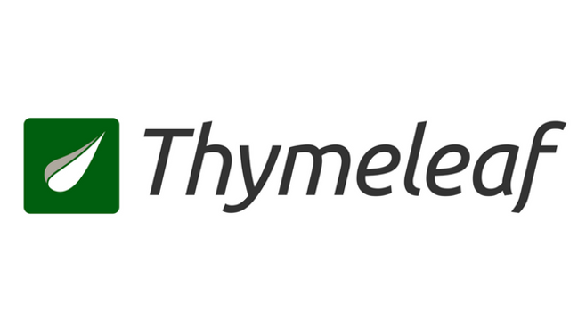

# 📚 lectures

이 저장소는 Inflearn, YouTube, FastCampus, 공식 문서 등의 플랫폼에서 수강한 강의들의 학습 내용을 정리한 공간입니다. 각 플랫폼별 디렉토리 아래 강의별로 내용을 분류하여 정리하였습니다.

## 📁 디렉토리 구조

```plaintext
lectures/
├── inflearn/ # Inflearn 강의 정리
├── fascampus/ # FastCampus 강의 정리
├── youtube/ # YouTube 영상 강의 정리
├── docs/ # 공식 문서 정리
├── etc/ # 기타 등등 (커뮤니티 코멘트, 블로그 포스트 등)
```

## 🗂️ 강의 목록

<details>
<summary>Inflearn</summary>
<div markdown="1">

이 디렉토리는 [인프런(Inflearn)](https://www.inflearn.com) 플랫폼에서 수강한 강의들을 정리한 공간입니다. 강의별 디렉토리에는 실습 코드, 요약 노트, 참고 링크 등을 포함하고 있습니다.

## 📋 강의 목록

| No | 썸네일                                                                                                                                                                                                                                 | 강의명                                                | 강사명         | 디렉토리                                                                                                                                                  | 상태    | 비고 |
|----|-------------------------------------------------------------------------------------------------------------------------------------------------------------------------------------------------------------------------------------|----------------------------------------------------|-------------|-------------------------------------------------------------------------------------------------------------------------------------------------------|-------|----|
| 01 |                                                                                                 | 스프링 시큐리티 완전 정복 [6.x 개정판]                           | 정수원         | [inflearn-spring-security-6](inflearn/inflearn-spring-security-6)                                                                                     | ✅ 완료  |    |
| 02 |                                                                                                                | 비전공자도 이해할 수 있는 Redis 입문/실전 (조회 성능 최적화편)            | JSCODE 박재성  | [inflearn-redis](inflearn/inflearn-redis)                                                                                                             | ✅ 완료  |    |
| 03 |                                                                                                 | 토비의 스프링 6 - 이해와 원리                                 | 토비          | [inflearn-toby-spring-6](inflearn/inflearn-toby-spring-6)                                                                                             | ✅ 완료  |    |
| 04 |                                                                                                  | Java/Spring 테스트를 추가하고 싶은 개발자들의 오답노트                | 김우근         | [inflearn-java-spring-test](inflearn/inflearn-java-spring-test)                                                                                       | ✅ 완료  |    |
| 05 |                                                                                                 | Readable Code: 읽기 좋은 코드를 작성하는 사고법                  | 박우빈         | [inflearn-readable-code](inflearn/inflearn-readable-code)                                                                                             | ✅ 완료  |    |
| 06 |                                                                                             | 스프링부트 JUnit 테스트 - 시큐리티를 활용한 Bank 애플리케이션            | 최주호         | [inflearn-spring-security-junit-bank-class](inflearn/inflearn-spring-security-junit-bank-class)                                                       | ✅ 완료  |    |
| 07 |                                                                                             | 스프링 시큐리티 OAuth2                                    | 정수원         | [inflearn-spring-security-oauth2](inflearn/inflearn-spring-security-oauth2)                                                                           | ✅ 완료  |    |
| 08 |                                                                                                                | 한 입 크기로 잘라먹는 타입스크립트(TypeScript)                    | 이정환         | [inflearn-one-bite-typescript](inflearn/inflearn-one-bite-typescript)                                                                                 | ✅ 완료  |    |
| 09 |                                                                                        | 제대로 파는 Git & GitHub - by 얄코(Yalco)                 | 얄팍한 코딩사전    | [inflearn-yalco-git-practice](inflearn/inflearn-yalco-git-practice)                                                                                   | ⏸️ 보류 |    |
| 10 |                                                                                                 | Practical Testing: 실용적인 테스트 가이드                    | 박우빈         | [inflearn-practical-testing](inflearn/inflearn-practical-testing)                                                                                     | ✅ 완료  |    |
| 11 |                                                                                                 | spring boot actuator 파헤치기                          | Hello World | [inflearn-spring-boot-actuator-for-beginner](inflearn/inflearn-spring-boot-actuator-for-beginner)                                                     | ✅ 완료  |    |
| 12 |                                                                                                             | 스프링 시큐리티                                           | 정수원         | [inflearn-spring-security-core](inflearn/inflearn-spring-security-core)<br/>[inflearn-spring-security-basic](inflearn/inflearn-spring-security-basic) | ✅ 완료  |    |
| 13 |                                                                                           | Jenkins를 이용한 CI/CD Pipeline 구축                     | Dowon Lee   | [inflearn-cicd-pipeline-with-jenkins](inflearn/inflearn-cicd-pipeline-with-jenkins)                                                                   | ✅ 완료  |    |
| 14 |                                                                                             | 실습으로 배우는 선착순 이벤트 시스템                               | 최상용         | [inflearn-coupon-system](inflearn/inflearn-coupon-system)                                                                                             | ✅ 완료  |    |
| 15 |                                                                                             | 실전! 스프링부트 상품-주문 API 개발로 알아보는 TDD                   | 이중석         | [inflearn-tdd-product-order-service](inflearn/inflearn-tdd-product-order-service)                                                                     | ✅ 완료  |    |
| 16 |                                                                                             | 스프링 핵심 원리 - 고급편                                    | 김영한         | [inflearn-kyh-spring-aop](inflearn/inflearn-kyh-spring-aop)                                                                                           | ✅ 완료  |    |
| 17 |  | 실전! 스프링 부트와 JPA 활용1 - 웹 애플리케이션 개발                  | 김영한         | [inflearn-spring-data-jpa](inflearn/inflearn-spring-data-jpa)                                                                                         | ✅ 완료  |    |
| 18 |                                                                                        | 실전! Querydsl                                       | 김영한         | [inflearn-query-dsl](inflearn/inflearn-query-dsl)                                                                                                     | ✅ 완료  |    |
| 19 |                                                                                             | 재고시스템으로 알아보는 동시성이슈 해결방법                            | 최상용         | [inflearn-kotlin-library-app](inflearn/inflearn-kotlin-library-app)                                                                                   | ✅ 완료  |    |
| 20 |                                                                                            | 실전! 코틀린과 스프링 부트로 도서관리 애플리케이션 개발하기 (Java 프로젝트 리팩토링) | 최태현         | [inflearn-kotlin-library-app](inflearn/inflearn-kotlin-library-app)                                                                                   | ✅ 완료  |    |
| 21 |                                                                                                                | 한 입 크기로 잘라 먹는 리액트(React.js) : 기초부터 실전까지            | 이정환         | [inflearn-react-winterlood](inflearn/inflearn-react-winterlood)                                                                                       | ✅ 완료  |    |
| 22 |                                                                                             | 따라하며 배우는 NestJS                                    | John Ann    | [inflearn-nest-js](inflearn/inflearn-nest-js)                                                                                                         | ✅ 완료  |    |
| 23 |                                                                                             | 카프카 완벽 가이드 - 코어편                                   | 권철민         | [inflearn-kafka-perfect-guide-core](inflearn/inflearn-kafka-perfect-guide-core)                                                                       | ✅ 완료  |    |
| 24 |                                                                                             | 스프링 부트 - 핵심 원리와 활용                                 | 김영한         | [inflearn-kyh-spring-boot](inflearn/inflearn-kyh-spring-boot)                                                                                         | ✅ 완료  |    |
| 25 |                                                                                             | 토비의 스프링 부트 - 이해와 원리                                | 토비          | [inflearn-toby-spring-boot](inflearn/inflearn-toby-spring-boot)                                                                                       | ✅ 완료  |    |
| 26 |                                                                                             | 스프링 배치                                             | 정수원         | [inflearn-spring-batch](inflearn/inflearn-spring-batch)                                                                                               | ✅ 완료  |    |
| 27 |                                                                                                 | 스프링부트로 직접 만들면서 배우는 대규모 시스템 설계 - 게시판                | 쿠케          | [inflearn-kuke-board](inflearn/inflearn-kuke-board)                                                                                                   | ✅ 완료  |    |
| 28 |                                                                                                                | 스프링 웹 MVC 완전정복                                     | 정수원         | [inflearn-spring-mvc](inflearn/inflearn-spring-mvc)                                                                                                   | ✅ 완료  |    |
| 29 |                                                                                                 | 개발자를 위한 쉬운 도커                                      | 데브위키        | [inflearn-easydocker-leafy](inflearn/inflearn-easydocker-leafy)                                                                                       | ✅ 완료  |    |

</div>
</details>
<br/>
<details>
<summary>Fastcampus</summary>
<div markdown="1">

이 디렉토리는 [패스트캠퍼스(Fastcampus)](https://www.fastcampus.co.kr) 플랫폼에서 수강한 강의들을 정리한 공간입니다. 강의별 디렉토리에는 실습 코드, 요약 노트, 참고 링크 등을
포함하고 있습니다.

## 📋 강의 목록

| No | 강의명                                                  | 디렉토리                                                                                            | 상태    | 비고 |
|----|------------------------------------------------------|-------------------------------------------------------------------------------------------------|-------|----|
| 01 | 10개 프로젝트로 완성하는 백엔드 개발(Java/Spring) 초격차 패키지 Online)   | [fastcampus-10-projects-backend-web](fastcampus/fastcampus-10-projects-backend-web)             | ⏸️ 보류 |    |
| 02 | 백엔드 개발자를 위한 한 번에 끝내는 대용량 데이터 & 트래픽 처리 초격차 패키지 Online | [fastcampus-big-data-and-traffic-handling](fastcampus/fastcampus-big-data-and-traffic-handling) | ⏸️ 보류 |    |

</div>
</details>
<br/>
<details>
<summary>Youtube</summary>
<div markdown="1">

이 디렉토리는 [유튜브(Youtube)](https://www.youtube.com) 플랫폼에서 시청한 영상들을 정리한 공간입니다. 강의별 디렉토리에는 실습 코드, 요약 노트, 참고 링크 등을 포함하고 있습니다.

## 📋 영상 목록

| No | 제목                                                           | 디렉토리                                                                                         | 링크                                                                                                                                                                     | 비고 |
|----|--------------------------------------------------------------|----------------------------------------------------------------------------------------------|------------------------------------------------------------------------------------------------------------------------------------------------------------------------|----|
| 01 | 모던 자바 (자바8) 못다한 이야기                                          | [modern-java-with-kevin](youtube/modern-java-with-kevin)                                     | [youtube](https://www.youtube.com/watch?v=mu9XfJofm8U&list=PLRIMoAKN8c6O8_VHOyBOhzBCeN7ShyJ27&index=2)                                                                 |    |
| 02 | Dan Vega Security                                            | [dan-vega-security](youtube/dan-vega-security)                                               | [youtube](https://www.youtube.com/@DanVega/videos)                                                                                                                     |    |
| 03 | Dan Vega Security JWT                                        | [dan-vega-security](youtube/dan-vega-security-jwt)                                           | [youtube](https://www.youtube.com/@DanVega/videos)                                                                                                                     |    |
| 04 | 토비의 스프링 부트 1 - 스프링 부트 앱에 초기화 코드를 넣는 방법 3가지                   | [toby-spring-boot-inject-initializer-code](youtube/toby-spring-boot-inject-initializer-code) | [youtube](https://www.youtube.com/watch?v=f017PD5BIEc)                                                                                                                 |    |
| 05 | Spring 6의 새로운 HTTP Interface와 3 가지 REST Clients 라이브 코딩       | [toby-spring-rest-client](youtube/toby-spring-rest-client)                                   | [youtube](https://www.youtube.com/watch?v=Kb37Q5GCyZs)                                                                                                                 |    |
| 06 | [Oracle Code Seoul 2017] Java 9과 Spring 5로 바라보는 Java의 변화와 도전 | [toby-request-mapping](youtube/toby-request-mapping)                                         | [youtube](https://www.youtube.com/watch?v=Kb37Q5GCyZs)                                                  [youtube](https://www.youtube.com/watch?v=BFjrmj4p3_Y&t=1474s) |    |
| 07 | 스프링부트로 MVP 백엔드 API 빠르게 개발하기(WMS 편)                           | [spring-boot-wms](youtube/spring-boot-wms)                                                   | [youtube](https://www.youtube.com/watch?v=tEcRdRZ0x2U)                                                  [youtube](https://www.youtube.com/watch?v=BFjrmj4p3_Y&t=1474s) |    |

</div>
</details>
<br/>
<details>
<summary>Documents</summary>
<div markdown="1">

이 디렉토리는 공식문서를 기반으로 학습한 내용을 정리한 공간입니다. 공식문서별 디렉토리에는 실습 코드, 요약 노트, 참고 링크 등을 포함하고 있습니다.

## 📋 문서 목록

| No | 썸네일                                                    | 공식문서            | 디렉토리                                    | 링크                                          | 비고 |
|----|--------------------------------------------------------|-----------------|-----------------------------------------|---------------------------------------------|----|
| 01 |            | htmx            | [htmx](docs/htmx)                       | https://htmx.org/                           |    |
| 02 |      | handlebars      | [handlebars](docs/handlebars)           | https://handlebarsjs.com/                   |    |
| 03 |        | thymeleaf       | [thymeleaf](docs/thymeleaf)             | https://www.thymeleaf.org/                  |    |
| 04 |  | lucy-xss-filter | [lucy-xss-filter](docs/lucy-xss-filter) | https://naver.github.io/lucy-xss-filter/kr/ |    |

</div>
</details>
<br/>
<details>
<summary>Etc</summary>
<div markdown="1">

이 디렉토리는 커뮤니티 코멘트, 블로그 포스트 등을 기반으로 학습한 내용을 정리한 공간입니다. 디렉토리에는 실습 코드, 요약 노트, 참고 링크 등을 포함하고 있습니다.

## 📋 문서 목록

| No | 제목                                               | 디렉토리                                                                                     | 링크                                              | 비고 |
|----|--------------------------------------------------|------------------------------------------------------------------------------------------|-------------------------------------------------|----|
| 01 | @RequestBody 에서는 Setter 가 필요 없다                  | [request-body-no-need-setter](etc/request-body-no-need-setter)                           | https://jojoldu.tistory.com/407?category=635883 |    |
| 02 | Spring Boot 에서 JSP 사용시 jar 패키징이 가능한지 테스트         | [spring-boot-jsp-jar-test](etc/spring-boot-jsp-jar-test)                                 |                                                 |    |
| 03 | Spring ResponseEntity와 @ResponseBody 차이          | [spring-response-entity-and-response-body](etc/spring-response-entity-and-response-body) |                                                 |    |
| 04 | Spring에서 Bean 설계 시 항상 무상태(stateless)로 설계해야 하는 이유 | [spring-bean-stateless-test](etc/spring-bean-stateless-test)                             |                                                 |    |
| 05 | Toby's Spring Reading Club                       | [toby-spring-reading-club](etc/toby-spring-reading-club)                                 |                                                 |    |

</div>
</details>

## 📌 목적

- 강의 내용을 정리하며 복습합니다.
- 추후 참고용으로 빠르게 찾아볼 수 있도록 구성합니다.

## 📅 진행 현황

| 구분      | 전체 | Inflearn | FastCampus | Youtube |
|---------|----|----------|------------|---------|
| 총 강의    | 30 | 29       | 1          | 0       |
| 완료(✅)   | 28 | 28       | 0          | 0       |
| 진행중(🔄) | 0  | 0        | 0          | 0       |
| 보류(⏸️)  | 2  | 1        | 1          | 0       |

---
