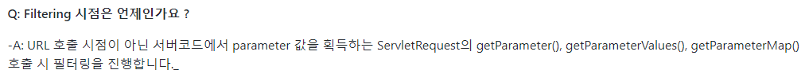
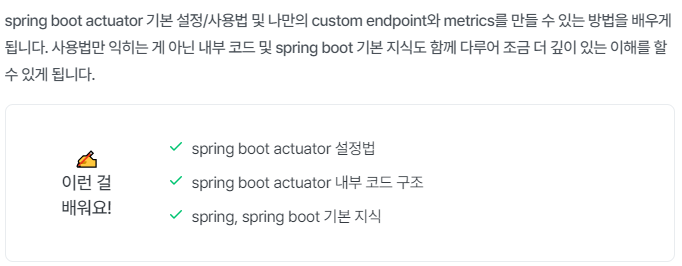
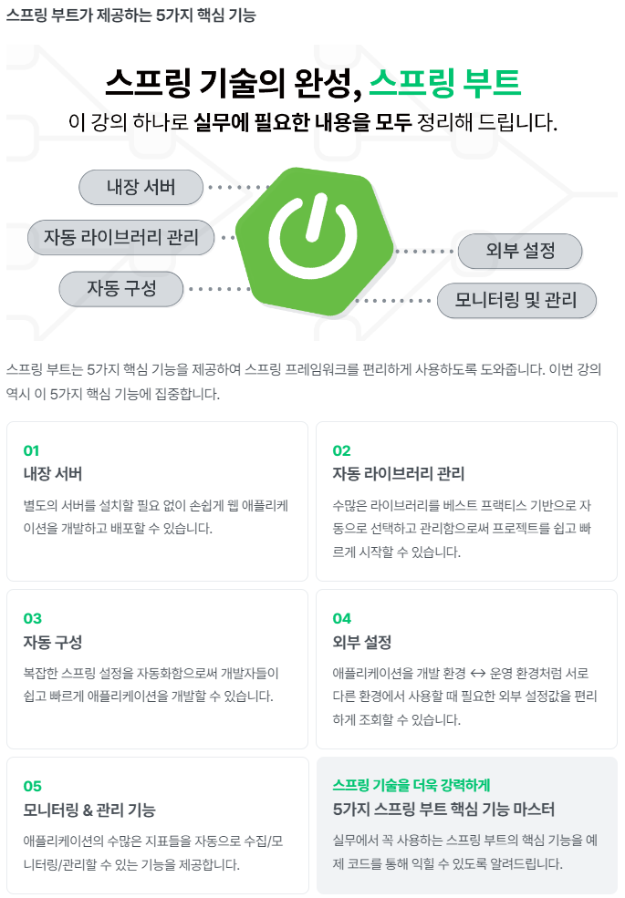

# inflearn-kyh-spring-boot

```
김영한님의 스프링 부트 인프런 강의를 토대로 학습한 Repository입니다.
```







### 인프런 강의
[인프런 강의 바로가기](https://www.inflearn.com/course/%EC%8A%A4%ED%94%84%EB%A7%81%EB%B6%80%ED%8A%B8-%ED%95%B5%EC%8B%AC%EC%9B%90%EB%A6%AC-%ED%99%9C%EC%9A%A9/dashboard)


### Notion
[Notion 바로가기](https://flat-asp-5ca.notion.site/fd89ea8fe75840568780eac39e1ce7e1)

### Blog 주소
1. [시작하기](https://soono-991.tistory.com/32)
2. [웹 서버와 서블릿 컨테이너](https://soono-991.tistory.com/33)
3. [스프링 부트와 내장 톰캣](https://soono-991.tistory.com/34)
4. [스프링 부트 스타터와 라이브러리 관리](https://soono-991.tistory.com/35)
5. [자동 구성(Auto Configuration)](https://soono-991.tistory.com/36)
6. [외부설정과 프로필1](https://soono-991.tistory.com/37)
7. [외부설정과 프로필2](https://soono-991.tistory.com/38)
8. [액츄에이터](https://soono-991.tistory.com/39)
9. [마이크로미터, 프로메테우스, 그라파나](https://soono-991.tistory.com/40)
10. [모니터링 메트릭 활용](https://soono-991.tistory.com/31)

### 이슈

