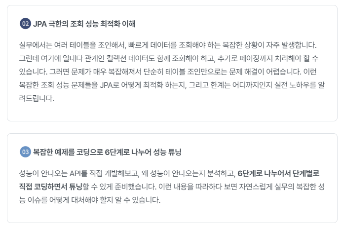

# inflearn-spring-boot-actuator-for-beginner


```
나는 학생이다님의 Spring Boot Actuator 인프런 강의를 토대로 학습한 Repository입니다.
```

### 링크
[인프런 강의 바로가기](https://www.inflearn.com/course/spring-boot-actuator-%ED%8C%8C%ED%97%A4%EC%B9%98%EA%B8%B0/dashboard)

[유튜브](https://www.youtube.com/@MrPaka535)




#### 목차
- endpoint
- custom endpoint
- health endpoint
- info endpoint
- metrics endpoint
  - counter
  - gauge
  - timer
  - metrics tag
- spring boot admin