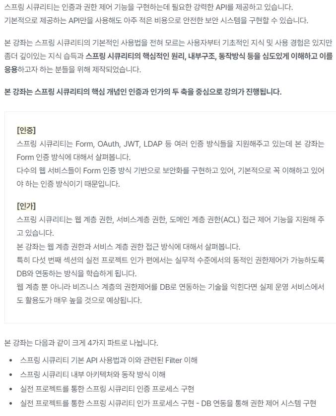
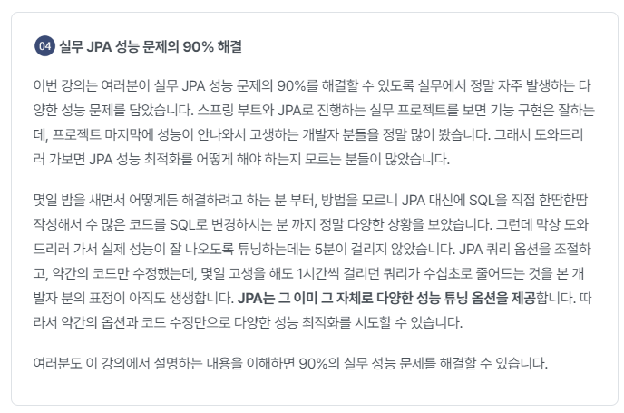

# inflearn-toby-spring-boot

```
토비님의 스프링 부트 인프런 강의를 토대로 학습한 Repository입니다.
```


### 인프런 강의
[인프런 강의 바로가기](https://www.inflearn.com/course/%ED%86%A0%EB%B9%84-%EC%8A%A4%ED%94%84%EB%A7%81%EB%B6%80%ED%8A%B8-%EC%9D%B4%ED%95%B4%EC%99%80%EC%9B%90%EB%A6%AC/dashboard)

### Notion
[notion 바로가기](https://flat-asp-5ca.notion.site/11303e8aa74246a5b9f3d5a41300350e)

### Blog 주소
1. 스프링 부트 살펴보기
2. 스프링 부트 시작하기
3. 독립 실행형 서블릿 애플리케이션
4. 독립 실행형 스프링 애플리케이션
5. DI와 테스트, 디자인 패턴
6. 자동 구성 기반 애플리케이션
7. 조건부 자동 구성
8. 외부 설정을 이용한 자동 구성
9. Spring JDBC 자동 구성 개발
10. 스프링 부트 자세히 살펴보기


### 이슈
```
독립 실행형 스프링 애플리케이션 - 애노테이션 매핑 정보 사용

HelloController에 @RequestMapping, @GetMapping, @ResponseBody 애노테이션을 추가하여도,
/hello에 대한 경로를 인식하지 못함.

원인: Spring 6 부터는 Type Level, 즉 Class에 @RequestMapping 애노테이션을 인식하지 않는다고 합니다.

해결: 
1. Type Level 에 @Controller, @RestController 애노테이션을 추가
2. 클래스 기반 프록시 (CGLib) 활성화
```




### Spring 6 이전


### Spring 6 이후


```
Class에 @RequestMapping 애노테이션을 인식하지 않는 이유

Spring Cloud @FeignClient 을 사용시 아래와 같이 사용하는데
```
```java
@FeignClient("")
@RequestMapping(value = "")
public interface UsersClient extends CrudClient<User> {
    
}
```
```
현재 @FeignClient 를 사용해보지 않아서 잘 모르겠지만,
MVC에서는 @RequestMapping 도 인식하여 Controller 라고 판단하는데
@FeignClient 에서는 이로 인해 의도치 않은 결과가 발생하는 것 같습니다.
```
### 관련 링크
[@FeignClient 사용 시 @RequestMapping 우회 방법](https://stackoverflow.com/questions/71284214/requestmapping-annotation-not-allowed-on-feignclient-interfaces)

[@FeignClient 에서 top-level에 @RequestMapping 사용 시 이슈 - 1](https://github.com/spring-cloud/spring-cloud-netflix/issues/466)

[@FeignClient 에서 top-level에 @RequestMapping 사용 시 이슈 - 2](https://www.google.com/search?q=%EB%B2%88%EC%97%AD%EA%B8%B0&oq=%EB%B2%88%EC%97%AD%EA%B8%B0&aqs=chrome.0.69i59.4483j0j7&sourceid=chrome&ie=UTF-8)

[remove support top-level @RequestMapping](https://github.com/spring-cloud/spring-cloud-openfeign/issues/547)

```
조건부 자동 구성 - @Conditional과 @Condition 강의 이슈
JettyWebServerConfig 적용시 에러 발생

Caused by: java.lang.ClassNotFoundException: jakarta.servlet.http.HttpSessionContext


해결:
build.gradle 에 아래 옵션 추가

ext['jakarta-servlet.version'] = '5.0.0'

```


### 관련 링크
[NoClassDefFoundError: jakarta/servlet/http/HttpSessionContext stack overflow](https://stackoverflow.com/questions/74949611/noclassdeffounderror-jakarta-servlet-http-httpsessioncontext-after-upgrade-to-sp)

[Spring Boot 3.0 migration guide](https://github.com/spring-projects/spring-boot/wiki/Spring-Boot-3.0-Migration-Guide#jetty)

