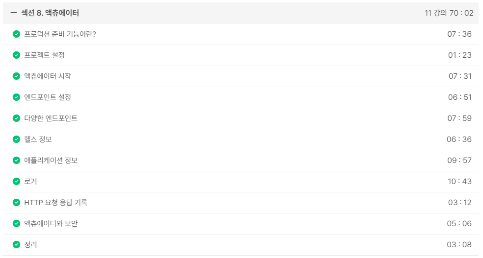
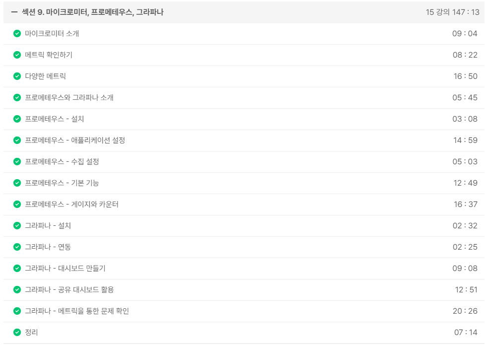

# actuator

### 인프런 강의 챕터

[액츄에이터](https://soono-991.tistory.com/39?category=1078163)

[마이크로미터, 프로메테우스, 그라파나](https://soono-991.tistory.com/40?category=1078163)

[모니터링 메트릭 활용](https://soono-991.tistory.com/41?category=1078163)

