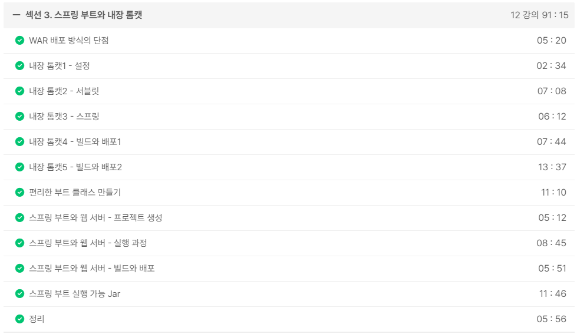

# boot

### 인프런 강의 챕터

WAR 배포 방식의 단점 
내장 톰캣1 - 설정 
내장 톰캣2 - 서블릿 
내장 톰캣3 - 스프링 
내장 톰캣4 - 빌드와 배포1 
내장 톰캣5 - 빌드와 배포2 
편리한 부트 클래스 만들기 
스프링 부트와 웹 서버 - 프로젝트 생성 
스프링 부트와 웹 서버 - 실행 과정 
스프링 부트와 웹 서버 - 빌드와 배포 
스프링 부트 실행 가능 Jar 

[스프링 부트와 내장 톰캣](https://soono-991.tistory.com/34?category=1078163)

