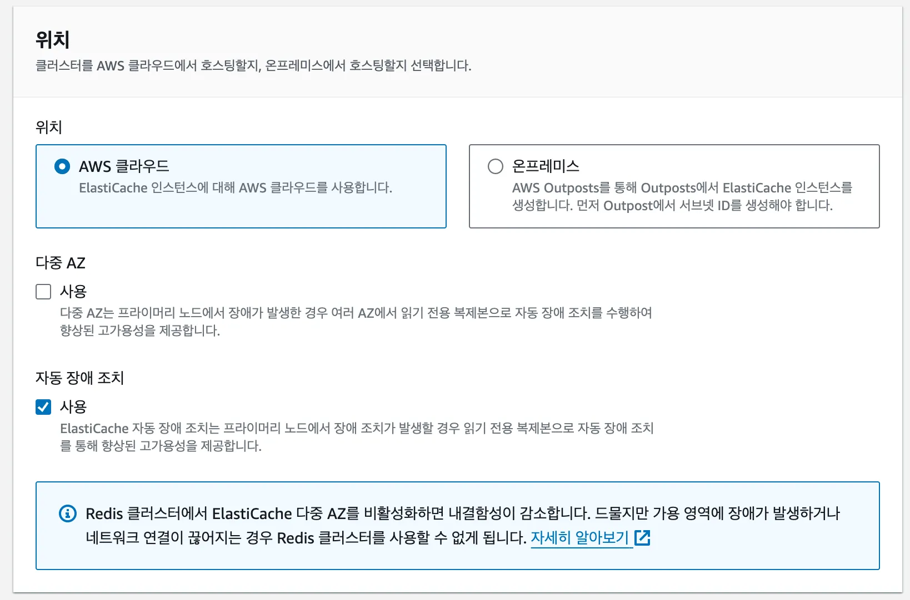
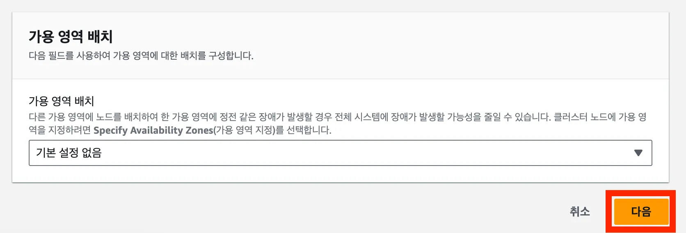
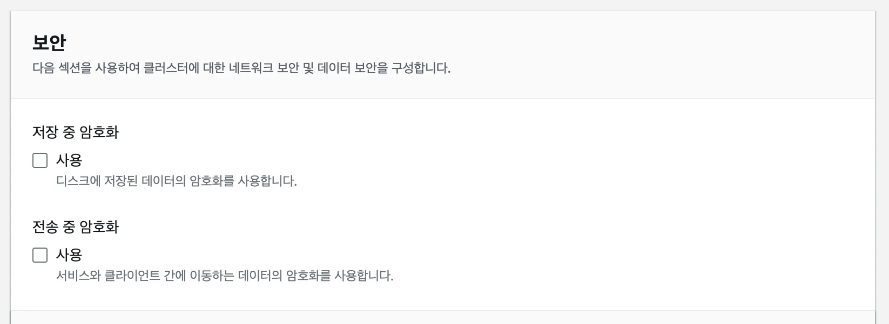
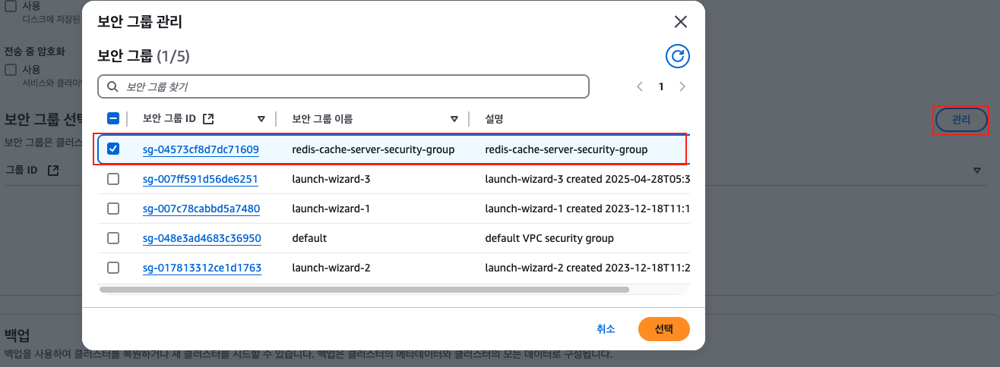
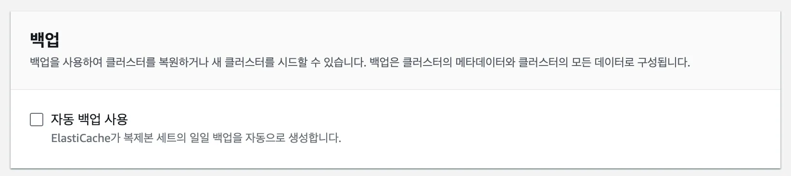

## AWS ElastiCache 셋팅하기

1. **ElastiCache 서비스로 들어가기**


2. **캐시 생성을 위해 ‘지금 시작’ 버튼 누르기**


3. 클러스터 설정에서 ‘구성’ 선택하기

   여기서 얘기하는 클러스터(cluster)란 여러 캐시 서버를 이루는 한 단위의 그룹을 뜻한다. 여기서 하나의 캐시 서버를 노드(Node)라고 얘기한다.


<sub>출처: AWS 공식 문서</sub>

4. ‘클러스터 모드’ 설정하기

```markdown
대규모 트래픽 처리를 위한 ‘클러스터 모드’라는 게 있다. 
하지만 어지간한 규모의 트래픽이 발생하는 서비스가 아니라면 ‘클러스터 모드’를 쓸 일은 없다. 
나중에 관심이 있으면 따로 공부하도록 하자. 레디스를 입문할 때 우선순위가 높은 기능은 아니다. 
```

5. ‘클러스터 정보’ 입력하기


6. ‘위치’ 설정하기


- **다중 AZ(Multi AZ)**는 여러 Region에 캐시 서버를 나눠서 셋팅해두는 것이다. 특정 Region에서 재난이 발생해 서비스가 중단될 수도 있는 걸 방지하는 기능이다. 하지만 재난이 발생할 가능성은 아주 적은데 비해서 비용은 추가로 발생하기 때문에, 재난으로 인해 서비스가 중단되는 게 치명적인 경우가 아니면 사용하지 말자.
- **자동 장애 조치(Failover)**는 클러스터 내부에 특정 노드(Node)가 장애가 났을 때 정상 노드(Node)로 교체하는 기능이다. 쉽게 얘기해서 내부에 장애가 일어나면 스스로 고치는 기능이다.


7. ‘클러스터 설정’ 셋팅하기


8. 기존 서브넷 그룹 선택하기


9. ‘가용 영역 배치’는 설정하지 않고 다음으로 넘어가기


10. ‘보안’ 설정하지 않기


11. EC2 서비스로 가서 보안그룹 생성하기


12. ‘보안그룹’ 셋팅하기


13. ‘백업’ 설정 해제하기


14. **나머지 옵션은 그대로 두고 다음으로 넘어가기**


15. ‘생성’ 누르기

