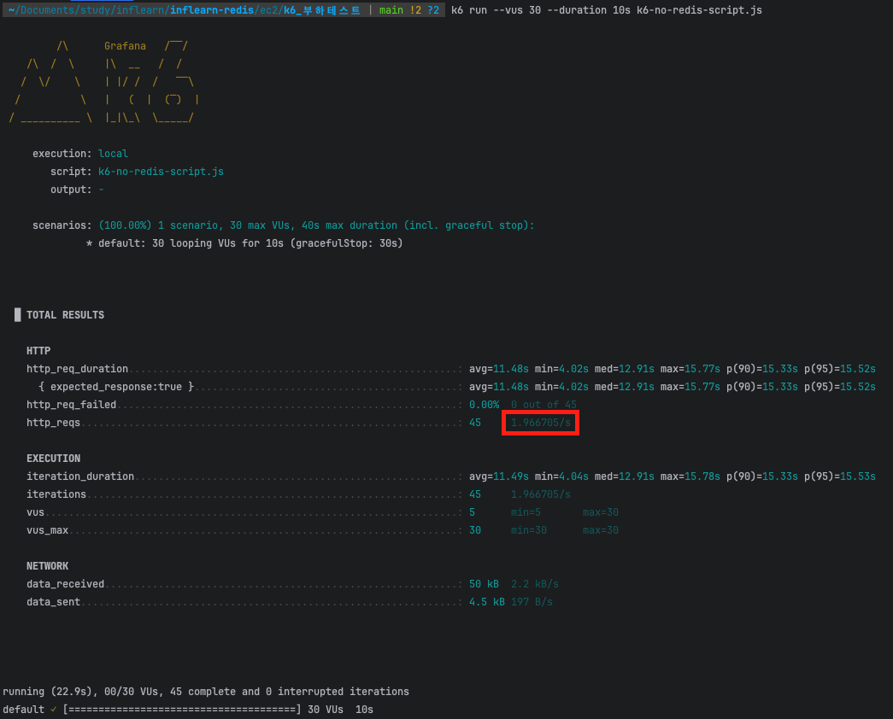

## k6를 사용한 부하테스트

### ✅ k6란?

```md
성능 비교를 위해 k6라는 부하테스트 툴을 사용할 것이다. 부하테스트 툴에는 k6 이외에도 ngrinder, jmeter, ab, locust 등 다양한 툴이 있다. 하지만 그 중에서 간단하고 빠르게 테스트 해볼 수 있는 툴인 **k6**를 활용하고자 한다.
간단하게 빠르게 테스트할 수 있다고 해서 테스트 결과가 부정확한 건 아니다. k6도 높은 정확도와 고부하를 발생시킬 수 있는 부하테스트 툴이다. k6를 설치해보자. 현업에서도 많이 쓰니까 걱정하지 말고 사용해도 된다.
(부하 테스트에 대한 강의가 아니기 때문에 자세한 k6의 사용법에 초점을 맞추진 않겠다. 성능 지표 위주로 참고할 예정이다.)
```


### ✅ k6 설치

- [공식 문서](https://grafana.com/docs/k6/latest/set-up/install-k6/)
```shell
$ brew install k6
```

### ✅ k6 설치 확인

```shell
$ k6

         /\      Grafana   /‾‾/
    /\  /  \     |\  __   /  /
   /  \/    \    | |/ /  /   ‾‾\
  /          \   |   (  |  (‾)  |
 / __________ \  |_|\_\  \_____/

Usage:
  k6 [command]

Available Commands:
  archive     Create an archive
  cloud       Run a test on the cloud
  completion  Generate the autocompletion script for the specified shell
  help        Help about any command
  inspect     Inspect a script or archive
  new         Create and initialize a new k6 script
  pause       Pause a running test
  resume      Resume a paused test
  run         Start a test
  scale       Scale a running test
  stats       Show test metrics
  status      Show test status
  version     Show application version

Flags:
  -a, --address string              address for the REST API server (default "localhost:6565")
  -c, --config string               JSON config file (default "/Users/yoonsoonho/Library/Application Support/k6/config.json")
  -h, --help                        help for k6
      --log-format string           log output format
      --log-output string           change the output for k6 logs, possible values are stderr,stdout,none,loki[=host:port],file[=./path.fileformat] (default "stderr")
      --no-color                    disable colored output
      --profiling-enabled           enable profiling (pprof) endpoints, k6's REST API should be enabled as well
  -q, --quiet                       disable progress updates
      --secret-source stringArray   setting secret sources for k6 file[=./path.fileformat],
  -v, --verbose                     enable verbose logging
      --version                     version for k6

Use "k6 [command] --help" for more information about a command.
```

### ✅ API에 부하를 주기 위해 k6 스크립트 작성

```javascript
import http from 'k6/http';
import { sleep } from 'k6';

export default function () {
    http.get('http://{EC2 IP 주소}:8080/boards/redis');
}
```

### ✅ k6 스크립트 실행

```shell
# K6의 스크립트 파일이 위치한 경로에서 아래 명령어 실행시키기
# inflearn-redis/ec2/k6_부하테스트
$ k6 run --vus 30 --duration 10s k6-redis-script.js # redis 적용 api 부하 테스트
$ k6 run --vus 30 --duration 10s k6-no-redis-script.js # redis 적용 api 부하 테스트
```
- `--vus 30` : 가상 유저(Virtual Users)를 30명으로 셋팅
  (API 요청을 보내는 사용자가 30명인 것처럼 부하 생성)
- `--duration 30s` : 30초 동안 테스트를 유지

#### Redis 적용 부하 테스트 결과

- 초당 처리 가능한 최대 요청 수: 약 71.6개
- 해당 API의 Throughput은 71.6 TPS 

#### Redis 미적용 부하 테스트 결과

- 초당 처리 가능한 최대 요청 수: 약 1.9개
- 해당 API의 Throughput은 1.9 TPS 