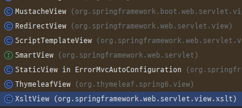

# spring-response-entity-test

스프링 커뮤티니에서 한 개발자 분이 공유해주신 내용을 토대로 학습해본 코드를 정리한 Repository 입니다.


### 궁금증
```
위 내용을 보자마자 바로 "응!?" 하는 생각과 함께 다시 RestController와 ResponseEntity에 대해 생각해보게 되었습니다.
물론 RestController에서 ResponseEntity를 사용하지 않고 데이터 자체를 반환해도 되지만, ResponseEntity를 통해 명시하려는 것으로 생각했었습니다.

공유 주신 내용을 통해 보다 정확하게 RestController, ResponseEntity에 대해 정리해볼 수 있는 계기가 되었습니다.
```

### HandlerMethodReturnValueHandler
```
우리가 Controller를 통해 응답하는 응답 정보를 통해 어떻게 데이터와 응답을 처리할지 결정하는데요,
이 처리를 HandlerMethodReturnValueHandler Interface의 구현체들이 담당하게 됩니다.
```

```
15개의 구현체들이 등록되어 있는 것을 확인할 수 있는데, 여기서 자주 사용하여 익숙한 것들과
이번 내용과 관련 있는 Handler를 표시해봤습니다.

1. ModelAndViewMethodReturnValueHandler: return type이 ModelAndView type일 경우 해당 Handler가 처리
2. ModelMethodProcessor: return type이 Model type일 경우 해당 Handler가 처리
3. ViewMethodReturnValueHandler: return type이 View type일 경우 해당 Handler가 처리
* ThymeleafView, RedirectView, XsltView 등이 이에 해당
★4. HttpEntityMethodProcessor: return type이 HttpEntity type일 경우 해당 Handler가 처리
★5. RequestResponseBodyMethodProcessor: 호출된 method or class에 @ResponseBody annotation이 있을 경우 해당 Handler가 처리
6. ViewNameMethodReturnValueHandler: return type이 String일 경우 처리, "redirect:" 접두사 또는 지정한 redirect pattern이
접두사로 있을 경우 해당 Handler가 처리
```


### RequestResponseBodyMethodProcessor
@ResponseBody를 사용할 경우 RequestResponseBodyMethodProcessor에 의해 응답이 처리됩니다.
하지만 @ResponseBody와 ResponseEntity가 같이 사용될 경우 ResponseEntity가 우선적으로 적용되어
HttpEntityMethodProcessor에 의해 응답이 처리됩니다.

### HttpEntityMethodProcessor
return type을 ResponseEntity로 return하게 될 경우 HttpEntityMethodProcessor에 의해 응답이 처리됩니다.

### 그렇다면 왜 ResponseEntity를 사용했었을까?
```
공유해주신 분의 내용을 보면 @ResponseBody를 일일이 Method에 붙여가며 사용하는 것이 번거로워
ResponseEntity가 인기를 얻었다고 하는데 이 때 드는 생각은 @ResponseBody를 Class에 적용하면 되는데 굳이
일일이 Method에 적용할 필요가 있었을까? 였습니다.
제가 모르는 무언가가 있다고 생각해 @ResponseBody annotation을 살펴본 결과 아래와 같은 설명이 있는 것을 확인할 수 있었습니다.
```


```
@ResponseBody annotation은 3.0 부터 지원되기 시작했는데 이 때 당시에는 Method level에서만 사용할 수 있었다고 합니다.
그리고 4.0이 되어서야 비로소 @ResponseBody를 Class level에서도 사용할 수 있게 되고, 그와 동시에 @RestController가 등장했습니다.

정리해보자면,
3.0 ~ 4.0 이전까지는 @ResponseBody를 Class에 사용할 수 없었기 때문에 일일이 Method에 붙여 사용했었으며, 그렇기 때문에
ResponseEntity를 사용하는 것이 인기를 얻었습니다.
하지만 4.0에 와서 @ResponseBody를 Class에서도 사용할 수 있게 했지만, 이미 사용했던 습관들과 인터넷상에 공유된 코드들에서
ResponseEntity를 사용한 코드들이 많았기 때문에 이 후 개발자들이 참고할 때 이를 그대로 가져와 사용한 것으로 보입니다.

하지만 @RestController와 ResponseEntity를 같이 사용하지 말라는 의미는 아닙니다.
응답 코드 또는 응답 헤더들을 직접 개발자가 Custom하게 만들어서 응답하고 싶은 경우에는 ResponseEntity가 정답이 될 수 있습니다.

따라서 이번 Repository를 통해 학습한 결과는 
"@ResponseBody를 사용할 경우 굳이 ResponseEntity를 사용하지 않아도 되기 때문에,
 ResponseEntity를 사용하려는 의도와 목적이 명확할 경우 사용하자."입니다.
```


