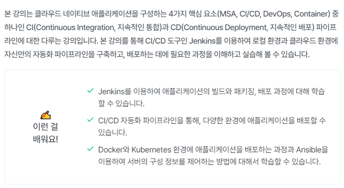

### inflearn-cicd-pipeline-with-jenkins

### Jenkins를 이용한 CI/CD Pipeline 구축

[인프런 강의 바로가기](https://www.inflearn.com/course/%EC%A0%A0%ED%82%A8%EC%8A%A4-ci-cd-%ED%8C%8C%EC%9D%B4%ED%94%84%EB%9D%BC%EC%9D%B8/dashboard)

#### 목차
- 섹션 0. 과정 및 강의 내용 소개
- 섹션 1. DevOps와 CI/CD의 이해
- 섹션 2. Jenkins를 이용한 CI/CD 자동화 도구의 사용
- 섹션 3. Jenkins + Infrastructure as Code 와의 연동
- 섹션 4. Jenkins + Ansible + Kubernetes 와의 연동
- 섹션 5. Advanced Jenkins 사용 ① - Pipeline
- 섹션 6. Advanced Jenkins 사용 ② - SonarQube, Multi nodes
- 섹션 7. 상용 클라우드 환경에 배포하기
- 섹션 8. 실습 환경을 위한 필수 SW
- 섹션 9. Appendix