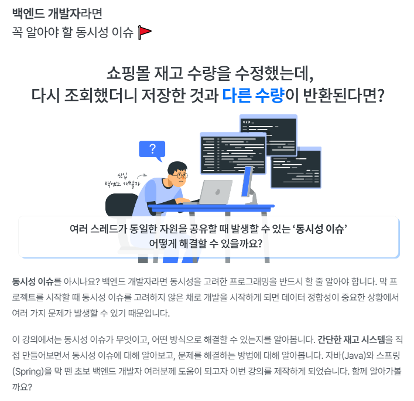

# inflearn-concurrency-issue

### 재고시스템으로 알아보는 동시성이슈 해결방법

[인프런 강의 바로가기](https://www.inflearn.com/course/%EB%8F%99%EC%8B%9C%EC%84%B1%EC%9D%B4%EC%8A%88-%EC%9E%AC%EA%B3%A0%EC%8B%9C%EC%8A%A4%ED%85%9C/dashboard)

#### 목차
- 섹션 0. 강의소개 및 환경세팅
- 섹션 1. 재고시스템 만들어보기
- 섹션 2. Synchronized 이용해보기
- 섹션 3. Database 이용해보기
- 섹션 4. Redis 이용해보기
- 섹션 5. 마무리