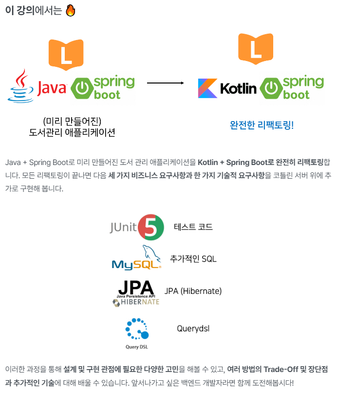

# inflearn-kotlin-library-app

### 실전! 코틀린과 스프링 부트로 도서관리 애플리케이션 개발하기 (Java 프로젝트 리팩토링)
[인프런 강의 바로가기](https://www.inflearn.com/course/java-to-kotlin-2/dashboard)

#### 목차
- 섹션 0. 소개와 준비, 수업 자료(PDF, PPT) 섹션
- 섹션 1. 도서관리 애플리케이션 리팩토링 준비하기
- 섹션 2. Java 서버를 Kotlin 서버로 리팩토링하자!
- 섹션 3. 첫 번째 요구사항 추가하기 - 책의 분야
- 섹션 4. 두 번째 요구사항 추가하기 - 도서 대출 현황
- 섹션 5. 세 번째 요구사항 추가하기 - 책 통계
- 섹션 6. 네 번째 요구사항 추가하기 - Querydsl
- 섹션 7. 마지막 섹션