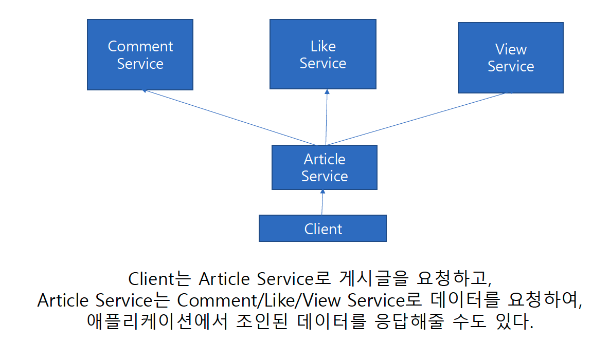
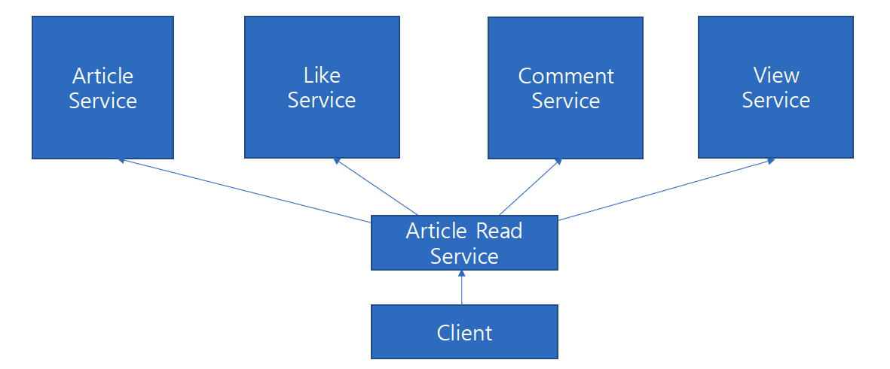

## 섹션 7. 게시글 조회 최적화

### 요구사항
- 게시글 단건 조회 최적화 전략
- 게시글 목록 조회 최적화 전략
- 캐시 최적화 전략
  - 조회에 최적화된 캐시 전략 만들어보기

### 게시판 서비스의 특성 파악
- 게시판 서비스의 특성 상, 읽기 트래픽이 쓰기 트래픽보다 압도적으로 많다.
- 사용자에게 게시글만 보여주진 않는다.
  - 게시글, 좋아요 수, 댓글 수, 조회 수, 작성자 정보 등을 언제나 함께 보여줄 수 있다.
- 이 경우 게시글 조회는 게시글 뿐만 아니라 다양한 정보를 함께 조회해야 하는데 어떻게 처리해야 할까?

1. 첫 번째 방법

- 게시글 서비스에서 관련된 서비스들을 호출하여 게시글을 조회하는 방법이다.
- 이 방법은 서비스 간의 의존성이 생기고, 서비스 호출에 따른 성능 저하가 발생할 수 있다.
- 또한 다른 서비스에서도 게시글 서비스의 의존성이 있을 경우 순환 참조가 발생할 수 있다.
  - 다른 서비스들의 경우 쓰기 작업 시 게시글 서비스의 파생 정보들이기 때문에 게시글에 대한 유효성 검증이 필요하여 게시글 서비스를 의존할 수 밖에 없다.
- 이 경우 쓰기 작업과 읽기 작업을 분리하여 의존성을 분리해볼 수 있다.

- 이 처럼 읽기 작업과 쓰기 작업을 분리하는 것을 CQRS(Command Query Responsibility Segregation)라고 한다.

### [CQRS](cqrs/README.md)

### [게시글 단건 조회 최적화](single/README.md)

### [캐시 최적화 전략](cache/README.md)