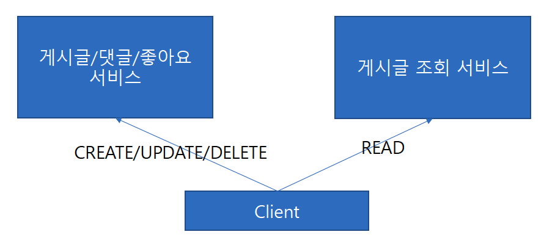
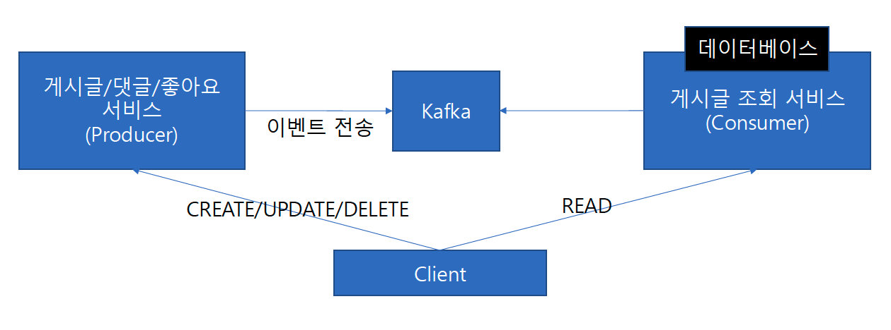

### CQRS(Command and Query Responsibility Segregation)

- Command(쓰기,명령)와 Query(읽기,조회)의 책임을 분리하는 아키텍처 패턴이다.
- 클래스 레벨에서, 패키지 레벨에서, 서비스 레벨에서, 데이터 저장소 레벨에서
  - 좁은 또는 넓은 범위에서 이러한 책임 분리가 일어날 수 있다.

- CQRS 적용

- 게시글 서비스에 대한 문제를 CQRS를 적용하여 해결했지만 아직 한가지 문제가 더 남아있다.
- 게시글의 파생 정보인 좋아요 수, 댓글 수, 조회 수, 작성자 정보 등을 어떻게 처리할 것인가?
  - Command에서 실시간으로 조회하게 되면 결국 Command로의 부하가 전파되기 때문에 이를 해결하기 위해 게시글 조회에 대한 데이터베이스를 별도로 구축해볼 수 있다.
- 그러면 게시글 조회 DB는 게시글의 변경 사항(등록/수정/삭제)를 실시간을 반영할 수 있어야 하는데,
  - API, Polling, Message Broker 중 앞서 적용해보았던 Kafka를 사용하여 게시글의 변경 사항을 실시간으로 반영해볼 수 있다.

- 게시글 조회 모델은 반드시 게시글 서비스의 모델과 같을 필요는 없다.
- 필요한 정보들을 조합해서 새로운 모델을 만들 수 있다.
- 그리고 게시글 조회 DB 저장소는 Redis를 사용하여 더 빠른 조회를 할 수 있도록 한다.
  - 게시글 특성상 최신글이 조회되는 경우가 많기 때문에,
  - Redis TTL을 1일로 설정하여 1일마다 게시글 조회 DB를 갱신할 수 있도록 한다.
