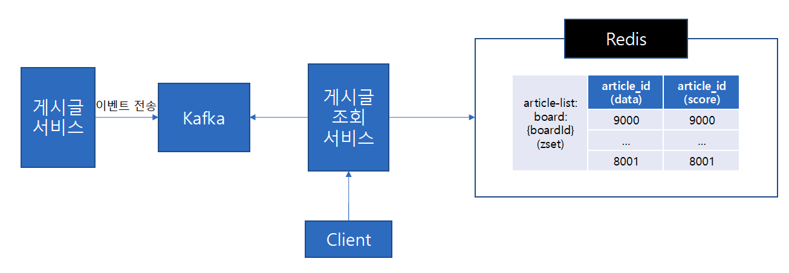

### 게시글 목록 조회 최적화

- 게시글 서비스의 MySQL 데이터베이스는 모든 게시글 목록 조회 트래픽을 받아주고 있다.
- 목록 조회도 Redis를 활용하여 캐시를 고려해볼 수 있다.

- 게시글 목록 조회는 조회 파라미터가 많이 사용되는데
  - boardId, page, pageSize
  - boardId, lastArticleId, pageSize
- 단순히 key/value 저장 전략을 취하면 캐시효과를 볼 수가 없다.

- 그래서 캐시 데이터를 실시간으로 미리 만들어두는 방법을 고려해볼 수 있다.
  - 게시글이 생성/삭제되면 캐시에 미리 목록 데이터를 생성해둔다.

- 하지만 모든 게시글의 데이터를 메모리에 저장하기에는 비용측면에서 부담이 크다.
- 게시판의 사용 패턴은
  - 특정 게시판을 클릭하면, 게시판의 첫 페이지로 이동하여 최신글 목록이 조회된다.
  - 게시판의 첫 페이지는 나타나는 최신의 게시글이 가장 많이 조회될 수 밖에 없다.
  - 뒷 페이지로 명시적으로 이동하지 않는 이상 과거 데이터는 비교적 조회 횟수가 적어진다.
- 그래서 모든 데이터를 캐시할 필요는 없다.
- 조회되는 주기에 따라 데이터를 두가지로 분류해볼 수 있다.
  - hot data = 자주 조회되는 데이터(최신의 글)
  - cold data = 자주 조회되지 않는 데이터(과거의 글)

- 따라서 hot data에만 캐시를 적용해서 게시글 조회 서비스가 Redis에 최신 1000개의 목록을 캐시하도록 한다.
- 1000개 이후의 데이터는 게시글 서비스로 직접 요청을 보내도록 한다.

