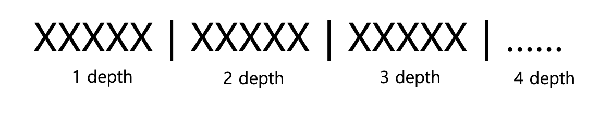
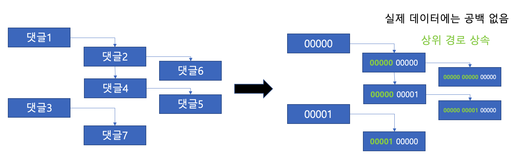

### 댓글 무한 depth

#### 요구사항


#### 테이블 설계
- 무한 depth에서는 상하위 댓글이 재귀적으로 무한할 수 있으므로 정렬 순을 나타내기 위해 모든 상위 댓글의 정보가 필요할 수 있다.
- 문자열 컬럼 1개로 각 depth의 순서를 문자열로 나타내고 순서대로 결합하여 경로를 나타낸다.
- 이 방식을 Path Enumeration (경로 열거)라고 한다.



- 위와 같이 각 depth 별로 5개의 문자열로 경로 정보를 저장한다.
- N depth는 (N * 5)개의 문자열로 모든 상위 댓글에서 각 댓글까지의 경로를 저장한다.


- 각 경로는 상위 댓글의 경로를 상속하며, 각 댓글마다 독립적이고 순차적인(문자열 순서) 경로가 생성된다.

#### 경로 설정
- 각 경로를 depth 별로 5개의 문자로 나타내는데, 만약 10개의 숫자(0 ~ 9)로 나타낸다면 표현할 수 있는 경로의 범위가 각 경로 별로 10^5 = 100,000개로 제한된다. ('00000' ~ '99999')
- 각 경로의 자리수를 0~9(10개), A~Z(26개), a~z(26개)로 62개의 문자로 표현하여 충돌의 가능성을 더 낮춘다.
  - 문자열 순서 = 0~9 < A~Z < a~z
- 위와 같이 할 경우 표현할 수 있는 경로의 범위는 각 경로 별로 62^5 = 916,132,832개가 된다. ('00000' ~ 'zzzzz')

##### Collation

- 고려해야할 점은 depth 경로에 대소문자가 포함된다는 것인데, MySQL의 `utf8mb4_0900_ai_ci` collation은 대소문자를 구분하지 않는다.
  - `utf8mb4`: 각 문자 최대 4바이트 utf8 지원
  - `0900`: 정렬 방식 버전
  - `ai`: 악센트 비구분
  - `ci`: 대소문자 비구분
- 따라서 `utf8mb4_bin` collation을 사용하여 대소문자를 구분할 수 있도록 설정한다.
- 참고로 MySQL의 default collation은 `utf8mb4`, `utf8mb4_0900_ai_ci`이다.

#### 참고 링크
- [MySQL Default Collation](https://dev.mysql.com/doc/refman/8.4/en/charset-server.html)
- [MySQL Collation Type](https://dev.mysql.com/doc/refman/8.4/en/charset-mysql.html)
- [MySQL Collation Naming Conventions](https://dev.mysql.com/doc/refman/8.4/en/charset-collation-names.html)

#### depth 경로 컬럼 추가

- 강의에서는 무한 depth이지만 학습을 위해 5 depth로 제한한다.
- 이미 생성한 comment table은 그대로 두고 v2로 새로 생성한다.

```shell
mysql> create table comment_v2 (
    -> comment_id bigint not null primary key,
    -> content varchar(3000) not null,
    -> article_id bigint not null,
    -> writer_id bigint not null,
    -> path varchar(25) character set utf8mb4 collate utf8mb4_bin not null,
    -> deleted bool not null,
    -> created_at datetime not null
    -> );
```

```shell
mysql> create unique index idx_article_id_path on comment_v2(
    -> article_id asc, path asc
    -> );
```

- script는 `service/comment/src/main/resources/db/rdb-schema.sql`에 위치