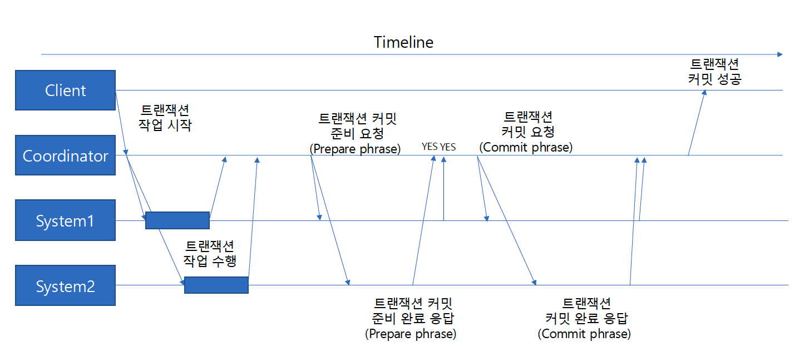
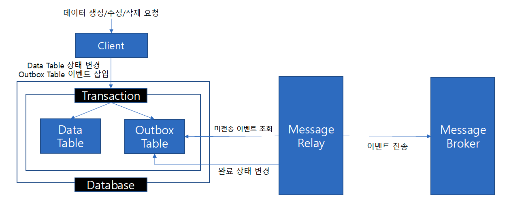
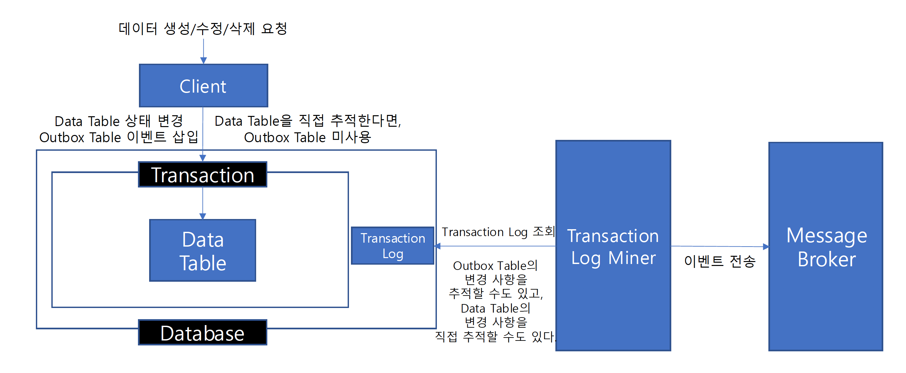

#### 인기글 Producer 설계

#### Transactional Messaging
- consumer에서는 이벤트 수신 시 장애가 발생해도 kafka에 저장된 메시지는 안전하게 보관된다.
- 반면 producer는 장애가 발생하면 메시지가 손실될 수 있다.

- producer는 kafka로의 데이터 전송과 무관하게 정상 동작해야 한다.
- kafka로 데이터 전송이 실패한다고 해서 product에 장애가 전파되면 안되는 것이다.
- 그리고 비즈니스 로직과 이벤트의 데이터 일관성이 깨지게 된다.

- 따라서 비즈니스 로직 수행과 이벤트 전송이 하나의 트랜잭션으로 처리되어야 한다.

``비즈니스 로직은 우선적으로 처리되더라도 이벤트 전송은 장애가 해소된 이후 뒤늦게 처리되어도 충분할 수 있다.
최종적으로 일관성이 유지될 수도 있는 것이다. (Eventually Consistency)``

```markdown
1. Transaction start
2. 비즈니스 로직 수행
3. publishEvent()
4. commit or rollback
```

- 위 코드는 MySQL의 단일 데이터베이스(1개의 샤드)에 대한 트랜잭션이다.
- MySQL과 Kafka는 서로 다른 시스템이기 때문에,
- MySQL의 상태 변경과 Kafka로의 데이터 전송을 MySQL의 트랜잭션 기능을 이용해서 단일 트랜잭션으로 묶을 수 없다.

- 그래서 2개의 다른 시스템에 대한 트랜잭션을 묶는 방법이 필요하다.
  - 즉, 분산 시스템 간에 트랜잭션 관리가 필요하다.

### Distributed Transaction
- 분산 시스템에서 트랜잭션을 보장하기 위한 방법

### Transactional Messaging 방법
- Transactional Messaging을 달성하기 위한 방법
  - Two Phase Commit
  - Transactional Outbox
  - Transaction Log Tailing

### Two Phase Commit
- 분산 시스템에서 모든 시스템이 하나의 트랜잭션을 수행할 때
  - 모든 시스템이 성공적으로 작업을 완료하면 commit
  - 하나라도 실패하면 rollback
- Prepare phase(준비 단계)
  - Coordinator는 각 참여자에게 트랜잭션을 커밋할 준비가 되었는지 물어본다.
  - 각 참여자는 트랜잭션을 커밋할 준비가 되었는지 응답한다.
- Commit phase(커밋 단계)
  - 모든 참여자가 준비 완료 응답을 보내면, Coordinator는 모든 참여자에게 트랜잭션 커밋을 요청한다.
  - 모든 참여자는 트랜잭션을 커밋한다.



- 단점
  - 모든 참여자의 응답을 기다려야 하기 때문에 지연이 길어질 수 있다.
  - coordinator 또는 참여자 장애가 발생하면
    - 참여자들은 현재 상태를 모른 채 대기해야 할 수도 있다.
    - 트랜잭션 복구 처리가 복잡해질 수 있다.

### Transactional Outbox
- 이벤트 전송 작업을 일반적인 데이터베이스 트랜잭션에 포함시킬 수는 없다.
- 하지만 이벤트 전송 정보를 데이터베이스 트랜잭션에 포함하여 기록할 수는 있다.
  - 트랜잭션을 지원하는 데이터베이스에 Outbox 테이블을 생성하고,
  - 서비스 로직 수행과 Outbox 테이블 이벤트 메시지 기록을 단일 트랜잭션으로 묶는다.

```markdown
1. 비즈니스 로직 수행 및 Outbox 테이블에 이벤트 메시지 기록
  1-1. Transaction start
  1-2. 비즈니스 로직 수행
  1-3. Outbox 테이블에 전송 할 이벤트 데이터 기록
  1-4. commit or rollback

2. Outbox 테이블을 이용한 이벤트 전송 처리
  2-1. Outbox 테이블 미전송 이벤트 조회
  2-2. 이벤트 전송
  2-3. Outbox 테이블 전송 완료 처리
```



- Tow Phase Commit의 성능과 오류 처리에 대한 문제가 줄어든다.
- 하지만 추가적인 Outbox 테이블 생성 및 관리가 필요하고,
- Outbox 테이블의 미전송 이벤트를 Message Broker로 전송하는 작업이 필요하다.

### Transaction Log Tailing
- 데이터베이스의 트랜잭션 로그를 추적 및 분석하는 방법
  - 데이터베이스는 각 트랜잭션의 변경 사항을 로그로 기록한다.
  - MySQL binlog, PostgreSQL WAL, SQL Server Transaction Log 등
- 이러한 로그를 읽어서 Message Broker에 이벤트를 전송해볼 수 있다.
  - CDC(Change Data Capture) 기술을 활용하여 데이터의 변경 사항을 다른 시스템에 전송한다.
  - CDC: 데이터 변경 사항을 추적하는 기술

  
- Data Table을 직접 추가하면 Outbox Table은 미사용 할 수도 있다.

### [Transactional Outbox 설계](outbox/README.md)