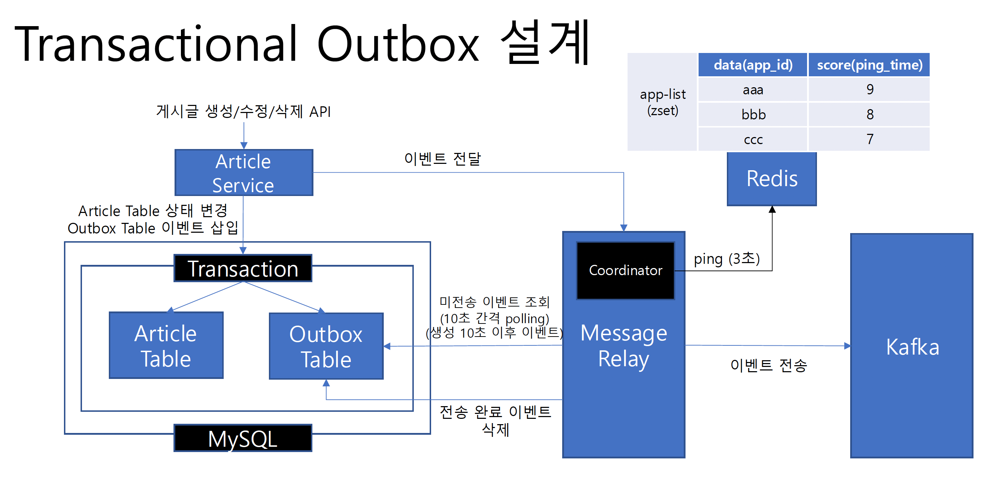

### Transactional Outbox 설계



1. Outbox 테이블 생성
```shell
mysql> create table outbox 
    -> (
    -> outbox_id bigint not null primary key,
    -> shard_key bigint not null,
    -> event_type varchar(100) not null,
    -> payload varchar(5000) not null,
    -> created_at datetime not null
    -> );
```

- 각 database 별로 생성한다.
  - article
  - article_like
  - article_view
  - comment

- shard key의 존재
  - 우리는 샤딩이 고려된 분산 데이터베이스를 사용하고 있다.
  - 트랜잭션을 각 샤드에서 단일 트랜잭션으로 빠르고 안전하게 수행될 수 있다.
  - 여러 shard 간에 분산 트랜잭션을 지원하는 데이터베이스도 있으나, 성능이 다소 떨어진다.
  - Outbox Table에 이벤트 데이터 기록과 비즈니스 로직에 의한 상태 변경이 동일한 shard에서 단일 트랜잭션으로 처리될 수 있도록 한다.

2. 인덱스 생성
```shell
mysql> create index idx_shard_key_created_at on outbox(shard_key asc, created_at asc);
```

- script는 `service/outbox-message-relay/src/main/resources/db/rdb-schema.sql`에 위치