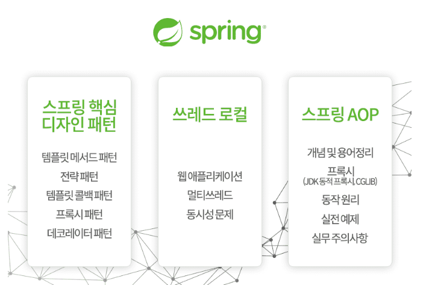

# study-spring-aop

### 스프링 핵심 원리 - 고급편

[인프런 강의 바로가기](https://www.inflearn.com/course/%EC%8A%A4%ED%94%84%EB%A7%81-%ED%95%B5%EC%8B%AC-%EC%9B%90%EB%A6%AC-%EA%B3%A0%EA%B8%89%ED%8E%B8/dashboard)

#### 목차
- 섹션 0. 소개
- 섹션 1. 예제 만들기
- 섹션 2. 쓰레드 로컬 - ThreadLocal
- 섹션 3. 템플릿 메서드 패턴과 콜백 패턴
- 섹션 4. 프록시 패턴과 데코레이터 패턴
- 섹션 5. 동적 프록시 기술
- 섹션 6. 스프링이 지원하는 프록시
- 섹션 7. 빈 후처리기
- 섹션 8. @Aspect AOP
- 섹션 9. 스프링 AOP 개념
- 섹션 10. 스프링 AOP 구현
- 섹션 11. 스프링 AOP - 포인트컷
- 섹션 12. 스프링 AOP - 실전 예제
- 섹션 13. 스프링 AOP - 실무 주의사항
- 섹션 14. 다음으로
