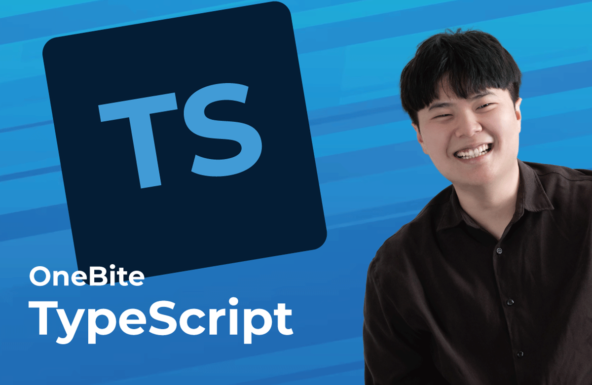
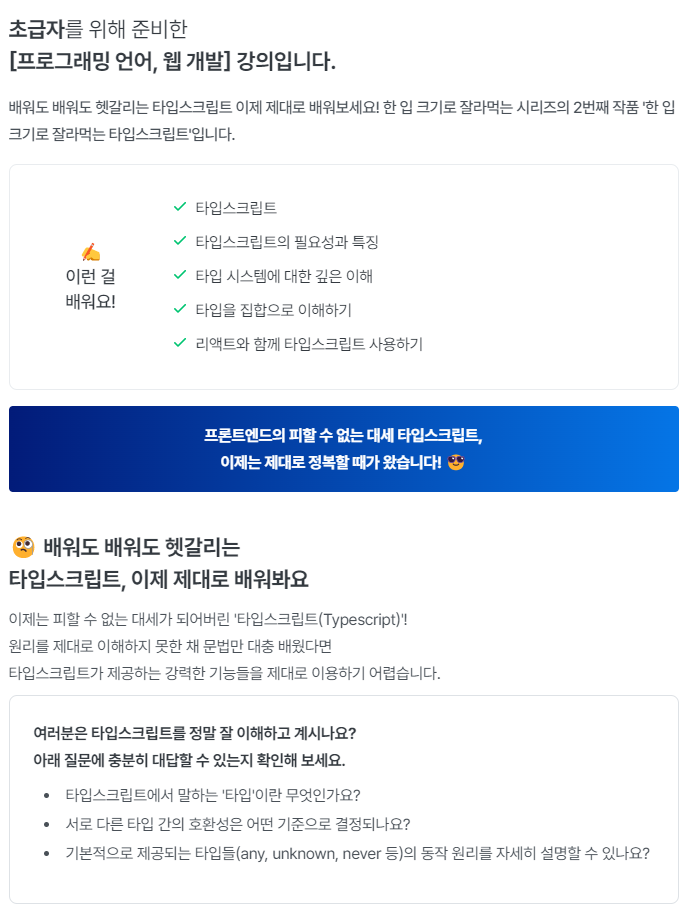

### inflearn-one-bite-typescript

```
이정환(winterlood)님의 인프런 한 입 크기로 잘라먹는 타입스크립트 강의로 학습한 Repository입니다.
핸드북: https://ts.winterlood.com/
```

[인프런 바로가기](https://www.inflearn.com/course/%ED%95%9C%EC%9E%85-%ED%81%AC%EA%B8%B0-%ED%83%80%EC%9E%85%EC%8A%A4%ED%81%AC%EB%A6%BD%ED%8A%B8/dashboard)





### 챕터
- 강의 소개
- 타입스크립트 개론
- 타입스크립트 기본
- 타입스크립트 이해하기
- 함수와 타입
- 인터페이스
- 클래스
- 제네릭
- 타입 조작하기
- 조건부 타입
- 유틸리티 타입
- 보너스) 리액트와 타입스크립트