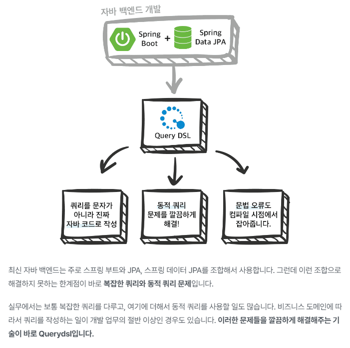

# study-query-dsl

### 실전! Querydsl 

[인프런 강의 바로가기](https://www.inflearn.com/course/Querydsl-%EC%8B%A4%EC%A0%84/dashboard)

#### 목차
- 섹션 0. Querydsl 소개
- 섹션 1. 프로젝트 환경설정
- 섹션 2. 예제 도메인 모델
- 섹션 3. 기본 문법
- 섹션 4. 중급 문법
- 섹션 5. 실무 활용 - 순수 JPA와 Querydsl
- 섹션 6. 실무 활용 - 스프링 데이터 JPA와 Querydsl
- 섹션 7. 스프링 데이터 JPA가 제공하는 Querydsl 기능