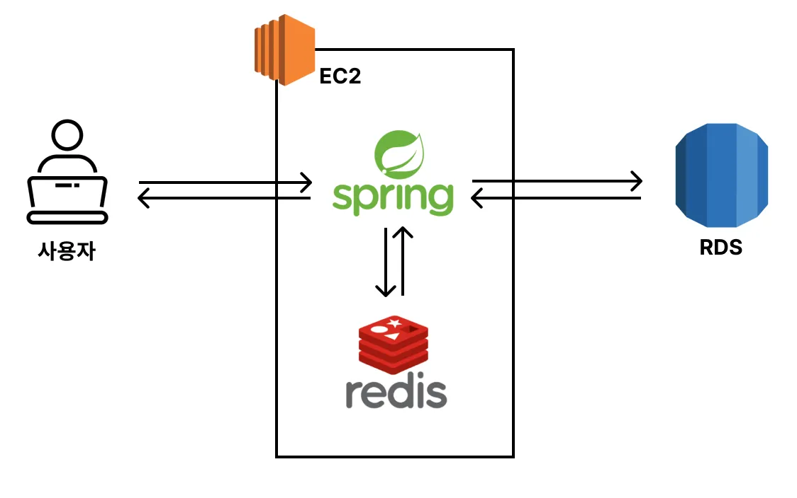

### AWS EC2 환경에서 Redis 적용

- 아키텍처 구성

[AWS EC2에서 Spring Boot / Redis 활용](초기_설정/README.md)

[k6를 사용한 부하테스트](k6_부하테스트/README.md)

[docker compose로 Redis, Spring 같이 구성하기](docker_compose/README.md)

[AWS EC2에서 Docker Compose를 활용해 Redis, Spring Boot 띄워보기](aws_docker_compose/README.md)

[AWS ElastiCache 활용하기](aws_elasticache/README.md)