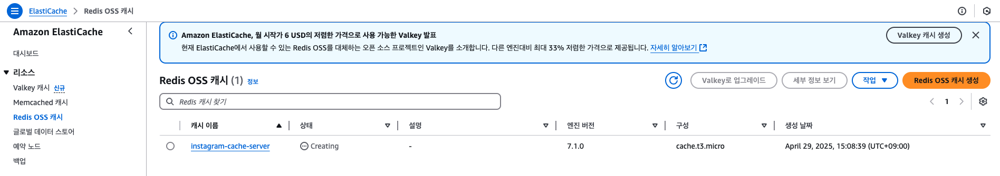
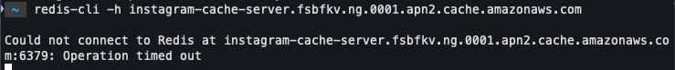

## AWS ElastiCache가 정상적으로 잘 생성됐는 지 확인하기

✅ AWS ElastiCache 생성 확인

1. ElastiCache 대시보드 들어가기


2. ‘기본 엔드포인트’ 주소에서 포트 번호 빼고 복사하기


3. EC2에 들어가서 ElastiCache에 접속해보기
```shell
# redis-cli -h {호스트 주소}
$ redis-cli -h {ElastiCache의 기본 엔드포인트}
```


4. 로컬 환경에서 접속되는 지 테스트해보기

```shell
$ redis-cli -h {ElastiCache의 기본 엔드포인트}
```


`접속이 안 되는 걸 알 수 있다. 왜냐하면 ElastiCache는 같은 VPC일 때만 접속할 수 있기 때문이다. 그럼 EC2와 ElastiCache가 같은 VPC인지 확인해보자. `
