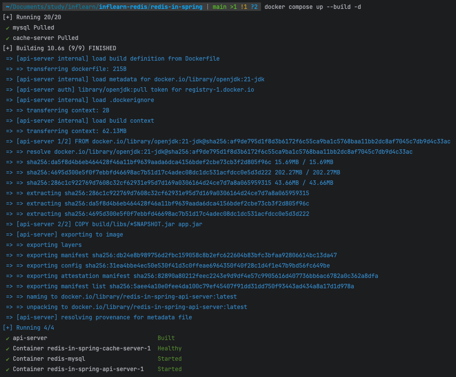

## docker compose로 Redis, Spring 같이 구성하기

### ✅ Dockerfile 작성
```dockerfile
FROM openjdk:21-jdk

COPY build/libs/*SNAPSHOT.jar app.jar

ENTRYPOINT ["java", "-jar", "/app.jar"]
CMD ["--spring.profiles.active=docker"]
```
- Dockerfile 작성 시 경로는 프로젝트 root에 위치해야 합니다.

### ✅ docker-compose.yml 작성
```yaml
services:
  mysql:
    image: mysql:8.0
    container_name: redis-mysql
    ports:
      - "3306:3306"
    environment:
      MYSQL_ROOT_PASSWORD: root
      MYSQL_DATABASE: mydb
      MYSQL_USER: mysql
      MYSQL_PASSWORD: mysql
    volumes:
      - mysql-data:/var/lib/mysql
  api-server:
    build: .
    ports:
      - 8080:8080
    depends_on:
      cache-server:
        condition: service_healthy
  cache-server:
    image: redis
    ports:
      - 6379:6379
    healthcheck:
      test: [ "CMD", "redis-cli", "ping" ]
      interval: 5s
      retries: 10
volumes:
  mysql-data:
```
- docker-compose.yml 작성 시 경로는 프로젝트 root에 위치해야 합니다.

### ✅ application.yml 추가
```yaml
---
# docker 환경
spring:
  config:
    activate:
      on-profile: docker
  datasource:
    url: jdbc:mysql://host.docker.internal:3306/mydb
    username: admin
    password: password
  data:
    redis:
      host: cache-server
      port: 6379
```
- docker 프로필 추가

### ✅ Docker 컨테이너로 실행
```shell
$ ./gradlew clean build -x test
$ docker compose up --build -d

$ docker ps # 잘 띄워졌는 지 확인
$ docker compose logs -f # 실시간 로그 확인하기
```
