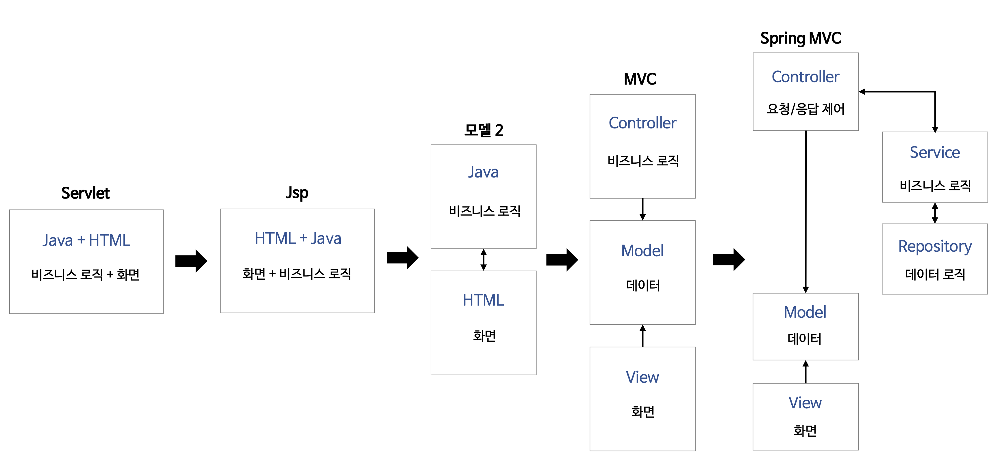

# ☘️ 모델 2 방식 - MVC

---

## 📖 내용

- MVC (Model-View-Controller) 패턴을 따르는 구조로, 서블릿과 JSP를 결합하여 웹 애플리케이션을 개발하는 방식이다.
- 2000년대 초반부터 주류 아키텍처로 자리잡았다.

### MVC 패턴

- Model (Java Bean): 비즈니스 로직과 데이터 관리
- View (JSP): 사용자 인터페이스
- Controller (Servlet): 사용자 요청 처리 및 모델과 뷰 연결

### 특징

- 화면은 JSP가 담당하고 비즈니스 로직은 Servlet이 담당하는 구조로 진화함으로써 코드의 분리가 명확하여 유지보수가 용이하고 확장성이 높아졌다.
- 작은 프로젝트에 비해 구현이 복잡하며 서블릿이나 모델 1에 비해 성능적으로 약간의 오버헤드가 발생할 수 있다.
- MVC 구조에 대한 확실한 이해를 바탕으로 한 전문적인 설계가 필요하며 잘못된 설계는 오히려 유지보수룰 더 어렵게 할 수 있다.

### MVC 기반 요청 프로세스


<sub>※ 이미지 출처: https://encrypted-tbn0.gstatic.com/images?q=tbn:ANd9GcQ-RufvXFbXdm-Fvd-K-kHZ7jG_TB0d0I0qJA&s</sub>

### Servlet vs JSP vs MVC



<sub>※ 이미지 출처: 인프런</sub>

---

## 🔍 중심 로직

```
// View 의 경우 Servlet에서 바로 JSP로 포워딩
@WebServlet(name = "memberRegisterFormController", urlPatterns = "/member/registerForm")
public class MemberRegisterFormServlet extends HttpServlet {
    @Override
    protected void doGet(HttpServletRequest request, HttpServletResponse response)
            throws ServletException, IOException {

        // 뷰(JSP)로 포워딩
        String viewPath = "/WEB-INF/member/registerForm.jsp";
        request.getRequestDispatcher(viewPath).forward(request, response);
    }
}

// registerForm.jsp
<%@ page contentType="text/html; charset=UTF-8" %>
<!DOCTYPE html>
<html>
<head>
<title>Register Form - Model2</title>
</head>
<body>
    <h1>Register Form (Model2)</h1>
    <form action="/member/register" method="post">
    Username: <input type="text" name="username"><br>
    Password: <input type="password" name="password"><br>
        <button type="submit">Register</button>
    </form>
</body>
</html>
```

```
// 비즈니스 처리 담당 Servlet
@WebServlet(name = "memberRegisterController", urlPatterns = "/member/register")
public class MemberRegisterServlet extends HttpServlet {

    private final MemberRepository memberRepository = new MemberRepository();

    @Override
    protected void doPost(HttpServletRequest request, HttpServletResponse response)
            throws ServletException, IOException {

        request.setCharacterEncoding("UTF-8");
        String username = request.getParameter("username");
        String password = request.getParameter("password");

        Member newMember = new Member(username, password);
        memberRepository.save(newMember);

        // 리스트 페이지로 리다이렉트
        response.sendRedirect(request.getContextPath() + "/member/list");
    }
}
```
📌

- JSP 파일을 WEB-INF 폴더에 두어 외부에서 접근할 수 없도록 설정한다.

---

## 💬 코멘트

---
