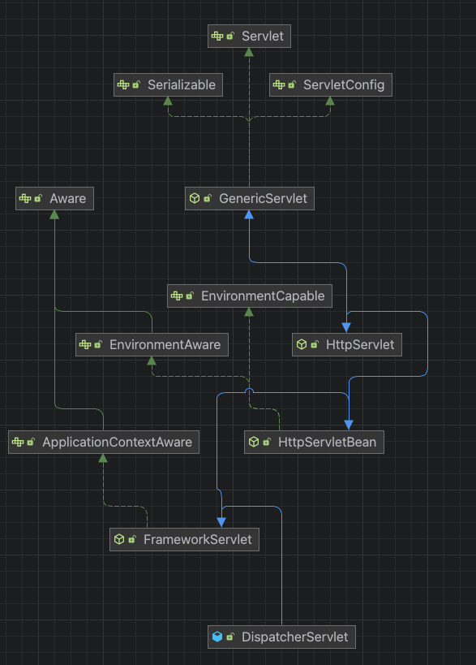
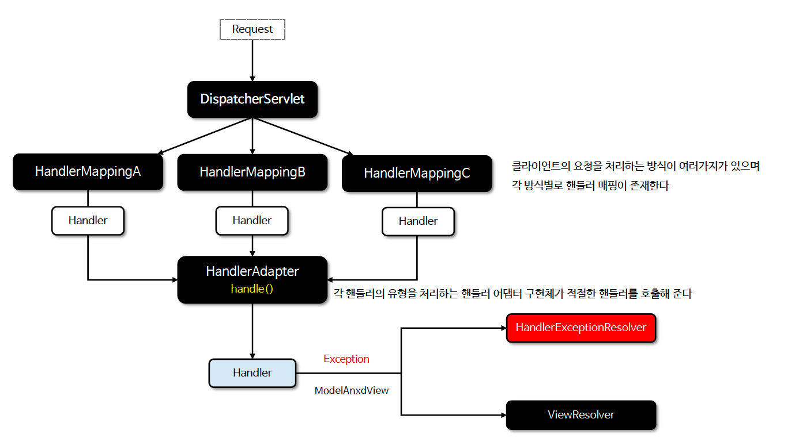

# ☘️ DispatcherServlet 개요

---

## 📖 내용

- DispatcherServlet은 스프링 MVC의 핵심 프론트 컨트롤러로 모든 HTTP 요청을 중앙에서 받아 처리하는 역할을 한다.
- DispatcherServlet은 요청을 적절한 핸들러(일반적으로 컨트롤러)로 라우팅하고 요청 처리 후에는 적절한 뷰를 선택하여 응답을 반환한다.
- DispatcherServlet은 핸들러 매핑, 뷰, 리졸버, 인터셉터 등을 조정하여 요청 처리 흐름을 관리하고 스프링 MVC 애플리케이션에서 중심적인 역할을 수행한다.
- DispatcherServlet은 서블릿 컨테이너에 등록되는 서블릿인 동시에 스프링 컨테이너에 빈으로도 등록된다.



<sub>※ 이미지 출처: 인프런</sub>

---

### 핵심 클래스들

| 유형                                    | 설명                                                                                                     |
|---------------------------------------|--------------------------------------------------------------------------------------------------------|
| HandlerMapping                        | 클라이언트 요청을 적절한 핸들러(컨트롤러 등)와 매핑하고, 이 과정에서 요청 전후에 실행할 인터셉터 목록도 함께 관리한다.                                   |
| HandlerAdapter                        | DispatcherServlet가 요청에 매핑된 핸들러를 호출할 때 핸들러의 호출 방식에 관계없이 일관되게 동작할 수 있도록 처리한다.                            |
| HandlerExceptionResolver              | 예외가 발생했을 때 이를 적절하게 처리하는 전략을 제공한다.<br/>예를 들어, 특정 핸들러로 예외를 전달하거나 오류 페이지를 보여주는 방식으로 처리할 수 있다.             |
| ViewResolver                          | 컨트롤러가 반환한 뷰 이름을 실제 뷰 (jsp, thymeleaf)로 변환하여 응답으로 렌더링할 수 있도록 한다.                                        |
| LocaleResolver, LocaleContextResolver | 사용자가 요청한 언어와 지역 설정 (로케일)을 해석하여 이 정보에 맞는 국제화된 뷰를 제공할 수 있게 한다. (다국어처리)                                   |
| MultipartResolver                     | 브라우저에서 파일 업로드와 같은 멀티파트 요청을 처리한다.                                                                       |
| FlashMapManager                       | 리다이렉션 후에 속성을 전달할 수 있도록 데이터를 임시로 저장하고 전달하는 역할을 한다. <br/>예를 들어, 폼 제출 후 리다이렉션된 페이지에서 메시지를 보여줄 때 사용할 수 있다. |


---

### 핵심 클래스 흐름도


<sub>※ 이미지 출처: 인프런</sub>

---

## 🔍 중심 로직

```java
```

📌

---

## 💬 코멘트

---
