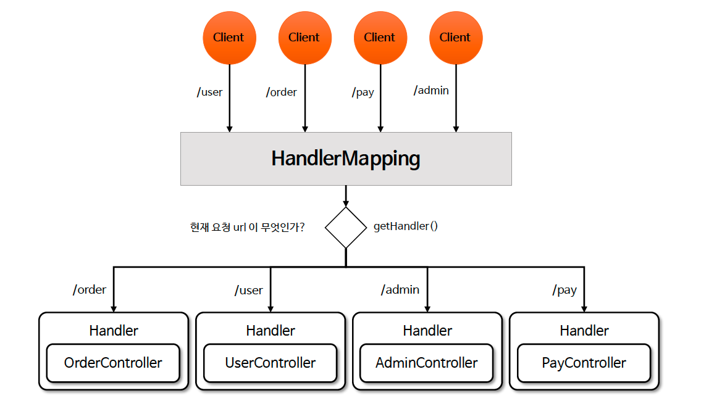

# ☘️ HandlerMapping 이해

---

## 📖 내용

- HandlerMapping 은 요청 URL과 이를 처리할 핸들러(Handler, 일반적으로 Controller)를 매핑하는 인터페이스이다
- 클라이언트 요청이 들어오면 DispatcherServlet 은 등록된 모든 HandlerMapping 구현체를 탐색하여 적합한 핸들러를 찾아 반환하고 이후 적절한 HandlerAdapter 를 통해 실행한다
- HandlerMapping 은 핸들러를 검색해서 찾는 역할만 할 뿐 핸들러를 실행하지는 않는다. 핸들러 실행은 HandlerAdapter 가 담당한다


- `BeanNameUrlHandlerMapping`
  - 빈 이름을 url로 매핑합니다.
  - 현재는 잘 사용하지 않는 방식
- `RequestMappingHandlerMapping`
  - 가장 우선순위가 높고 대부분 이 방식을 사용
  - `@RequestMapping`, `@GetMapping`과 같은 애노테이션을 기반으로 URL과 핸들러를 매핑한다.
- `SimpleUrlHandlerMapping`
  - 명시적으로 URL과 패턴을 핸들러와 매핑하는 방식으로서 간단한 URL 매핑에 사용된다.

---

### HandlerMapping 설계 의도
- DispatcherServlet 은 수 많은 요청들을 핸들러를 통해서 처리하는데 현재 요청이 어떤 핸들러에 의해 처리될 것인지 결정해서 DispatcherServlet 에게 알려 주어야 한다
- HandlerMapping 은 클라이언트의 요청 Url 정보를 분석해서 해당 Url 과 매핑이 되어 있는 핸들러를 결정한다


<sub>※ 이미지 출처: 인프런</sub>

---

### Handler 구현 방식

- `@Controller`, `@RestController`
  - @Controller 는 Spring MVC 에서 가장 널리 사용되는 요청 처리 방식으로서 클래스에 @Controller 를 붙이고 메서드에 @RequestMapping 과 같은 어노테이션을 사용하여 요청을 처리한다
```java
@Controller
public class ExampleController {
  @RequestMapping(value = "/hello", method = RequestMethod.GET)
  public String hello(Model model) {
      // ...   
  }
}
```

- `Controller` 인터페이스
  - Spring 2.5 이전에 사용되던 요청 처리 방식으로서 Controller 인터페이스를 구현하여 요청을 처리한다
```java
public class ExampleController implements Controller {
    @Override
    public ModelAndView handleRequest(HttpServletRequest request, HttpServletResponse response) throws Exception {
        // ...
    }
}
```

- `HttpRequestHandler`
  - HttpRequestHandler 인터페이스를 구현하여 요청을 처리하는 방식으로서 Spring의 가장 저수준 API 중 하나로 서블릿에 가까운 형태로 동작한다
```java
public class ExampleHttpRequestHandler implements HttpRequestHandler {
  @Override
  public void handleRequest(HttpServletRequest request, HttpServletResponse response) throws IOException {
      // ...
  }
}
```

---

## 🔍 중심 로직

```java
package org.springframework.web.servlet;

...

public interface HandlerMapping {

	String BEST_MATCHING_HANDLER_ATTRIBUTE = HandlerMapping.class.getName() + ".bestMatchingHandler";

	@Deprecated
	String LOOKUP_PATH = HandlerMapping.class.getName() + ".lookupPath";

	String PATH_WITHIN_HANDLER_MAPPING_ATTRIBUTE = HandlerMapping.class.getName() + ".pathWithinHandlerMapping";

	String BEST_MATCHING_PATTERN_ATTRIBUTE = HandlerMapping.class.getName() + ".bestMatchingPattern";

	String INTROSPECT_TYPE_LEVEL_MAPPING = HandlerMapping.class.getName() + ".introspectTypeLevelMapping";

	String URI_TEMPLATE_VARIABLES_ATTRIBUTE = HandlerMapping.class.getName() + ".uriTemplateVariables";

	String MATRIX_VARIABLES_ATTRIBUTE = HandlerMapping.class.getName() + ".matrixVariables";

	String PRODUCIBLE_MEDIA_TYPES_ATTRIBUTE = HandlerMapping.class.getName() + ".producibleMediaTypes";
    
	default boolean usesPathPatterns() {
		return false;
	}
    
	@Nullable
	HandlerExecutionChain getHandler(HttpServletRequest request) throws Exception;

}
```

```java
// 대표적인 구현체들
org.springframework.web.servlet.handler.BeanNameUrlHandlerMapping
org.springframework.web.servlet.handlerSimpleUrlHandlerMapping
org.springframework.web.servlet.mvc.method.annotation.RequestMappingHandlerMapping
```

📌

---

## 💬 코멘트

---
