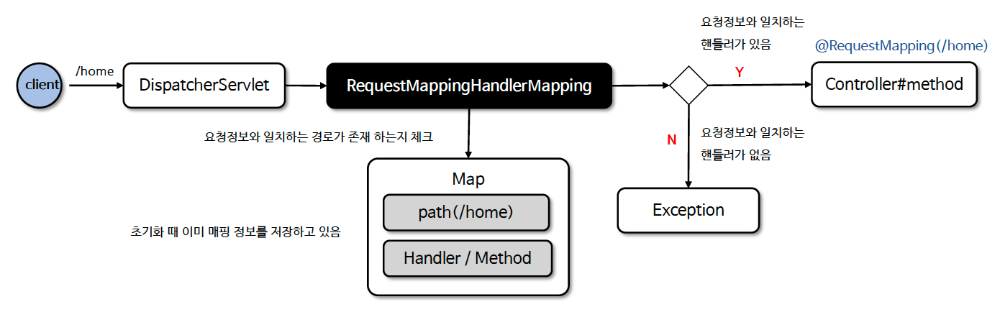

# ☘️ @RequestMapping (1) ~ (2)

---

## 📖 내용

- @RequestMapping 은 특정 URL 경로에 대한 요청을 처리할 메서드를 매핑하는 데 사용되는 어노테이션이다
- @RequestMapping 은 @Controller 및 @RestController 로 선언된 클래스에서 사용되며 내부적으로 RequestMappingHandlerMapping 클래스가 처리하고 있다


- `consumes`
  - 클라이언트가 서버로 전송하는 데이터의 형식을 제한한다
  - 클라이언트에서 Content-Type: application/json 헤더를 지정하고 스프링에서 consumes = "application/json“ 으로 설정하면 해당 메서드는 JSON 형식의 데이터를 처리할 수 있다


- `produces`
  - 클라이언트가 서버에 요청을 보낼 때 서버가 어떤 형식의 데이터를 반환할지를 지정한다
  - 클라이언트가 Accept: application/json 헤더를 지정하고 스프링에서 produces = "application/json“ 으로 설정하면 해당 메서드는 JSON 형식의 응답을 반환한다

---

### HTTP Content-Type / Accept 헤더 이해

- consumes 속성과 Content-Type 헤더
  - `일치할 경우`
    - 서버의 consumes 속성에 정의된 미디어 타입이 클라이언트의 Content-Type 헤더와 일치하는 경우 서버는 해당 요청을 정상적으로 처리한다.
    - consumes 속성은 서버가 수락할 수 있는 요청의 미디어 타입을 지정하며, 클라이언트는 그 형식으로 데이터를 서버에 전송해야 한다
  - `일치하지 않을 경우`
    - 만약 클라이언트가 전송한 요청의 Content-Type 헤더가 서버의 consumes 속성에 정의된 형식과 일치하지 않으면 서버는 
    - HTTP 415 (Unsupported Media Type) 상태 코드를 반환할 수 있으며 이 상태 코드는 서버가 클라이언트가 보낸 데이터 형식을 처리할 수 없음을 나타낸다.
  - `consumes 속성 미지정`
    - 만약 서버에서 consumes 속성을 지정하지 않았다면, 서버는 기본적으로 요청을 처리할 수 있는 미디어 타입에 대해 특별한 제한을 두지 않지만
    - 클라이언트의 Content-Type 헤더와 서버의 처리 능력이 일치하지 않으면, 요청이 처리되지 않을 수 있다


- produces 속성과 Accept 헤더
  - `일치할 경우`
    - 서버의 produces 속성에 정의된 미디어 타입이 클라이언트의 Accept 헤더와 일치하는 경우, 서버는 해당 미디어 타입으로 응답을 생성한다
  - `일치하지 않을 경우`
    - 만약 produces 속성에 정의된 미디어 타입이 클라이언트의 Accept 헤더와 일치하지 않으면, 
    - 서버는 HTTP 406 (Not Acceptable) 상태 코드를 반환할 수 있으며 이 상태 코드는 서버가 클라이언트가 요청한 형식으로 응답을 생성할 수 없음을 나타낸다
  - `produces 속성 미지정`
    - 만약 서버에서 produces 속성을 지정하지 않았다면, 서버는 클라이언트의 Accept 헤더와 일치하는 미디어 타입으로 응답을 생성하려고 시도하며 
    - 이 경우 클라이언트가 요청한 형식과 서버가 반환할 수 있는 형식이 일치하면 그 형식으로 응답을 생성한다

---

### RequestMappingHandlerMapping
- RequestMappingHandlerMapping 은 @RequestMapping 이 선언된 핸들러와 URL 경로를 매핑하고 검색하는 기능을 제공한다
  - RequestMappingHandlerMapping 은 스프링 부트의 초기화 과정에서 @RequestMapping 이 선언된 모든 핸들러를 검사하고 검사 결과 해당 핸들러와 URL 경로를 매핑하여 저장소에 저장한다
  - 클라이언트 요청이 들어오면 매핑 저장소로부터 URL 패턴과 일치하는 핸들러를 검색하고 적합한 핸들러를 찾아 반환한다


<sub>※ 이미지 출처: 인프런</sub>

---

## 🔍 중심 로직

```java
package org.springframework.web.bind.annotation;

...

@Target({ElementType.TYPE, ElementType.METHOD})
@Retention(RetentionPolicy.RUNTIME)
@Documented
@Mapping
@Reflective(ControllerMappingReflectiveProcessor.class)
public @interface RequestMapping {

	String name() default "";

	@AliasFor("path")
	String[] value() default {};

	@AliasFor("value")
	String[] path() default {};

	RequestMethod[] method() default {};

	String[] params() default {};

	String[] headers() default {};

	String[] consumes() default {};

	String[] produces() default {};

}
```

- Param 매핑
  - parameter 값에 따라서 다른 API를 호출한다.
```java
@RestController
public class OrderController {
    // http://localhost:8080/order?type=pizza
    @RequestMapping(value="/order", params="type=pizza")
    public String order1() {
        return "pizza";
    }

    // http://localhost:8080/order?type=chicken
    @RequestMapping(value="/order", params="type=chicken")
    public String order2() {
        return "chicken";
    }
}
```

📌

---

## 💬 코멘트

---
