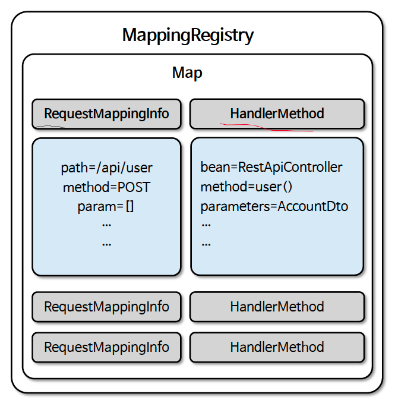

# ☘️ @RequestMapping 원리 이해 (1) ~ (2)

---

## 📖 내용

- RequestMappingHandlerMapping 클래스의 실행 구조 및 클라이언트의 요청을 어떻게 매핑하고 있는지 내부 클래스들을 분석함으로서 스프링 MVC 의 내부 흐름을 더 깊이 이해하고 개발적 관점에서의 인사이트를 넓혀 갈수 있다

---

### 핵심 클래스

- `RequestMappingHandlerMapping`
  - @RequestMapping 이 선언된 모든 핸들러를 검사하고 해당 핸들러와 URL 경로를 매핑하여 저장소에 저장한다
  - 요청이 들어오면 매핑 저장소로부터 URL 패턴과 일치하는 핸들러를 검색하고 적합한 핸들러를 찾아 반환한다
- `HandlerMethod`
  - 핸들러 객체로서 최종 호출할 컨트롤러와 메서드 정보를 포함하고 있다
  - 메서드의 매개변수, 반환 값, 메서드에 정의된 어노테이션 등에 쉽게 접근할 수 있는 기능을 제공한다
- `RequestMappingInfo`
  - @RequestMapping 에 선언된 여러 속성들의 값들을 추출해서 가지고 있는 객체
- `MappingRegistry`
  - 모든 HandlerMethod 및 매핑된 경로를 저장하고 관리하는 클래스로서 요청을 처리할 핸들러를 조회할 수 있다
- `HandlerExecutionChain`
  - HandlerMethod 와 HandlerInterceptor 를 포함하고 있으며 HandlerAdapter 에게 전달된다

---

## 🔍 중심 로직

```java
class MappingRegistry {
  private final Map<T, MappingRegistration<T>> registry = new HashMap<>();
  ...
}
```



<sub>※ 이미지 출처: 인프런</sub>

📌

---

## 💬 코멘트

---
