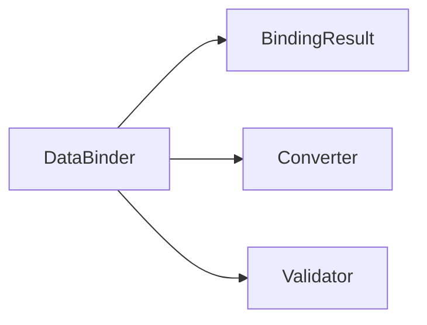
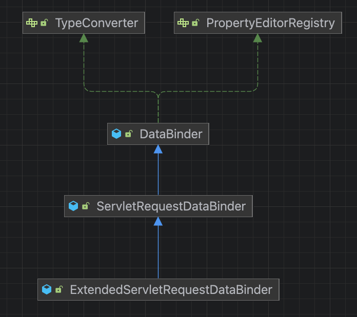
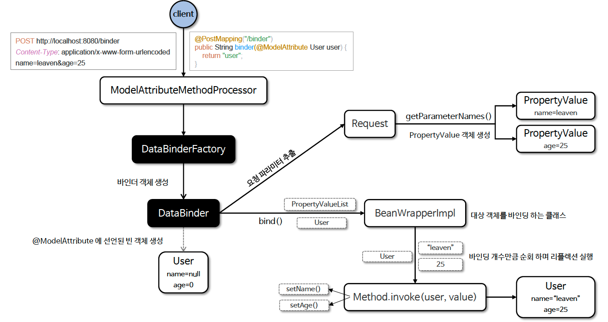

# ☘️ 바인딩 - DataBinder (1) ~ (2)

---

## 📖 내용

- HTTP 요청에 대한 데이터 바인딩 방식은 크게 두 가지로 구분할 수 있는데 바로 쿼리 파라미터 및 폼 데이터 바인딩과 HTTP 본문 데이터 바인딩이다

---

### 데이터 바인딩 분류

- 쿼리 파라미터 및 폼 데이터 바인딩
  - 기본형, 문자열, 래퍼 클래스
    - @RequestParam 적용하여 RequestParamMethodArgumentResolver 가 요청 처리
    - @PathVariable 적용하여 PathVariableMethodArgumentResolver 가 적용 처리
  - **객체 : @ModelAtrribute 적용하여 ServletModelAttributeMethodProcessor 가 요청 처리**
    - DataBinder 를 사용하여 객체의 필드에 값을 바인딩한다
- HTTP 본문 바인딩
  - Text, JSON : @RequestBody 적용하여 RequestResponseBodyMethodProcessor 와 HttpMessageConverter 가요청 처리

---

### DataBinder vs HttpMessageConverter

| DataBinder                             | HttpMessageConverter                                             |
|----------------------------------------|------------------------------------------------------------------|
| 웹 요청 파라미터를 객체에 바인딩                     | HTTP 요청/응답 본문을 객체로 변환하거나 객체를 HTTP 본문으로 변환                        |
| 주로 폼 데이터(key-value), 쿼리 스트링, URL 패스 변수 | JSON, XML, Plain Text, Binary 등 HTTP 본문 데이터                      |
| 메서드의 파라미터에서 @ModelAttribute 을 선언해서 사용  | @RequestBody, @ResponseBody, HttpEntity, ResponseEntity 등과 함께 사용 |
| 바인딩에 필요한 타입변환과 검증 과정을 거침               | 본문 변환 후 검증 과정만 거침                                                |


---

### DataBinder
- Spring 의 DataBinder 는 크게 3 가지 특징을 가지고 있는데 바로 HTTP 요청 파라미터를 객체에 바인딩 하고 타입변환 과정 및 유효성 검증을 진행하는 것이다



- BindingResult
  - 데이터 바인딩 - 요청 파라미터를 모델 객체의 속성에 자동으로 할당
- Converter
  - 타입 변환 – 클라이언트의 요청 문자열로 전달된 데이터를 적절한 형식(예: 날짜, 숫자)으로 변환
- Validator
  - 유효성 검증 - 데이터가 유효한지 확인하고, 유효성 검사 오류를 기록

---

### 계층도



---

### 흐름도


<sub>※ 이미지 출처: 인프런</sub>

---

## 🔍 중심 로직

```java
package org.springframework.web.bind.support;

// imports

public interface WebDataBinderFactory {

	WebDataBinder createBinder(NativeWebRequest webRequest, @Nullable Object target, String objectName)
			throws Exception;

	default WebDataBinder createBinder(
			NativeWebRequest webRequest, @Nullable Object target, String objectName,
			ResolvableType targetType) throws Exception {

		return createBinder(webRequest, target, objectName);
	}
    
}
```

📌

---

## 💬 코멘트

---
