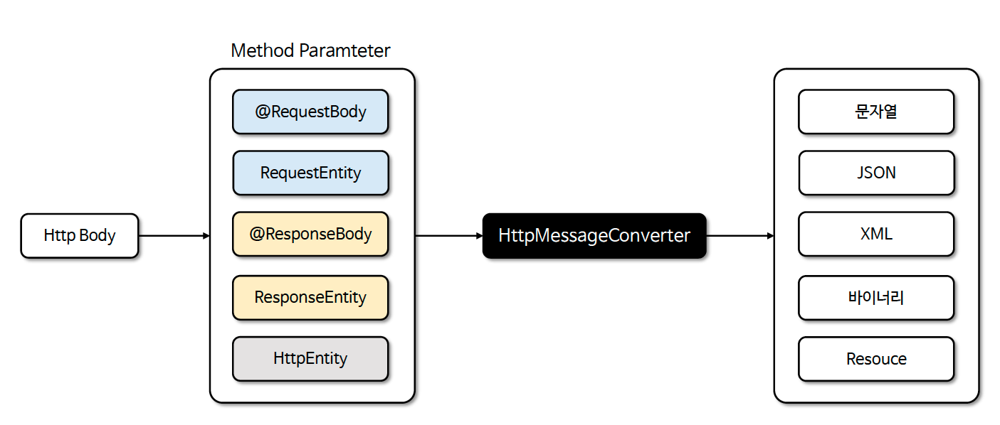
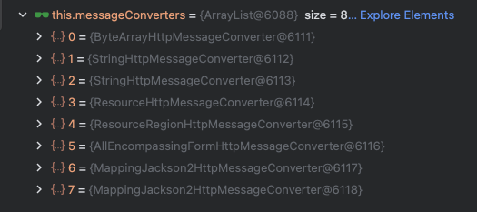
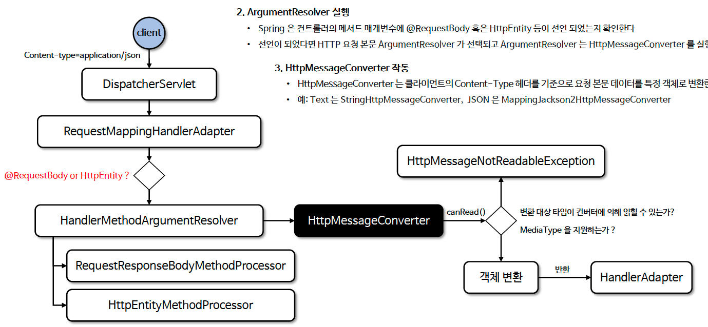
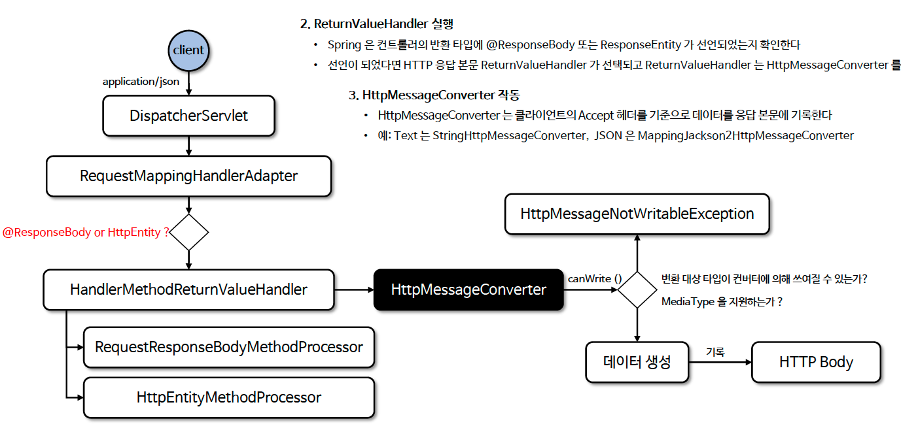
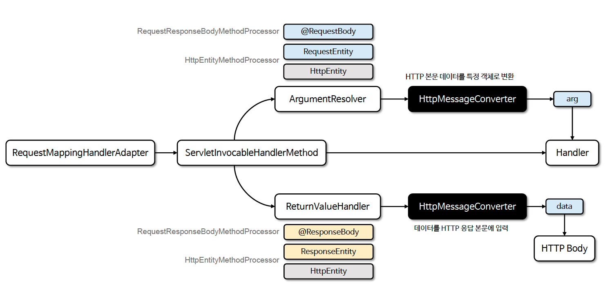

# ☘️ HttpMessageConverter (1) ~ (2)

---

## 📖 내용

- HttpMessageConverter 는 HTTP 요청과 응답의 바디(body) 내용을 객체로 변환하고 객체를 HTTP 메시지로 변환하는 데 사용되는 인터페이스이다
- HttpMessageConverter 는 클라이언트와 서버 간의 데이터를 직렬화/역직렬화하는 기능을 담당하며 주로 JSON, XML, Plain Text와 같은 다양한 데이터 포맷을 지원한다
- HttpMessageConverter 는 주로 Rest API 통신에서 사용된다


<sub>※ 이미지 출처: 인프런</sub>

---

### 기본으로 제공되는 HttpMessageConverter 구현체



- [Http Message Converters](https://www.baeldung.com/spring-httpmessageconverter-rest)

---

### 주요 HttpMessageConverter 구현체

1. ByteArrayHttpMessageConverter
   - application/octet-stream 과 같은 바이너리 데이터를 처리하며주로 파일 전송에 사용된다
2. StringHttpMessageConverter
   - text/plain 과 같은 문자열데이터를 String 객체로 변환하거나 String 객체를 text/plain 형식으로 변환하여 HTTP 본문에 넣는다
3. ResourceHttpMessageConverter
   - Resource 타입의 데이터를 HTTP 요청과 응답으로 변환하거나 처리하는 데 사용된다
4. ***MappingJackson2HttpMessageConverter*** (가장 많이 사용됨)
   - application/json 형식의 데이터를 파싱하여 Java 객체를 JSON으로 변환하거나 JSON을 Java 객체로 변환한다
5. FormHttpMessageConverter
   - MultiValueMap + application/x-www-form-urlencoded 형식의 데이터를 파싱하여 MultiValueMap 형태로 변환한다

---

### HttpMessageConverter 요청 처리 흐름
1. 클라이언트의 Content-Type 헤더
2. ArgumentResolver 실행
   - Spring 은 컨트롤러의 메서드 매개변수에 @RequestBody 혹은 HttpEntity 등이 선언 되었는지 확인한다
   - 선언이 되었다면 HTTP 요청 본문 ArgumentResolver 가 선택되고 ArgumentResolver 는 HttpMessageConverter 를 실행한다
3. HttpMessageConverter 작동
   - HttpMessageConverter 는 클라이언트의 Content-Type 헤더를 기준으로 요청 본문 데이터를 특정 객체로 변환한다
   - 예: Text 는 StringHttpMessageConverter, JSON 은 MappingJackson2HttpMessageConverter


<sub>※ 이미지 출처: 인프런</sub>

---

### HttpMessageConverter 응답 처리 흐름
1. 클라이언트의 Accept 헤더
   - 클라이언트는 Accept 헤더를 통해 서버가 어떤 형식의 데이터를 반환해야 하는지 명시한다
   - 예: Accept: application/json, Accept: application/xml
2. ReturnValueHandler 실행
   - Spring 은 컨트롤러의 반환 타입에 @ResponseBody 또는 ResponseEntity 가 선언되었는지 확인한다
   - 선언이 되었다면 HTTP 응답 본문 ReturnValueHandler 가 선택되고 ReturnValueHandler 는 HttpMessageConverter 를 실행한다
3. HttpMessageConverter 작동
   - HttpMessageConverter 는 클라이언트의 Accept 헤더를 기준으로 데이터를 응답 본문에 기록한다
   - 예: Text 는 StringHttpMessageConverter, JSON 은 MappingJackson2HttpMessageConverter


<sub>※ 이미지 출처: 인프런</sub>

---

### ### HttpMessageConverter 응답 처리 흐름

<sub>※ 이미지 출처: 인프런</sub>

---

### HttpMessageConverter 가 작동하지 않는 요청

1. GET 요청과 같은 본문이 없는 요청
   - GET, DELETE와 같은 HTTP 메서드는 일반적으로 본문을 포함하지 않으므로 HttpMessageConverter가 작동하지 않는다
2. Content-Type 헤더가 지원되지 않는 요청
   - POST, PUT 등의 본문이 포함된 HTTP 요청이라도Content-Type 헤더가지원되지 않는 미디어 타입일 경우 HttpMessageConverter가 작동하지 않는다
3. @RequestParam, @ModelAttribute 를 사용하는 경우
   - @RequestParam, @ModelAttribute 와 같은 어노테이션을 사용하여 쿼리 파라미터나 application/x-www-form-urlencoded 형식의 폼 데이터를 처리하는 경우HttpMessageConverter 가 필요하지 않다
4. 파일 업로드 요청 중 @RequestPart 또는 MultipartFile을 사용한 경우
   - multipart/form-data 요청에서 파일을 업로드할 때, MultipartFile 이나 @RequestPart 를 사용하면 HttpMessageConverter 가 작동하지 않으며 이 경우에는MultipartResolver 가 요청을 처리한다
5. 컨트롤러에서 단순 문자열(String) 반환 시@ResponseBody나 @RestController가 없는 경우
   - 컨트롤러 메서드가 String 을 반환하지만 @ResponseBody나 @RestController가 없는 경우반환된 String은 뷰 이름으로 간주되며 이 경우에는 ViewResolver 가 요청을 처리한다

---

## 🔍 중심 로직

```java
package org.springframework.http.converter;

// imports

public interface HttpMessageConverter<T> {

	boolean canRead(Class<?> clazz, @Nullable MediaType mediaType);

	boolean canWrite(Class<?> clazz, @Nullable MediaType mediaType);

	List<MediaType> getSupportedMediaTypes();

	default List<MediaType> getSupportedMediaTypes(Class<?> clazz) {
		return (canRead(clazz, null) || canWrite(clazz, null) ?
				getSupportedMediaTypes() : Collections.emptyList());
	}

	T read(Class<? extends T> clazz, HttpInputMessage inputMessage)
			throws IOException, HttpMessageNotReadableException;

	void write(T t, @Nullable MediaType contentType, HttpOutputMessage outputMessage)
			throws IOException, HttpMessageNotWritableException;

}
```

📌

---

## 💬 코멘트

---
