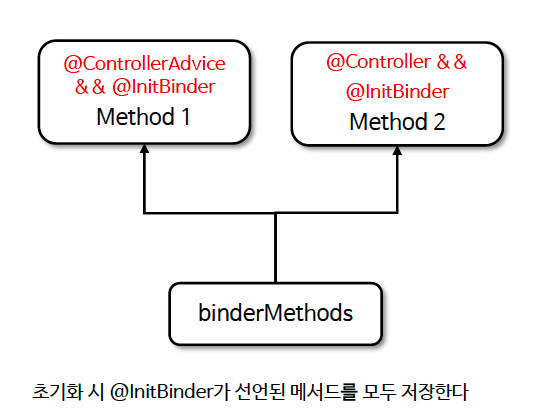
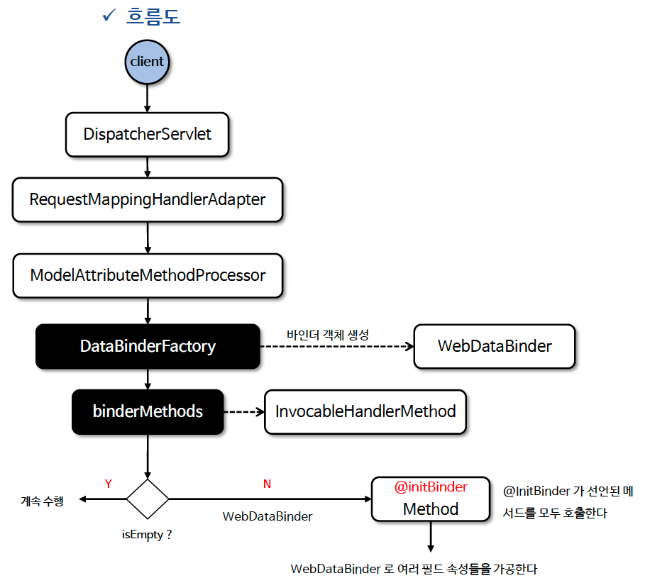

# ☘️ @InitBinder

---

## 📖 내용

- @InitBinder 는 요청 파라미터를 객체의 속성에 바인딩할 때 데이터 바인딩 설정을 커스터마이징 하기 위한 어노테이션이다 (날짜형식,숫자 형식 등을 지정)
  - @Controller에서 @InitBinder를 사용하면 해당 컨트롤러 내에서만 적용
  - @ControllerAdvice 와 함께 사용하면 모든 컨트롤러에 적용
- @InitBinder 는 커스텀 유효성 검증기를 등록하여 검증 시 사용할 수 있다
- 데이터 바인딩 시 외부 클라이언트가 필드를 임의로 설정하지 못하도록 allowedFields 나 disallowedFields 설정을 통해 허용 또는 차단할 필드를 지정할 수 있다
- @InitBinder 를 사용하여 PropertyEditor 또는 Formatter 를 등록할 수 있다. 이를 통해 일반적인 데이터 변환 외에 복잡한 데이터 변환 규칙을 적용할 수 있다

---

### 메서드 선언
- @InitBinder 메서드는 보통 WebDataBinder 인수를 가지며, 리턴 값이 없는 void 타입이다
```java
@InitBinder
public void initBinder(WebDataBinder binder) {
    SimpleDateFormat dateFormat = new SimpleDateFormat("yyyy-MM-dd");
    dateFormat.setLenient(false); //엄격한 검사를 실행하도록 설정함
    binder.registerCustomEditor(Date.class, new CustomDateEditor(dateFormat, false));

    // username과 email 필드만 바인딩 허용
    binder.setAllowedFields("username", "email");
    // password 필드는 바인딩을 차단
    // binder.setDisallowedFields("password");

    // username과 email 필드는 필수
    // 누락시 바인딩 오류 발생
    binder.setRequiredFields("username", "email");
}
```

---

### @ControllerAdvice
- @ControllerAdvice 에 @InitBinder 를 선언하면 모든 컨트롤러에서 전역적으로 데이터 바인딩 설정이 적용된다

---

### 초기화


<sub>※ 이미지 출처: 인프런</sub>

---

### 흐름도


<sub>※ 이미지 출처: 인프런</sub>

---

## 🔍 중심 로직

```java
package org.springframework.web.bind.annotation;

// imports

@Target({ElementType.METHOD})
@Retention(RetentionPolicy.RUNTIME)
@Documented
@Reflective
public @interface InitBinder {

	String[] value() default {};

}
```

📌

---

## 💬 코멘트

---
