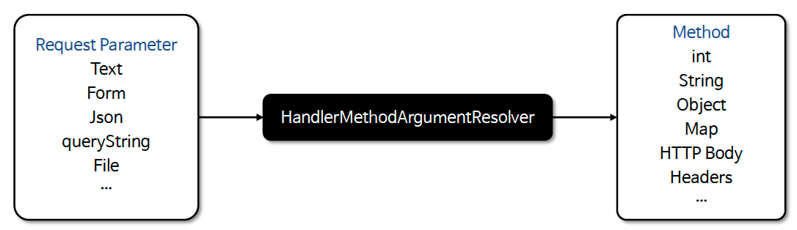
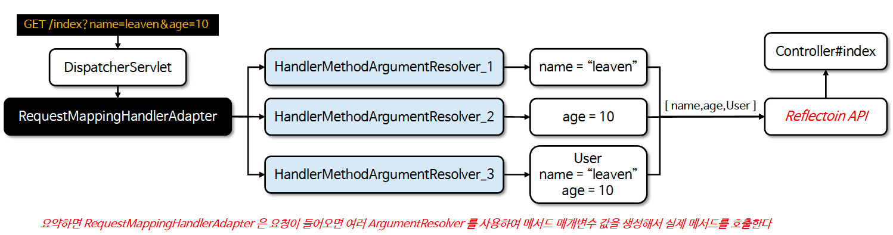
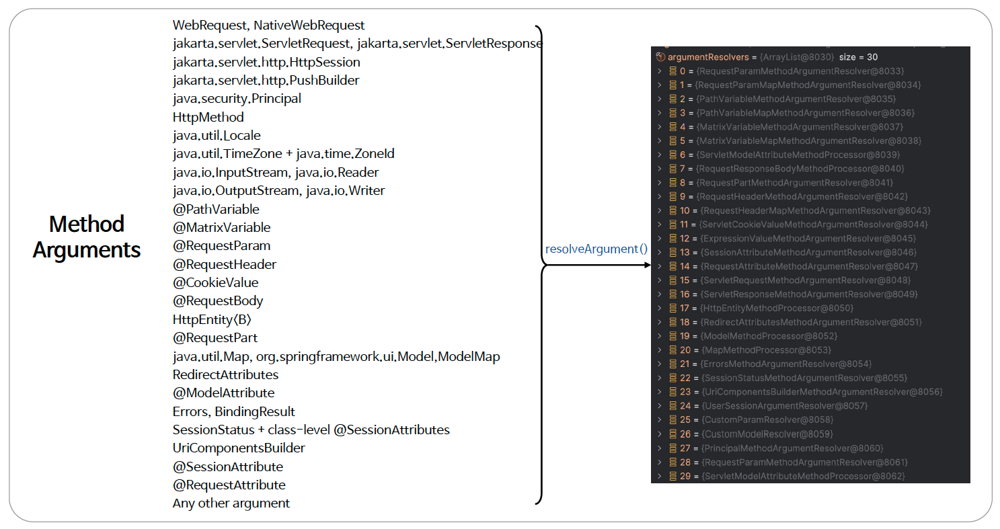

# ☘️ Method Arguments

---

## 📖 내용

- 스프링의 메서드 매개변수(Method Arguments)는 컨트롤러 메서드에서 HTTP 요청 데이터를 직접 접근하고 처리할 수 있도록 다양한 매개변수를 지원한다
- 요청의 URL, 헤더, 본문, 쿠키, 세션 데이터 등과 같은 정보를 자동으로 매핑하여 개발자가 이를 쉽게 활용할 수 있도록 제공한다

---

### 핵심 클래스
- `HandlerMethodArgumentResolver`
  - HTTP 요청과 관련된 데이터를 컨트롤러 메서드의 파라미터로 변환하는 작업을 담당하는 클래스이다
  - 다양한 유형의 파라미터 (예: @RequestParam, @PathVariable, @RequestBody 등)를 처리하기 위해 여러 HandlerMethodArgumentResolver 기본 구현체를 제공한다
  - 개발자가 필요에 따라 HandlerMethodArgumentResolver 인터페이스를 직접 구현할 수 있다


<sub>※ 이미지 출처: 인프런</sub>

---

### HandlerMethodArgumentResolver 설계 의도

- 메소드 호출은 최소 2가지가 만족되어야 한다.
- 클래스와 호출 메서드의 시그니처 정보
  - 스프링은 HandlerMapping 을 통해 매핑한 핸들러에 RestApiController 와 public String index(String name, String age, User user) 와 같은 정보를 저장한다
- 메서드 매개변수 개수만큼 각 타입별로 바인딩할 데이터를 생성해서 메서드 호출 시 전달해 주어야 함 (리플렉션 기술 사용)
  - 스프링은 메서드 매개변수의 값을 요청 파라미터로부터 추출해서 생성하는데 이 역할을 하는 클래스가 바로 HandlerMethodArgumentResolver 이다


<sub>※ 이미지 출처: 인프런</sub>

---

### 매개변수 타입과 그에 맞는 Resolver 목록

<sub>※ 이미지 출처: 인프런</sub>

--- 

## 🔍 중심 로직

```java

```

📌

---

## 💬 코멘트

---
