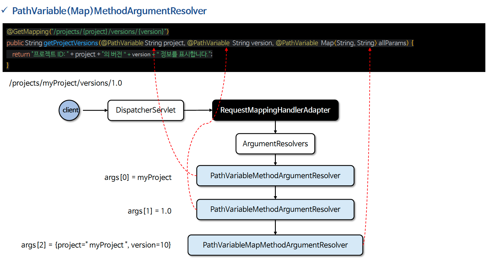

# ☘️ @PathVariable

---

## 📖 내용

- @PathVariable 은 @RequestMapping 에 지정한 URI 템플릿 변수에 포함된 값을 메서드의 매개변수로 전달하기 위해 사용하는 어노테이션이다
- @PathVariable 은 GET, DELETE, PUT, POST 요청에서 사용 할 수 있다
- 

<sub>※ 이미지 출처: 인프런</sub>

---

### URI 패턴
- 경로 변수에서 한 문자와 일치
  - @GetMapping("/resources/ima?e.png")
  - /resources/image.png 또는 /resources/imaxe.png가 매치된다
- 경로 변수에서 0개 이상의 문자와 일치
  - @GetMapping("/resources/*.png")
  - /resources/image.png 또는 /resources/imae.png 등이 매치된다
- 여러 경로 변수와 일치
  - @GetMapping("/resources/**")
  - /resources/images/test.png, /resources/css/style.css 등이 매치된다
- 정규 표현식과 일치
  - @GetMapping("/projects/{projectId:[a-z]+}/details")
  - {projectId:[a-z]+} 는 projectId 가 하나 이상의 소문자로만 구성되어야 함을 나타낸다.
  - /projects/alpha/details와 같은 URL에 매칭되며 /projects/123/details와 같은 URL은 매칭되지 않는다

---

### @PathVariable 에서 name을 정의하지 않는 경우
- @PathVariable 에서 name 속성을 정의하지 않으면 URI 템플릿 변수의 이름과 메서드 매개변수의 이름이 동일해야 한다
- 이 방식은 Spring Boot 3.2부터 지원되지 않으며, 명시적으로 name 속성을 지정해야 한다.

---

### @PathVariable 자체를 선언하지 않는 경우
- @PathVariable 애노테이션을 아예 사용하지 않으면 URL 경로의 변수를 메서드의 파라미터로 바인딩할 수 없다

---

## 🔍 중심 로직

```java
package org.springframework.web.bind.annotation;

...

@Target(ElementType.PARAMETER)
@Retention(RetentionPolicy.RUNTIME)
@Documented
public @interface PathVariable {

	@AliasFor("name")
	String value() default "";

	@AliasFor("value")
	String name() default "";

	boolean required() default true;

}
```

```java
package org.springframework.web.servlet.mvc.method.annotation;

...

public class PathVariableMapMethodArgumentResolver implements HandlerMethodArgumentResolver {

	@Override
	public boolean supportsParameter(MethodParameter parameter) {
		PathVariable ann = parameter.getParameterAnnotation(PathVariable.class);
		return (ann != null && Map.class.isAssignableFrom(parameter.getParameterType()) &&
				!StringUtils.hasText(ann.value()));
	}
    
	@Override
	public Object resolveArgument(MethodParameter parameter, @Nullable ModelAndViewContainer mavContainer,
			NativeWebRequest webRequest, @Nullable WebDataBinderFactory binderFactory) throws Exception {

		@SuppressWarnings("unchecked")
		Map<String, String> uriTemplateVars =
				(Map<String, String>) webRequest.getAttribute(
						HandlerMapping.URI_TEMPLATE_VARIABLES_ATTRIBUTE, RequestAttributes.SCOPE_REQUEST);

		if (!CollectionUtils.isEmpty(uriTemplateVars)) {
			return Collections.unmodifiableMap(uriTemplateVars);
		}
		else {
			return Collections.emptyMap();
		}
	}

}
```

📌

---

## 💬 코멘트

---
