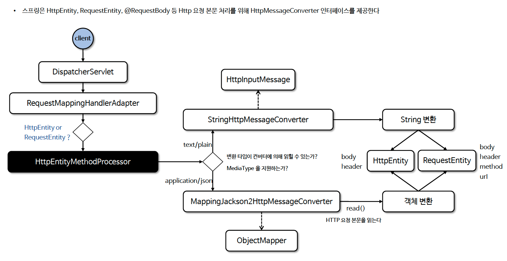

# ☘️ [HttpEntity_RequestEntity (1) ~ (2)]()

---

## 📖 내용

- HTTP 요청이 파라미터나 폼 데이터가 아닌 요청 본문(Body)일 경우 앞서 보았던 @RequestParam 이나 @ModelAttribute 는 요청을 매개변수에 바인딩 할 수 없다
- 일반적으로 헤더정보가 Content-type=application/ json 과 같이 되어 있는 HTTP 본문 요청은 getParameter() 로 읽어 드릴 수 없으며 직접 본문 데이터를 파싱해서 읽는 방식으
  로 처리해야 한다


- `@RequestParam`
  - 요청을 보내면 Spring 은 JSON 데이터에서 "name" 값을 읽을 수 없으며 @RequestParam 은 요청 본문을 매핑하려 하지 않고 쿼리 파라미터를 찾으려 한다
- `@ModelAttribute`
  - 요청을 보내면 JSON 데이터가 제공되었지만@ModelAttribute는 이를 파싱하지 못하고 객체의 기본값(null 또는 0)으로 설정됩니다


- 흐름도


<sub>※ 이미지 출처: 인프런</sub>

---

### HttpServletRequest – InputStream, Reader
- HTTP 요청 본문(Body) 은 HttpServletRequest의 InputStream 또는 Reader를 통해 접근할 수 있으며 요청 본문은 getInputStream() 또는 getReader() 메서드를 사용하여 읽을 수 있다
- HTTP Body 나 이진 데이터들은 자바의 스트림을 사용해서 직접 데이터를 읽어야 한다
```java
@RestController
public class RequestBodyController {
    @PostMapping("/readbody")
    public String readBody(HttpServletRequest request) throws IOException {
        StringBuilder requestBody = new StringBuilder();
        try (BufferedReader reader = request.getReader()) {
            String line;
            while ((line = reader.readLine()) != null) {
                requestBody.append(line);
            }
        }
        return "Received Body: " + requestBody.toString();
    }
}
```

---

### HttpEntity
- HttpEntity 는 기존 HttpServletRequest 나 HttpServletResponse 를 사용하여 요청 및 응답 데이터를 처리하는 복잡성을 해결하기 위해 도입되었다
- HttpHeaders 와 Body 데이터를 하나의 객체로 통합하였고 JSON, XML, 문자열, 바이너리 데이터 등 다양한 본문 데이터 형식을 처리 가능하게 하였다
- 내부적으로 HttpMessageConverter 객체가 작동되어 본문을 처리한다


```java
package org.springframework.http;

// imports

public class HttpEntity<T> {

	public static final HttpEntity<?> EMPTY = new HttpEntity<>();


	private final HttpHeaders headers;

	@Nullable
	private final T body;

	protected HttpEntity() {
		this(null, null);
	}

	public HttpEntity(T body) {
		this(body, null);
	}

	public HttpEntity(MultiValueMap<String, String> headers) {
		this(null, headers);
	}

	public HttpEntity(@Nullable T body, @Nullable MultiValueMap<String, String> headers) {
		this.body = body;
		this.headers = HttpHeaders.readOnlyHttpHeaders(headers != null ? headers : new HttpHeaders());
	}

	public HttpHeaders getHeaders() {
		return this.headers;
	}

	@Nullable
	public T getBody() {
		return this.body;
	}
    
	public boolean hasBody() {
		return (this.body != null);
	}

    // equals() and hashCode() and toString()

}
```

---

### RequestEntity
- HttpEntity 의 확장 버전으로 HTTP 메서드와 대상 URL 도 포함하며 RestTemplate 에서 요청을 준비하거나 @Controller 메서드에서 요청 입력을 나타낼 때 사용된다

---

## 🔍 중심 로직

```java
```

📌

---

## 💬 코멘트

---
