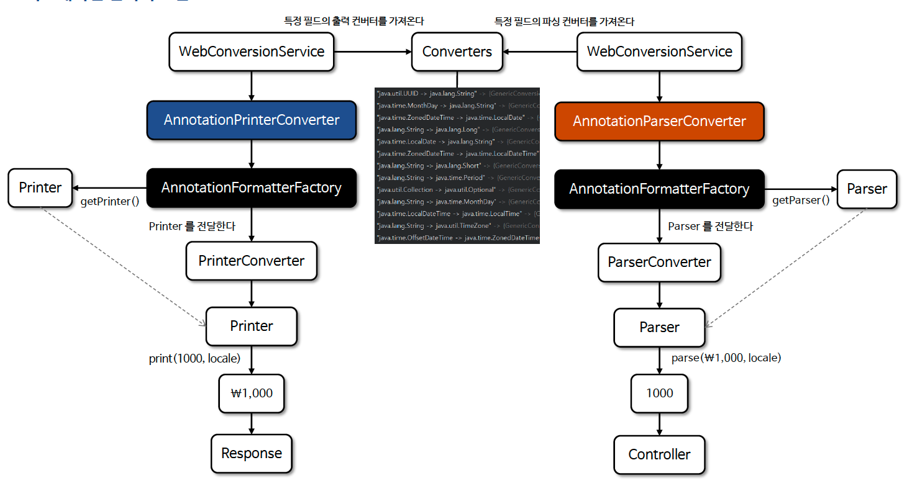

# ☘️ 어노테이션 기반 포매팅 (1) ~ (2)

---

## 📖 내용

- 기본 포맷터는 전체적으로 동일한 형식으로만 동작하기 때문에 각 필드마다 다른 형식을 지정하려는 요구사항을 처리하기 어렵다
- 어노테이션 기반 포맷터(AnnotationFormatterFactory)를 활용하면 필드별로 포맷을 다르게 지정할 수 있다

---

### AnnotationFormatterFactory
- AnnotationFormatterFactory 는 특정 어노테이션이 붙은 필드의 값을 지정된 형식으로 변환해 주는 Formatter 를 생성하는 팩토리 클래스이다
- 예를 들어 Jsr310DateTimeFormatAnnotationFormatterFactory 는 @DateTimeFormat 어노테이션이 붙은 필드에서 날짜(LocalDateTime) 값을 지정된 형식으로 변환해
  주는 Formatter 를 만들어 사용할 수 있다

---

### 주요 구현체
- DateTimeFormatAnnotationFormatterFactory
  - java.util.Date 와 java.util.Calendar 같은 레거시 날짜/시간 API 를 사용하여 @DateTimeFormat 어노테이션이 지정된 필드를 포맷한다
- Jsr310DateTimeFormatAnnotationFormatterFactory
  - JDK 8의 LocalDateTime 와 ZonedDateTime 과 같은 날짜/시간 API 를 사용하여 @DateTimeFormat 어노테이션이 지정된 필드를 포맷한다
- NumberFormatAnnotationFormatterFactory
  - @NumberFormat 어노테이션이 붙은 필드에서 숫자 값을 지정된 형식으로 포맷한다

---

### 어노테이션 컨버터 흐름도

<sub>출처: 인프런</sub>

---

## 🔍 중심 로직

```java
package org.springframework.format;

// imports

public interface AnnotationFormatterFactory<A extends Annotation> {

	Set<Class<?>> getFieldTypes();

	Printer<?> getPrinter(A annotation, Class<?> fieldType);

	Parser<?> getParser(A annotation, Class<?> fieldType);

}
```

📌

---

## 💬 코멘트

---
