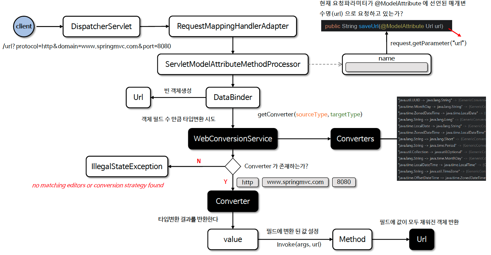
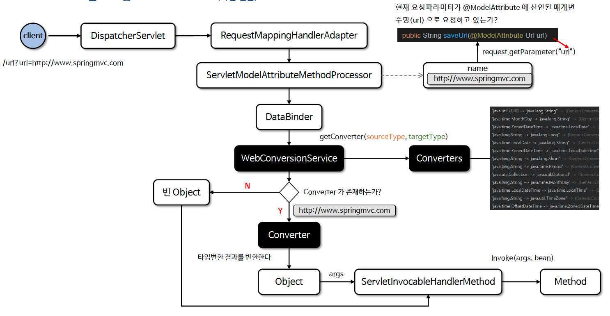

# ☘️ 바인딩과 타입 변환 관계 (1) ~ (2)

---

## 📖 내용

### 바인딩 vs 타입 변환 관계
- DataBinder의 역할
  - DataBinder 는 요청 데이터를 객체로 바인딩하는 클래스로서 HTTP 요청 파라미터(쿼리 파라미터, 폼 데이터 등) 를 자바 객체의 속성에 매핑한다
- ConversionService의 역할
  - ConversionService 는 타입 변환에 특화된 서비스로서 바인딩 중 필요한 경우 Converter 를 호출해 특정 필드 값을 변환한다
- DataBinder 와 ConversionService 의 상호 작용
  - DataBinder 는 필요할 경우 ConversionService 를 통해 요청 데이터를 변환하고 변환된 데이터를 객체 필드에 할당한다
  - 바인딩 중에 타입변환이 실패하게 되면 예외가 발생해 바인딩을 더 이상 진행하지 않거나 BindingResult 를 사용해 오류를 남기고 계속 바인딩을 진행할 수 있다

---

### @RequestParam 동작 방식
- 클라이언트가 보낸 요청 파라미터를 문자열 형태로 가져온다 (기본적으로 모든 요청 파라미터는 String 형태로 전달된다)
- 가져온 문자열을 @RequestParam 에 지정한 매개변수에 저장하기 위해 ConversionService 를 사용하여 타입 변환을 수행한 후 저장한다
- 타입 변환이 실패하면 스프링은 즉시 TypeMismatchException 을 발생시키며 오류 응답을 반환하거나 별도로 설정된 예외 처리 로직이 실행된다


- @RequestParam 에 지정된 매개변수가 객체인 경우 보통 컨버터가 등록 안되어 있기 때문에 오류가 발생한다
- 객체를 지정해서 사용할 경우는 @ModelAttribute 를 사용하든지 아니면 객체타입으로 변환할 수 있는 컨버터를 만들어야 한다

---

### @ModelAttribute 동작 방식
- @ModelAttribute 는 클라이언트의 요청 유형에 따라 객체 바인딩 방식과 타입변환 방식으로 객체가 생성되어 메서드에 전달된다


- 클라이언트의 요청 파라미터가 @ModelAttribute 에 지정된 매개변수명과 다른 경우 객체 바인딩 방식으로 객체가 생성된다
  - 요청 파라미터 명 : protocol, domain, port
  - @ModelAttribute 매개변수명 : url
  - 객체를 만들고 객체의 필드명과 동일한 요청 파라미터의 값을 설정함
  - 필드타입과 요청파라미터 타입이 다를 경우 타입변환을 거쳐 설정함
- 클라이언트의 요청 파라미터가 @ModelAttribute 에 지정된 매개변수명과 같은 경우 타입변환 방식으로 객체가 생성된다
  - 요청 파라미터 명 : url
  - @ModelAttribute 매개변수명 : url
  - StringToUrlConverter 를 통해 Url 객체 생성 후 메서드에 전달
  - Converter 가 존재하지 않으면 빈 객체 생성 후 메서드에 전달

- 객체 바인딩

<sub>출처: 인프런</sub>


- 타입 변환

<sub>출처: 인프런</sub>

---

## 🔍 중심 로직

```java
```

📌

---

## 💬 코멘트

---
