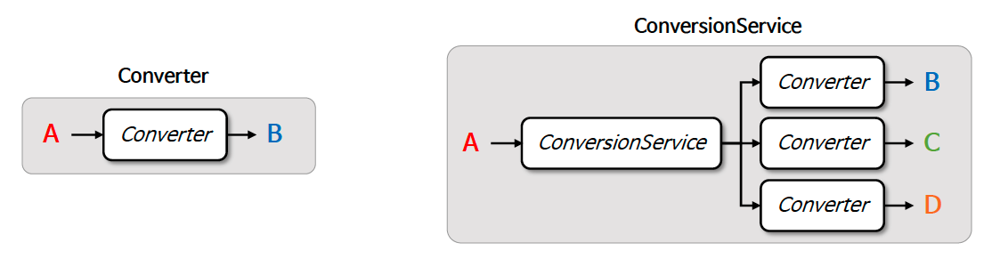

# ☘️ ConversionService

---

## 📖 내용

- Converter 가 단일 변환 로직을 위한 것이라면 ConversionService 는 어플리케이션 전반에서 통합된 타입 변환 서비스를 제공한다
- ConversionService 는 타입 변환과 Converter 들을 등록하고 관리하는 기능을 제공하며 데이터 바인딩, 유효성 검사 등에서 통합적으로 사용하고 있다


<sub>출처: 인프런</sub>

- ConversionService: 변환
- ConverterRegistry: converter 등록 

---

### 문제점
- Converter 예제처럼 여전히 ConversionService.convert() 메서드를 직접 실행하고 있다
- ConversionService 를 내부에 숨기고 자동적으로 변환이 이루어질 수 있는 API 가 필요하다

```java
@Configuration
public class ConversionServiceConfig {
    @Bean
    public DefaultConversionService conversionService() {
        DefaultConversionService conversionService = new DefaultConversionService();
        conversionService.addConverter(new StringToUrlConverter()); //ConversionService 에 사용할 Converter 를 등록한다
        conversionService.addConverter(new UrlToStringConverter()); //ConversionService 에 사용할 Converter 를 등록한다
        return conversionService;
    }
}

@RestController
public class ConversionController {
    @Autowired
    private DefaultConversionService conversionService;

    @PostMapping("/url")
    public String saveUrl(@RequestParam("url") String url) {
        Url result = conversionService.convert(url, Url.class);
        return "Url : " + result;
    }

    @GetMapping("/url")
    public String getUrl(@ModelAttribute Url url) {
        String result = conversionService.convert(url, String.class);
        return "Url : " + result;
    }
}
```

---

## 🔍 중심 로직

```java
package org.springframework.core.convert;

// imports

public interface ConversionService {

	boolean canConvert(@Nullable Class<?> sourceType, Class<?> targetType);

	boolean canConvert(@Nullable TypeDescriptor sourceType, TypeDescriptor targetType);

	@Nullable
	<T> T convert(@Nullable Object source, Class<T> targetType);

	@Nullable
	default Object convert(@Nullable Object source, TypeDescriptor targetType) {
		return convert(source, TypeDescriptor.forObject(source), targetType);
	}

	@Nullable
	Object convert(@Nullable Object source, @Nullable TypeDescriptor sourceType, TypeDescriptor targetType);

}
```

```java
package org.springframework.core.convert.converter;

public interface ConverterRegistry {

	void addConverter(Converter<?, ?> converter);

	<S, T> void addConverter(Class<S> sourceType, Class<T> targetType, Converter<? super S, ? extends T> converter);

	void addConverter(GenericConverter converter);

	void addConverterFactory(ConverterFactory<?, ?> factory);

	void removeConvertible(Class<?> sourceType, Class<?> targetType);

}
```

📌

---

## 💬 코멘트

---
