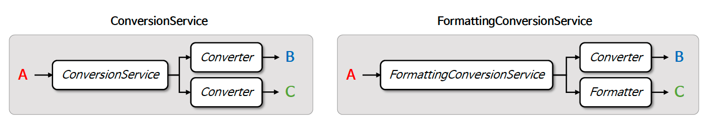
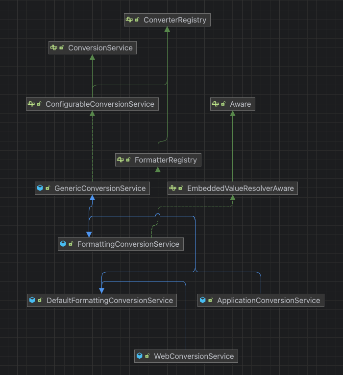

# ☘️ FormattingConversionService

---

## 📖 내용

- FormattingConversionService 는 Converter 와 Formatter 를 통합적으로 등록할 수 있는 구현체로서 타입 변환과 로컬화된 데이터 포맷팅을 함께 처리할 수 있다


<sub>출처: 인프런</sub>



---

## 🔍 중심 로직

```java
package org.springframework.format;

// imports

public interface FormatterRegistry extends ConverterRegistry {

	void addPrinter(Printer<?> printer);

	void addParser(Parser<?> parser);

	void addFormatter(Formatter<?> formatter);

	void addFormatterForFieldType(Class<?> fieldType, Formatter<?> formatter);

	void addFormatterForFieldType(Class<?> fieldType, Printer<?> printer, Parser<?> parser);

	void addFormatterForFieldAnnotation(AnnotationFormatterFactory<? extends Annotation> annotationFormatterFactory);

}
```

```java
package org.springframework.format;

// imports

public interface FormatterRegistrar {

	void registerFormatters(FormatterRegistry registry);

}
```

📌

---

## 💬 코멘트

---
