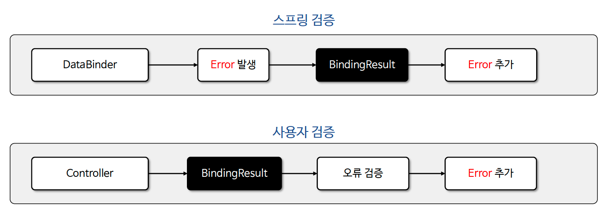
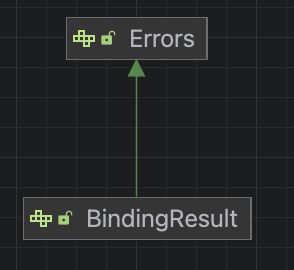
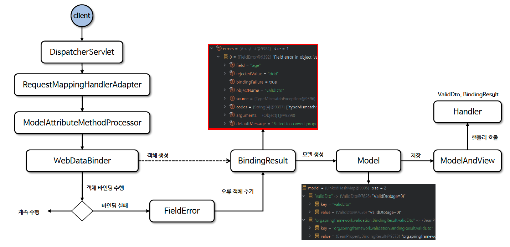

# ☘️ BindingResult 기본 (1) ~ (2)

---

## 📖 내용

- 스프링의 검증은 데이터 바인딩 과정과 밀접하게 연관되어 있다. 즉, 데이터 바인딩은 요청 데이터를 객체로 변환하는 과정인데 이 과정에서 데이터를 검증함으로써 어플리케이션의 안정성과 데이터 무결성을 보장하게 된다
- 스프링에서는 크게 두 가지로 구분해서 검증이 이루어진다
  - 스프링은 데이터 바인딩 시 검증 로직을 자동으로 실행하도록 설계되었으며 BindingResult 통해 오류 정보 및 검증 결과를 저장하고 관리한다
  - 컨트롤러에서 사용자가 직접 BindingResult 를 통해 오류 데이터를 추가하고 검증을 진행할 수 있다.


<sub>출처: 인프런</sub>

---

### Errors / BindingResult 구조



- Errors
  - 검증 과정에서 기본적인 오류를 추가하고 확인하는 인터페이스이다
- BindingResult
  - 컨트롤러에서 데이터 바인딩과 검증을 동시에 처리해야 하는 상황에서 주로 사용된다
  - 메시지 코드 해석과 세부적인 오류 관리 기능 등 보다 정교하고 확장된 기능을 제공한다

---

### BindingResult 기본 전략
- 스프링의 BindingResult 는 세 가지 기본 전략을 가진다
  - 스프링은 데이터 바인딩 시 발생하는 모든 오류 정보를 자동으로 BindingResult 의 errors 속성에 저장 한다
  - 사용자가 BindingResult 의 오류 정보를 활용하기 위해서는 컨트롤러 메서드 매개변수로 지정 해야 한다
    - 매개변수로 지정 시 BindingResult 는 @ModelAttribute 객체 바로 뒤에 위치해야 한다
    - 매개변수로 지정하게 되면 객체 바인딩 오류가 나서 예외가 발생하더라도 컨트롤러는 정상으로 실행된다
  - BindingResult API 를 사용해서 추가적인 검증을 진행하거나 검증 결과를 클라이언트에게 전달할 수 있다.


- DataBinder 에 의해 바인딩이 완료되면 BindingResult 는 바인딩 된 객체를 저장한다. 그리고 errors 속성은 비어 있는 상태다

---

### BindingResult 기본
- 바인딩 오류 발생 : BindingResult 를 메서드에 선언하지 않는 경우
  -  스프링은 MethodArgumentNotValidException 예외를 발생시키고 요청한 컨트롤러는 실행되지 않는다.
  - 가장 기본이 되는 바인딩 오류는 타입 불일치이다 즉. 요청 데이터와 필드 타입이 서로 맞지 않아 바인딩이 실패 하는데 이때 내부적으로 TypeMismatchException 예외가 발생한다
- 바인딩 오류 발생 : BindingResult 를 메서드에 선언한 경우
  - MethodArgumentNotValidException 예외를 건너뛰고 컨트롤러 메서드가 호출된다. 이유는 간단하다. BindingResult 를 메서드에 선언했기 때문이다.
  - 스프링은 BindingResult 의 메서드 선언 여부에 따라 요청을 계속 진행시킬지 아니면 MethodArgumentNotValidException 예외로 요청을 중단할지 결정한다

---

### 흐름도


<sub>출처: 인프런</sub>

---

## 🔍 중심 로직

```java
public interface BindingResult extends Errors {

	String MODEL_KEY_PREFIX = BindingResult.class.getName() + ".";

	@Nullable
	Object getTarget();

	Map<String, Object> getModel();

	@Nullable
	Object getRawFieldValue(String field);

	@Nullable
	PropertyEditor findEditor(@Nullable String field, @Nullable Class<?> valueType);

	@Nullable
	PropertyEditorRegistry getPropertyEditorRegistry();

	String[] resolveMessageCodes(String errorCode);

	String[] resolveMessageCodes(String errorCode, String field);

	void addError(ObjectError error);
    
	default void recordFieldValue(String field, Class<?> type, @Nullable Object value) {
	}

	default void recordSuppressedField(String field) {
	}

	default String[] getSuppressedFields() {
		return new String[0];
	}

}
```

📌

---

## 💬 코멘트

---
