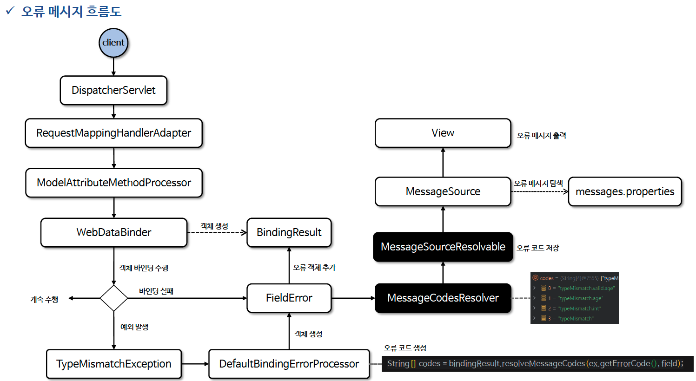

# ☘️ BindingResult 와 MessageSource 연동 (2) ~ (3)

---

## 📖 내용

- ObjectError 또는 FieldError API 를 사용해서 오류 코드를 기입하는 방식은 세밀한 제어는 가능하나 번거롭고 관리적인 측면에서 간단하지 않다
- BindingResult 에는 FieldError 를 사용하지 않고 오류 코드를 자동화하고 광범위하게 MessageSource 와 연동하는 API 를 제공하고 있다

---

### reject() / rejectValue()

- reject()
  - 객체 오류
  - `void reject(String errorCode, Object[] errorArgs, String defaultMessage);`
- rejectValue()
  - 필드 오류
  - `void rejectValue(String field, String errorCode, Object[] errorArgs, String defaultMessage);`


- field: 오류 필드 이름
- errorCode: 오류 코드 (메시지 소스에서 사용)
- errorArgs: 메시지에 사용될 인자 목록
- defaultMessage: 기본 오류 메시지


- rejectValue은 필드명 앞에 객체명이 빠져 있는데 사실 BindingResult 는 바인딩 과정에서 객체 정보인 target 을 저장하기 때문에 객체 정보를 입력하지 않아도 참조 가능하다
- 그 이유는 BindingResult 가 내부적으로 오류 코드와 관련된 특별한 작업을 수행하고 있는데 바로 MessageCodesResolver 클래스가 그 해결책을 가지고 있다

---

### MessageCodesResolver

- MessageCodesResolver 는 검증 오류 발생 시 오류 메시지의 메시지 코드를 생성하는 인터페이스이다
- 유효성 검증 시 필드 오류 또는 글로벌 오류가 발생하면 이 오류들을 MessageSource 와 연동하여 해당 오류 메시지를 찾기 위한 메시지 코드 목록을 생성한다

- 오류 메시지 전략
  - 일반적으로 어떤 기능의 오류 메시지를 표현 할 때는 범용적인 것과 세부적인 것들을 잘 구분해서 설정하게 된다.


- MessageCodesResolver 는 객체 오류인 경우 두 가지, 필드 오류인 경우 네 가지 형식으로 오류 코드를 생성한다
- 각 코드 형식은 우선순위에 따라 적용되는데 가장 구체적인 규칙부터 범용적인 규칙 순으로 찾고 적용된다
- 스프링은 기본 구현체인 DefaultMessageCodesResolver 를 제공하고 있다

- MessageSource 는 생성된 오류 메시지 코드의 가장 구체적인 것 부터 시작하여 순차적으로 돌면서 validation.properties 에 일치하는 코드 값이 존재하는지 검사한다
- 일치하는 값이 존재하면 해당 메시지를 타임리프 변수에 적용하고 만약 존재하지 않으면 기본 오류 메시지를 적용한다

---

### DefaultBindingErrorProcessor

- 앞서 언급했듯이 스프링의 데이터 바인딩 오류 시에는 BindingResult 객체의 errors 속성에 오류 객체(FieldError)가 저장 된다고 했다
- 주로 스프링의 바인딩 오류는 데이터 간 타입이 서로 맞지 않아 TypeMismatchException 예외가 발생하는데 이 예외로부터 기본적인 오류 메시지 코드가 생성이 된다
- DefaultBindingErrorProcessor 는 오류 코드를 포함하여 BindingResult 로 부터 여러가지 오류 정보를 가져와서 실제로 FieldError 객체를 생성하는 클래스이다
- 만약 validation.properties 에 위의 네 가지 오류 메시지 코드 중 아무것도 설정이 되어 있지 않으면 다음과 같은 기본 오류 메시지가 출력된다

---

### MessageSourceResolvable
- MessageSource 가 메시지를 찾을 때 오류 코드를 제공하는 클래스로서 순차적으로 메시지를 탐색하고 적절한 메시지를 찾아 반환한다
- 기본 구현체로 DefaultMessageSourceResolvable 클래가 제공되며 ObjectError 의 부모 클래스이다.
- 즉 ObjectError 로 부터 오류코드, 메시지 인자, 기본메시지를 전달 받는다

---

### 오류 메시지 흐름도

<sub>출처: 인프런</sub>

---

## 🔍 중심 로직

```java
package org.springframework.validation;

// imports

public interface MessageCodesResolver {

	String[] resolveMessageCodes(String errorCode, String objectName);

	String[] resolveMessageCodes(String errorCode, String objectName, String field, @Nullable Class<?> fieldType);

}
```

```java
package org.springframework.validation;

// import

public class DefaultBindingErrorProcessor implements BindingErrorProcessor {

	public static final String MISSING_FIELD_ERROR_CODE = "required";


	@Override
	public void processMissingFieldError(String missingField, BindingResult bindingResult) {
		// Create field error with code "required".
		String fixedField = bindingResult.getNestedPath() + missingField;
		String[] codes = bindingResult.resolveMessageCodes(MISSING_FIELD_ERROR_CODE, missingField);
		Object[] arguments = getArgumentsForBindError(bindingResult.getObjectName(), fixedField);
		FieldError error = new FieldError(bindingResult.getObjectName(), fixedField, "", true,
				codes, arguments, "Field '" + fixedField + "' is required");
		bindingResult.addError(error);
	}

	@Override
	public void processPropertyAccessException(PropertyAccessException ex, BindingResult bindingResult) {
		// Create field error with the code of the exception, for example, "typeMismatch".
		String field = ex.getPropertyName();
		Assert.state(field != null, "No field in exception");
		String[] codes = bindingResult.resolveMessageCodes(ex.getErrorCode(), field);
		Object[] arguments = getArgumentsForBindError(bindingResult.getObjectName(), field);
		Object rejectedValue = ex.getValue();
		if (ObjectUtils.isArray(rejectedValue)) {
			rejectedValue = StringUtils.arrayToCommaDelimitedString(ObjectUtils.toObjectArray(rejectedValue));
		}
		FieldError error = new FieldError(bindingResult.getObjectName(), field, rejectedValue, true,
				codes, arguments, ex.getLocalizedMessage());
		error.wrap(ex);
		bindingResult.addError(error);
	}

	protected Object[] getArgumentsForBindError(String objectName, String field) {
		String[] codes = new String[] {objectName + Errors.NESTED_PATH_SEPARATOR + field, field};
		return new Object[] {new DefaultMessageSourceResolvable(codes, field)};
	}

}
```

```java
package org.springframework.context;

// imports

@FunctionalInterface
public interface MessageSourceResolvable {

	@Nullable
	String[] getCodes();

	@Nullable
	default Object[] getArguments() {
		return null;
	}

	@Nullable
	default String getDefaultMessage() {
		return null;
	}

}
```

📌

---

## 💬 코멘트

---
