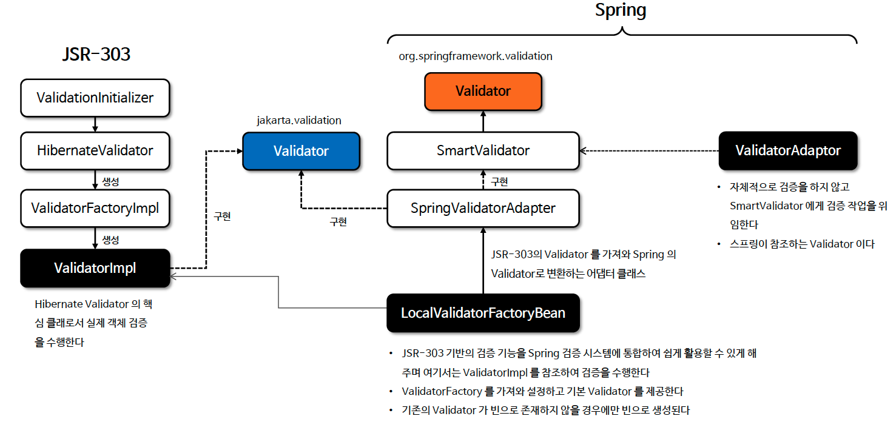
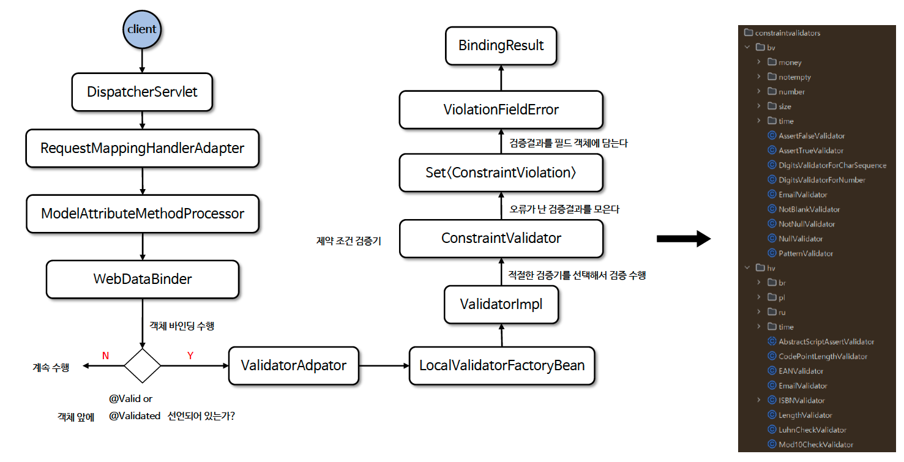

# ☘️ Java Bean Validation + Spring 통합 (1) ~ (3)

---

## 📖 내용

- Spring 에서는 org.springframework.validation.Validator 를 통해 Spring 의 자체 검증 메커니즘과 Java Bean Validation 을 통합하고 이를 통해 Bean Validation 표준 검증을 Spring 에서 바로 활용할 수 있다
- Spring MVC 는 컨트롤러 계층에서 @Valid 또는 @Validated 를 사용하여 자동으로 Bean Validation 을 수행하며 검증 실패 시 발생하는 오류를 BindingResult 를 통해 보관하고 프로그램적으로 처리할 수 있다
- Bean Validation 표준의 그룹(Group)화를 지원하여 특정 조건에서만 검증을 수행할 수 있으며 Bean Validation을 확장하여 커스텀 Validator 를 생성할 수 있다
- Spring 에서는 MessageSource 를 통해 에러 메시지를 커스터 마이징할 수 있다

---

### 기본 사용법
- 스프링에서는 어노테이션 기반 검증을 위해 @Valid 와 @Validated 어노테이션을 사용할 수 있으며 사용 방식에 있어 약간 차이가 있다
- @Valid 는 jakarta.validation 에 포함되어 있고 @Validated 은 `org.springframework.validation.annotation` 에 포함되어 있으며 @Valid 를 사용하기 위해서는
  `org.springframework.boot:spring-boot-starter-validation` 의존성이 필요하다
- 두 어노테이션 모두 객체 타입에만 사용 할 수 있으며 검증할 객체 바로 앞에 위치해야 하고 검증된 결과는 BindingResult 에 담긴다


- 검증은 바인딩의 맨 마지막 처리 과정이며 기본적으로 바인딩에 성공한 필드는 검증이 이루어진다
- 만약 필드의 타입변환이 실패하면 실패 결과가 FieldError 객체에 담기고 BindingResult 에 보관된다
- 타입변환에 실패한 필드는 기본 값이 저장된 상태에서 검증이 이루어지지만 Validator 구현체에 따라 예외가 발생
  할 수도 있고 기본 검증이 이루어질 수 있다

---

### Java Bean Validation 과 Spring 통합 구조

<sub>출처: 인프런</sub>

---

### @Valid
- JSR-380 표준에 속하는 기본적인 검증 어노테이션으로서 객체의 필드뿐만 아니라 중첩된 객체(nested object)에서도 유효성 검사를 수행할 수 있다
- 주로 단순한 유효성 검사를 수행하는 데 사용되며 jakarta.validation 패키지에 속해 있다

---

### @RequestBody + @Valid
- @RequestBody 와 @Valid 클라이언트의 요청 데이터를 Java 객체로 매핑하고 이를 검증하는 데 사용된다
- @RequestBody 는 객체 바인딩이 아닌 HttpMessageConverter 가 문자열 데이터를 객체로 변환하는 방식으로 이루어진다
- 그래서 필드 단위로 오류를 저장하는 것이 아니기 때문에 필드 제약 오류가 아닌 타입 오류가 나면 예외(HttpMessageNotReadableException)가 발생해서 빈 검증이 더 이상 진행
  되지 않고 중단된다

---

### 오류 검증 할 Validator 가 없는 경우
- 제약 조건에 맞는 Validator 자체가 존재하지 않을 경우 예외가 발생하여 정상적인 동작이 이루어지지 않는다

---

### @Validated
- Spring 프레임워크에서 제공하는 어노테이션으로서 그룹 기반 검증(validation group)을 지원하며 복잡한 검증 요구사항이 있는 경우 유용하다
- username 의 @NotEmpty 검증은 createUser() 인 회원가입에만 적용되며 email 의 @Email 검증은 createUser() 와 updateUser() 인 회원가입과 회원수정 모두 적용된다
- 예를 들어 등록하기와 수정하기를 하나의 객체를 가지고 분기해서 동시에 사용할 수는 있으나 비교적 필드나 로직이 간단한 경우는 유용하지만 필드가 많고 여러 상황에 따른 로직이 복잡
  할 경우에는 등록하는 객체와 수정하는 객체를 별도로 구분하여 검증에 사용하는 것이 더 좋다

---

### 흐름도

<sub>출처: 인프런</sub>

---

## 🔍 중심 로직

```java
package jakarta.validation;

// imports

@Target({ METHOD, FIELD, CONSTRUCTOR, PARAMETER, TYPE_USE })
@Retention(RUNTIME)
@Documented
public @interface Valid {
}
```

```java
package org.springframework.validation.annotation;

// imports

@Target({ElementType.TYPE, ElementType.METHOD, ElementType.PARAMETER})
@Retention(RetentionPolicy.RUNTIME)
@Documented
public @interface Validated {
    Class<?>[] value() default {};
}
```

📌

---

## 💬 코멘트

---
