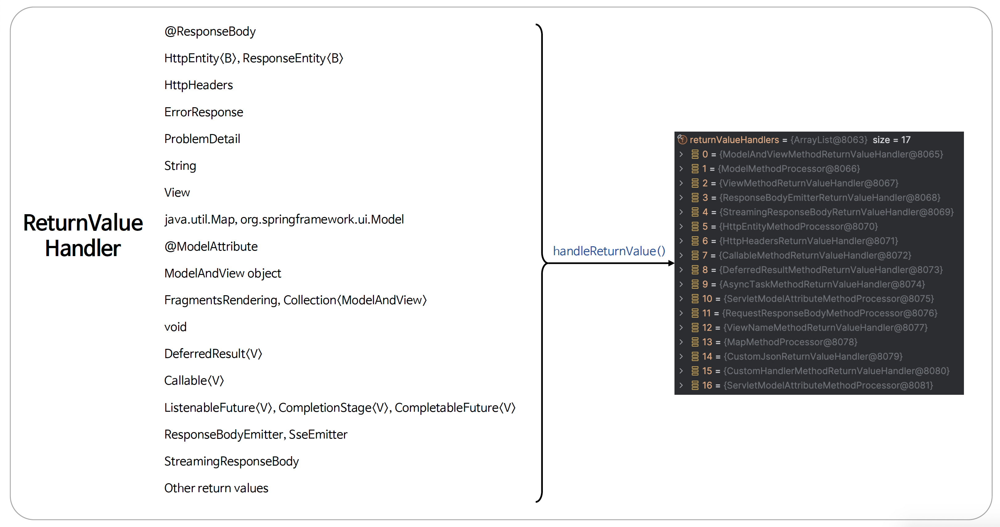

# ☘️ Return Values 개요

---

## 📖 내용

- 스프링 MVC 에서 컨트롤러 메서드의 반환 방식은 크게 View 와 HTTP 본문 응답으로 나눌 수 있으며 각 방식은 클라이언트에게 반환하는 응답의 형태를 결정한다


- View 렌더링
  - HTML 과 같은 페이지를 클라이언트에게 반환하는 방식으로서 컨트롤러가 뷰 이름을 반환하고 뷰 레이어에서 해당 이름을 해석하여 적절한 HTML을 생성한다
- HTTP 본문 응답
   - JSON, XML 등 데이터 형식으로 응답을 직접 반환하는 방식으로서 REST API 와 같은 데이터 중심의 애플리케이션에서 주로 사용된다
   - 뷰가 아닌 데이터를 응답 본문에 담아 전달해서 클라이언트는 페이지가 아닌 데이터를 수신하게 된다

---

### HandlerMethodReturnValueHandler

- 컨트롤러로부터 응답결과를 받아 응답처리를 위한 작업을 담당하는 클래스이다
- 다양한 유형의 파라미터 (예: String, View, @ResponseBody 등)를 처리하기 위해 여러 HandlerMethodReturnValueHandler 기본 구현체를 제공한다
- 개발자가 필요에 따라 HandlerMethodReturnValueHandler 인터페이스를 직접 구현할 수 있다

---

### View 렌더링 반환 타입

- String – 문자열로 뷰 이름을 반환하면 ViewResolver에 의해 해당 이름에 맞는 뷰가 렌더링 된다
- ModelAndView - 뷰와 모델 데이터를 함께 담아 반환하는 객체입니다. 뷰 이름뿐만 아니라 모델 데이터를 함께 설정하여 전달할 수 있다
- View - View 인터페이스를 구현한 객체를 직접 반환할 수 있다. 이 경우 ViewResolver 에 의존하지 않고 특정 View 인스턴스를 직접 렌더링 한다
- Model 또는 Map - 모델 데이터를 반환하면 뷰 이름은 요청 경로에 따라 자동으로 결정된다. Model이나 Map 은 뷰에 전달할 데이터로만 사용된다

---

### ModelViewContainer
- Spring MVC 가 내부적으로 요청 처리 시점에 자동으로 생성 및 관리하는 클래스로서 요청 처리가 완료될 때까지 모델과 뷰 관련 데이터를 임시로 보관한다

---

### ModelAndView
- 최종적으로 뷰를 렌더링하기 위한 모델과 뷰의 정보를 제공하는 클래스이다
- ModelAndView 객체를 직접 반환해도 되고 뷰 이름이나 뷰 객체를 반환하게 되면 내부적으로 ModelAndView 객체가 생성되어 응답을 구성한다

---

### HTTP 본문 응답 반환 타입
- @ResponseBody - 컨트롤러 메서드의 반환 값을 HttpMessageConverter 를 통해 JSON, XML 등으로 변환하여 응답 본문에 직접 작성한다
- HttpEntity<T>, ResponseEntity<T> - HTTP 응답(헤더와 본문 모두)을 구성할 수 있다. ResponseEntity는 상태 코드, 헤더, 본문을 모두 포함할 수 있어 더 정밀한 응답 구성이 가능하다
- Callable<V>, ListenableFuture<V>, CompletableFuture<V> - 비동기 작업의 결과로 반환되는 타입을 사용할 수 있다

---

### 반환 타입으로 사용할 수 있는 ReturnValueHandler

<sub>출처: 인프런</sub>

---

## 🔍 중심 로직

```java
package org.springframework.web.method.support;

// imports

public interface HandlerMethodReturnValueHandler {

	boolean supportsReturnType(MethodParameter returnType);

	void handleReturnValue(@Nullable Object returnValue, MethodParameter returnType,
			ModelAndViewContainer mavContainer, NativeWebRequest webRequest) throws Exception;

}
```

```java
package org.springframework.web.method.support;

// imports

public class ModelAndViewContainer {

    // Deprecated
    private boolean ignoreDefaultModelOnRedirect = true;

    @Nullable
    private Object view;

    private final ModelMap defaultModel = new BindingAwareModelMap();

    @Nullable
    private ModelMap redirectModel;

    private boolean redirectModelScenario = false;

    @Nullable
    private HttpStatusCode status;

    private final Set<String> noBinding = new HashSet<>(4);

    private final Set<String> bindingDisabled = new HashSet<>(4);

    private final SessionStatus sessionStatus = new SimpleSessionStatus();

    private boolean requestHandled = false;
}
```

```java
package org.springframework.web.servlet;

// imports

public class ModelAndView {
    
    @Nullable
    private Object view;

    @Nullable
    private ModelMap model;

    @Nullable
    private HttpStatusCode status;

    private boolean cleared = false;
}
```

📌

---

## 💬 코멘트

---
