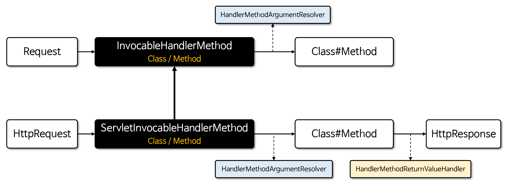

# ☘️ 핸들러 메서드 호출 원리 (1) ~ (2)

---

## 📖 내용

- 스프링의 핸들러 메서드를 호출하기 위해 내부적으로 사용되는 클래스로서 InvocableHandlerMethod 와 이를 확장한 ServletInvocableHandlerMethod 클래스가 있다
- 메서드 호출 시 메서드 파라미터를 해석하기 위한 HandlerMethodArgumentResolver 와 메서드 반환 값을 처리하기 위한 HandlerMethodReturnValueHandler 와 같은 클래스와 연
  계하여 요청을 처리하고 있다
- InvocableHandlerMethod 는 범용적 메서드 호출 클래스이며 ServletInvocableHandlerMethod HTTP 요청/응답 처리 클래스로 구분할 수 있다


<sub>출처: 인프런</sub>

---

### InvocableHandlerMethod
- HTTP 프로토콜에 독립적이며 범용적인 메서드 호출 기능을 제공하고 매개변수 처리를 위해 HandlerMethodArgumentResolver 를 사용한다
- 메서드를 호출한 결과를 반환하지만 내부적으로 반환값을 추가로 처리하지는 않는다
```java
// InvocableHandlerMethod를 생성
InvocableHandlerMethod handlerMethod = new InvocableHandlerMethod(myService, serviceMethod);
// Service 메서드 호출
Object result = handlerMethod.invokeForRequest(webRequest, mavContainer);
```

---

### ServletInvocableHandlerMethod
- InvocableHandlerMethod 를 상속한 클래스로서 Servlet 환경에 특화되어 있으며(HttpServletRequest/HttpServletResponse) HTTP 요청 및 응답을 포함한 핸들러 메서드
  를 호출 한다
- 메서드의 반환값을 HandlerMethodReturnValueHandler 를 통해 처리할 수 있으며 메서드 레벨의 @ResponseStatus 어노테이션을 지원하여 HTTP 응답 상태를 설정할 수 있다
```java
// ServletInvocableHandlerMethod 를 생성
ServletInvocableHandlerMethod handlerMethod = new ServletInvocableHandlerMethod(myService, serviceMethod);
// Service 메서드 호출
Object result = handlerMethod.invokeAndHandle(webRequest, mavContainer);
```

---

## 🔍 중심 로직

```java
package org.springframework.web.method.support;

// imports

public interface HandlerMethodReturnValueHandler {

	boolean supportsReturnType(MethodParameter returnType);
    
	void handleReturnValue(@Nullable Object returnValue, MethodParameter returnType,
			ModelAndViewContainer mavContainer, NativeWebRequest webRequest) throws Exception;

}
```

📌

---

## 💬 코멘트

---
