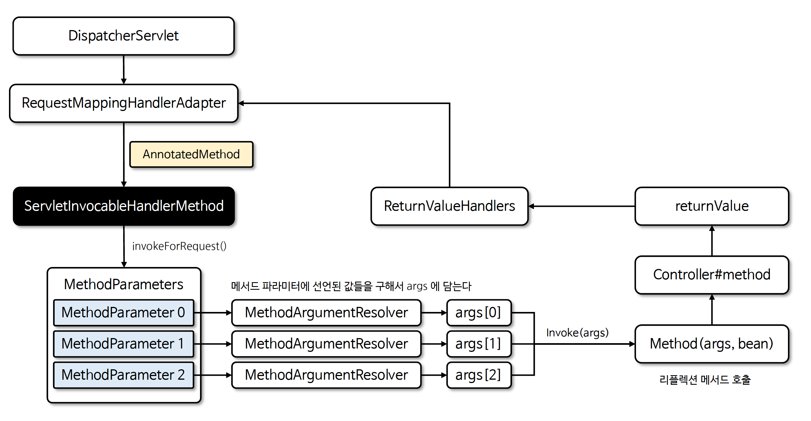

# ☘️ 메서드 파라미터 실행 구조 이해

---

## 📖 내용

- RequestMappingHandlerAdapter 클래스와 연관 클래스들의 실행 구조를 분석함으로서 스프링 MVC 의 내부 흐름을 더 깊이 이해하고 개발적 관점에서의 인사이트를 넓혀 갈수 있다

---

### 핵심 클래스

- ServletInvocableHandlerMethod
  - HTTP 요청 데이터를 받아 메서드를 실행시키는 클래스로서 HandlerMethodArgumentResolver 를 통해 요청 데이터를 메서드의
    매개변수에 맞게 변환하고 이를 사용해 메서드를 호출한다
- AnnotatedMethod
  - 호출 메서드 및 메서드 파라미터 정보를 가지고 있으며 파라미터에 어노테이션 정보를 탐색할 수 있다
- MethodParameter
  - 메서드에 있는 파라미터의 정보를 관리하는 클래스로서 메서드의 어노테이션을 분석하고 파라미터가 어디에 있고 어떤 타입인지를 편
    리하게 알 수 있게 해주는 도구이다
- MethodIntrospector
  - 메서드를 탐색할 수 있게 해주는 클래스로서 특정 어노테이션이 적용된 메서드들의 리스트를 구하거나 메서드의 메타데이터를 찾도록
    돕는 도구이다
  - 스프링 부트가 구동이 되면 초기화 시점에 빈 클래스들을 스캔하면서 @RequestMapping 이 선언된 Method 객체들을 생성한다

---

### 흐름도

<sub>출처: 인프런</sub>

---

## 🔍 중심 로직

```java
```

📌

---

## 💬 코멘트

---
