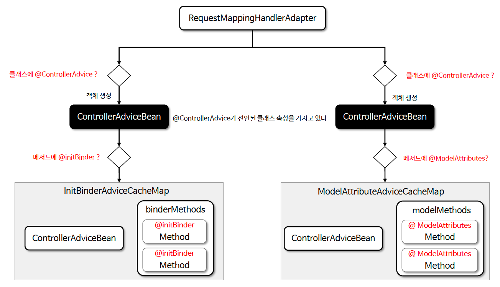
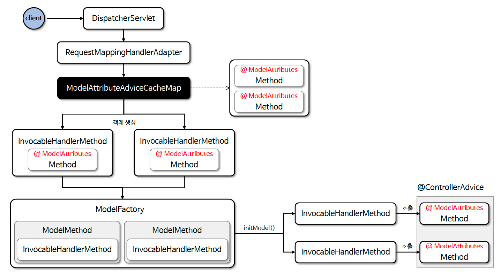

# ☘️ @ControllerAdvice (1) ~ (2)

---

## 📖 내용

- @ControllerAdvice 는 특정 컨트롤러 또는 전체 컨트롤러에서 발생하는 예외를 전역적으로 처리하거나 컨트롤러와 관련된 공통적인 기능을 구현하는 데 사용된다
- @ControllerAdvice 는 클래스 레벨에 선언하며 메서드 레벨에 선언하는 어노테이션(@ExceptionHandler, @ModelAttribute, @InitBinder)과 함께 사용할 수 있다

---

### 주요 용도

| 용도       | 설명                                              | 주요 애노테이션          | 적용 순서        |
|----------|-------------------------------------------------|-------------------|--------------|
| 예외 처리    | 컨트롤러에서 발생한 예외를 전역적으로 처리할 수 있으며 적절한 응답을 생성할 수 있다 | @ExceptionHandler | 메서드 실행 후에 적용 |
| 모델 속성 관리 | 컨트롤러의 모든 요청에 공통적으로 필요한 데이터를 추가할 수 있다            | @ModelAttribute   | 메서드 실행 전에 적용 |
| 데이터 바인딩  | 요청 파라미터를 특정 형식으로 변환하거나 검증 로직을 적용할 수 있다          | @InitBinder       | 메서드 실행 전에 적용 |

---

### 구조

| 속성                 | 설명                                | 예제                                                              |
|--------------------|-----------------------------------|-----------------------------------------------------------------|
| annotations        | 특정 애노테이션이 적용된 컨트롤러만 선택.           | @ControllerAdvice(annotations = RestController.class)           |
| basePackages       | 특정 패키지 내의 컨트롤러만 선택.               | @ControllerAdvice(basePackages = "com.example.controllers")     |
| basePackageClasses | 특정 클래스가 속한 패키지의 컨트롤러만 선택.         | @ControllerAdvice(basePackageClasses = {SomeController.class})  |
| assignableTypes    | 특정 클래스 또는 클래스 계층 구조에 속하는 컨트롤러만 선택 | @ControllerAdvice(assignableTypes = {AbstractController.class}) |

---

### @ControllerAdvice & @RestControllerAdvice

| 기준          | @ControllerAdvice      | @RestControllerAdvice             |
|-------------|------------------------|-----------------------------------|
| 적용 대상       | @Controller            | @RestController                   |
| 기본 응답 형식    | View 이름 반환 또는 HTML 렌더링 | JSON 또는 XML 응답                    |
| 내부 메타 어노테이션 | @Component             | @ControllerAdvice + @ResponseBody |

---

### 여러 @ControllerAdvice 적용 순서
- 다중 @ControllerAdvice 가 있을 경우 @Order 숫자가 낮을수록 높은 우선순위를 가진다
- 여러 개의 ControllerAdvice 에서 동일한 예외 타입이 선언되어 있을 경우 어떤 @ControllerAdvice 가 우선순위가 높은지 명확한 순서를 보장하지 않기 때문에 @Order 를 사용해
  순서를 지정해 사용하도록 한다
- 컨트롤러 내부에 @ExceptionHandler가 있으면 @ControllerAdvice 보다 우선 적용됨

---

### 초기화

<sub>※ 이미지 출처: 인프런</sub>

---

### 흐름도

<sub>※ 이미지 출처: 인프런</sub>

---

## 🔍 중심 로직

```java
package org.springframework.web.bind.annotation;

// imports

@Target(ElementType.TYPE)
@Retention(RetentionPolicy.RUNTIME)
@Documented
@Component
public @interface ControllerAdvice {

	@AliasFor(annotation = Component.class, attribute = "value")
	String name() default "";

	@AliasFor("basePackages")
	String[] value() default {};

	@AliasFor("value")
	String[] basePackages() default {};

	Class<?>[] basePackageClasses() default {};

	Class<?>[] assignableTypes() default {};

	Class<? extends Annotation>[] annotations() default {};

}
```

```java
package org.springframework.web.bind.annotation;

// imports

@Target(ElementType.TYPE)
@Retention(RetentionPolicy.RUNTIME)
@Documented
@ControllerAdvice
@ResponseBody
public @interface RestControllerAdvice {

	@AliasFor(annotation = ControllerAdvice.class)
	String name() default "";

	@AliasFor(annotation = ControllerAdvice.class)
	String[] value() default {};

	@AliasFor(annotation = ControllerAdvice.class)
	String[] basePackages() default {};

	@AliasFor(annotation = ControllerAdvice.class)
	Class<?>[] basePackageClasses() default {};

	@AliasFor(annotation = ControllerAdvice.class)
	Class<?>[] assignableTypes() default {};

	@AliasFor(annotation = ControllerAdvice.class)
	Class<? extends Annotation>[] annotations() default {};

}
```

📌

---

## 💬 코멘트

---
