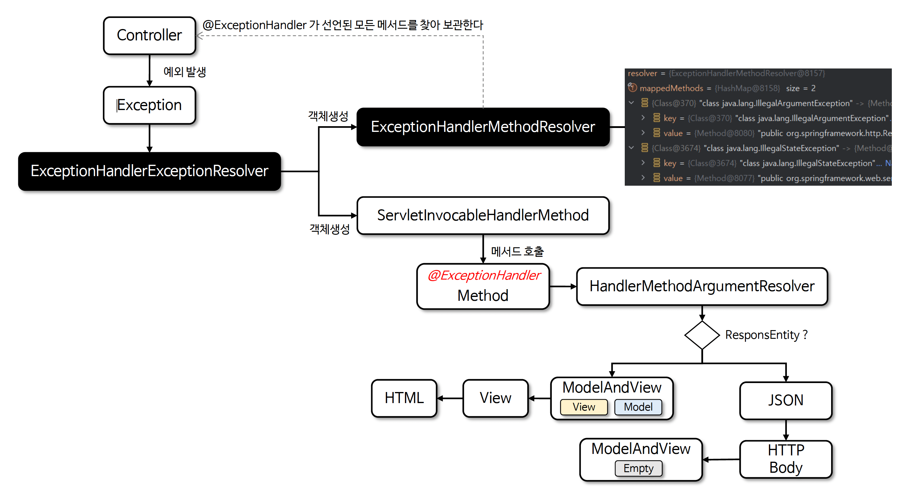
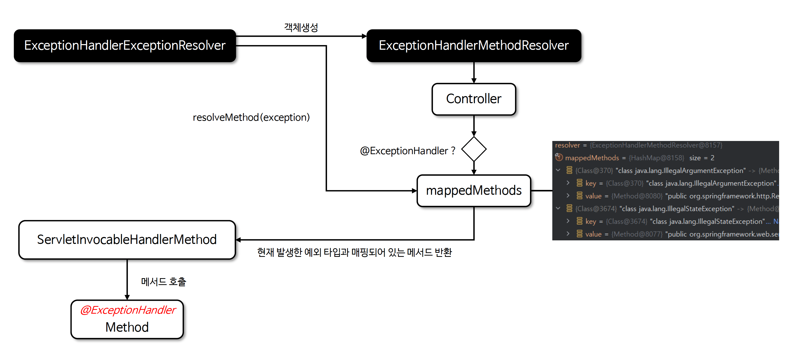

# ☘️ ExceptionHandlerExceptionResolver & @ExceptionHandler (1) ~ (2)

---

## 📖 내용

- ExceptionHandlerExceptionResolver 는 Spring MVC 의 예외 처리 메커니즘 중 가장 널리 사용되는 구현체로 컨트롤러 내부 또는 전역에서 @ExceptionHandler 로 정의된 메서
  드를 호출하여 예외를 처리한다
- REST API 에서는 요청 데이터나 비즈니스 로직에 따라 오류 정보를 세밀하게 제어해야 할 경우가 많은데 이런 동적이고 유연한 예외 처리가 가능하다
- 특정 컨트롤러와 밀접하게 연결된 예외 처리 뿐 아니라 @ControllerAdvice 를 사용하면 모든 컨트롤러에서 공통적인 예외 처리 로직을 적용할 수 있다


- argumentResolvers
  - @ExceptionHandler 메서드가 지원하는 파라미터 값 처리
- returnValueHandlers
  - @ExceptionHandler 메서드가 지원하는 반환 값 처리
- messageConverters
  - 예외 처리 시 Http 본문 응답으로 변환 하기 위한 컨버터
- exceptionHandlerCache
  - 컨트롤러에서 처리하는 예외 메서드
- exceptionHandlerAdviceCache
  - @ControllerAdvice 에서 처리하는 예외 메서드

---

### @ExceptionHandler
- @ExceptionHandler 는 컨트롤러에 특정 예외를 처리하기 위한 메서드를 정의할 때 사용하는 어노테이션으로서 ExceptionHandlerExceptionResolver 를 통해 실행되며 컨트롤러 클
  래스에서만 작동하거나 @ControllerAdvice 와 함께 사용하여 애플리케이션 전역적으로 동작하도록 설정할 수도 있다

- value()
  - @ExceptionHandler 에서 어떤 예외를 처리할지 한 개 이상 지정 할 수 있다
  - 만약 지정 하지 않으면 메서드 매개변수에 적혀 있는 예외를 기본적으로 처리한다

---

### 우선 순위에 따른 예외 처리
- 예외가 발생했을 때 자식 클래스 예외 처리 메서드는 항상 상위 클래스 예외 처리 메서드보다 우선적으로 호출된다
- 즉 구체적인 예외 클래스가 선언된 @ExceptionHandler 가 우선적으로 호출되며 덜 구체적인 예외 처리 메서드는 그 다음 순위로 처리된다

---

### ExceptionHandlerExceptionResolver 구조 이해

<sub>출처: 인프런</sub>

---

### ExceptionHandlerMethodResolver
- 주어진 클래스와 해당 클래스의 모든 상위 클래스에서 @ExceptionHandler 메서드를 찾아내어 선언된 예외와 메서드를 매핑하는 역할을 한다
- ExceptionHandlerExceptionResolver 는 ExceptionHandlerMethodResolver 에서 찾아낸 메서드를 호출하는 구조로 되어 있다


<sub>출처: 인프런</sub>

---

## 🔍 중심 로직

```java
package org.springframework.web.bind.annotation;

// imports

@Target(ElementType.METHOD)
@Retention(RetentionPolicy.RUNTIME)
@Documented
@Reflective(ExceptionHandlerReflectiveProcessor.class)
public @interface ExceptionHandler {

	@AliasFor("exception")
	Class<? extends Throwable>[] value() default {};
    
	@AliasFor("value")
	Class<? extends Throwable>[] exception() default {};

	String[] produces() default {};

}
```

📌

---

## 💬 코멘트

---
