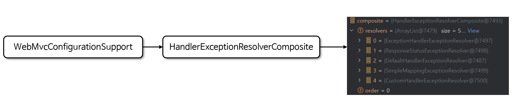
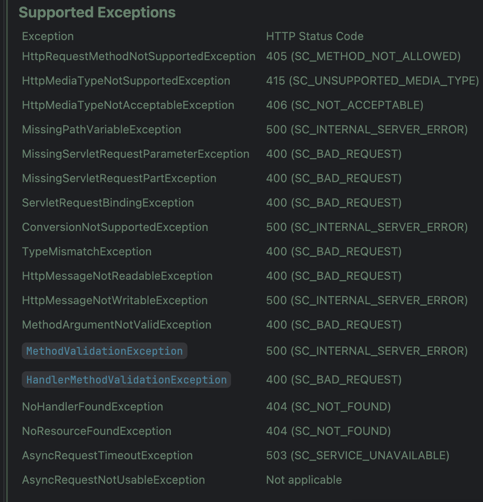

# ☘️ HandlerExceptionResolver 기본 구현체들

---

## 📖 내용

- Spring 은 기본적으로 예외 처리에 사용할 수 있는 HandlerExceptionResolver 구현체를 제공하며 각 구현체는 특정 시나리오에 따라 예외를 처리하도록 설계되어 있다
- 구현체는 ExceptionHandlerExceptionResolver, ResponseStatusExceptionResolver, DefaultHandlerExceptionResolver, SimpleMappingExceptionResolver 로서 총 4개의
  클래스가 제공된다

---

### 초기화 구성

- 예외 처리시 HandlerExceptionResolverComposite 가 가장 우선순위가 높으며 다음으로 resolvers 에 들어 있는 순서대로 호출 된다
- CustomHandlerExceptionResolver 를 직접 구현하게 되면 기본 구현체들 다음으로 순서가 정해진다
- 실무에서 가장 많이 사용하는 구현체는 ExceptionHandlerExceptionResolver 이며 @ExceptionHandler 어노테이션과 함께 사용한다


<sub>출처: 인프런</sub>

---

### ResponseStatusExceptionResolver
- ResponseStatusExceptionResolver 는 예외에 대해 HTTP 상태 코드와 메시지를 매핑하여 클라이언트에게 반환할 수 있도록 설계된 예외 처리 전략이다
- 이 구현체는 두 가지 방식으로 예외 및 HTTP 상태 코드를 처리하는데 @ResponseStatus 와 ResponseStatusException 를 사용하여 구현한다
- 이 클래스는 예외를 sendError(code, msg) 로 처리하기 때문에 뷰 렌더링 없이 WAS 의 ErrorPage 전략에 의해 예외 처리가 이루어지도록 한다

---

### ResponseStatusException
- @ResponseStatus 는 정적으로 예외와 상태 코드를 매핑하기 때문에 런타임에 다른 값을 설정할 수 없다
- ResponseStatusException 는 동적으로 상태 코드와 메시지를 설정할 수 있어 다양한 상황에서 재사용 가능하다

---

### DefaultHandlerExceptionResolver
- DefaultHandlerExceptionResolver 는 Spring 의 표준 예외와 HTTP 상태 코드를 자동으로 매핑하여 처리하는 클래스다
- 주로 Spring MVC 내부에서 발생하는 예외들을 처리하며특정 예외를 HTTP 상태 코드에 매핑시켜 클라이언트로 반환하는 역할을 한다
- 이 클래스는 예외를 sendError(code, msg) 로처리하기 때문에 뷰 렌더링 없이 WAS 의 ErrorPage 전략에 의해 예외 처리가 이루어지도록 한다



- Spring 표준 예외를 자동으로 처리하므로기본 예외가 필요한 경우 추가 설정을 할 필요가 없다
- 예외에 적절한 상태 코드를 설정하여 REST API 응답을 손쉽게 지원한다

---

### SimpleMappingExceptionResolver
- SimpleMappingExceptionResolver 는 특정 예외와 View 이름을 매핑하여 예외 발생 시 지정된 뷰(View)로 전환해 주는 클래스로서 어플리케이션 전역적으로 작동하며 모든 컨트롤러
  에 동일한 예외 처리 로직을 적용할 수 있다
- REST API 보다는 주로 HTML 기반의 전통적인 웹 애플리케이션에서 사용하기 적합하다

---

## 🔍 중심 로직

```java
package org.springframework.web.servlet.mvc.annotation;

// imports

public class ResponseStatusExceptionResolver extends AbstractHandlerExceptionResolver implements MessageSourceAware {

	@Nullable
	private MessageSource messageSource;


	@Override
	public void setMessageSource(@Nullable MessageSource messageSource) {
		this.messageSource = messageSource;
	}


	@Override
	@Nullable
	protected ModelAndView doResolveException(
			HttpServletRequest request, HttpServletResponse response, @Nullable Object handler, Exception ex) {

		try {
			if (ex instanceof ResponseStatusException rse) {
				return resolveResponseStatusException(rse, request, response, handler);
			}

			ResponseStatus status = AnnotatedElementUtils.findMergedAnnotation(ex.getClass(), ResponseStatus.class);
			if (status != null) {
				return resolveResponseStatus(status, request, response, handler, ex);
			}

			if (ex.getCause() instanceof Exception cause) {
				return doResolveException(request, response, handler, cause);
			}
		}
		catch (Exception resolveEx) {
			if (logger.isWarnEnabled()) {
				logger.warn("Failure while trying to resolve exception [" + ex.getClass().getName() + "]", resolveEx);
			}
		}
		return null;
	}

	protected ModelAndView resolveResponseStatus(ResponseStatus responseStatus, HttpServletRequest request,
			HttpServletResponse response, @Nullable Object handler, Exception ex) throws Exception {

		int statusCode = responseStatus.code().value();
		String reason = responseStatus.reason();
		return applyStatusAndReason(statusCode, reason, response);
	}

	protected ModelAndView resolveResponseStatusException(ResponseStatusException ex,
			HttpServletRequest request, HttpServletResponse response, @Nullable Object handler) throws Exception {

		ex.getHeaders().forEach((name, values) -> values.forEach(value -> response.addHeader(name, value)));
		return applyStatusAndReason(ex.getStatusCode().value(), ex.getReason(), response);
	}

	protected ModelAndView applyStatusAndReason(int statusCode, @Nullable String reason, HttpServletResponse response)
			throws IOException {

		if (!StringUtils.hasLength(reason)) {
			response.sendError(statusCode);
		}
		else {
			String resolvedReason = (this.messageSource != null ?
					this.messageSource.getMessage(reason, null, reason, LocaleContextHolder.getLocale()) :
					reason);
			response.sendError(statusCode, resolvedReason);
		}
		return new ModelAndView();
	}

}
```

```java
package org.springframework.web.server;

// imports

public class ResponseStatusException extends ErrorResponseException {
    @Nullable
    private final String reason;

    public ResponseStatusException(HttpStatusCode status) {
        this(status, (String)null);
    }

    public ResponseStatusException(HttpStatusCode status, @Nullable String reason) {
        this(status, reason, (Throwable)null);
    }

    public ResponseStatusException(int rawStatusCode, @Nullable String reason, @Nullable Throwable cause) {
        this(HttpStatusCode.valueOf(rawStatusCode), reason, cause);
    }

    public ResponseStatusException(HttpStatusCode status, @Nullable String reason, @Nullable Throwable cause) {
        this(status, reason, cause, (String)null, (Object[])null);
    }

    protected ResponseStatusException(HttpStatusCode status, @Nullable String reason, @Nullable Throwable cause, @Nullable String messageDetailCode, @Nullable Object[] messageDetailArguments) {
        super(status, ProblemDetail.forStatus(status), cause, messageDetailCode, messageDetailArguments);
        this.reason = reason;
        this.setDetail(reason);
    }

    @Nullable
    public String getReason() {
        return this.reason;
    }

    public HttpHeaders getHeaders() {
        return this.getResponseHeaders();
    }

    /** @deprecated */
    @Deprecated(
        since = "6.0"
    )
    public HttpHeaders getResponseHeaders() {
        return HttpHeaders.EMPTY;
    }

    public ProblemDetail updateAndGetBody(@Nullable MessageSource messageSource, Locale locale) {
        super.updateAndGetBody(messageSource, locale);
        if (messageSource != null && this.getReason() != null && this.getReason().equals(this.getBody().getDetail())) {
            Object[] arguments = this.getDetailMessageArguments(messageSource, locale);
            String resolved = messageSource.getMessage(this.getReason(), arguments, (String)null, locale);
            if (resolved != null) {
                this.getBody().setDetail(resolved);
            }
        }

        return this.getBody();
    }

    public String getMessage() {
        String var10000 = String.valueOf(this.getStatusCode());
        return var10000 + (this.reason != null ? " \"" + this.reason + "\"" : "");
    }
}
```

📌

---

## 💬 코멘트

---
