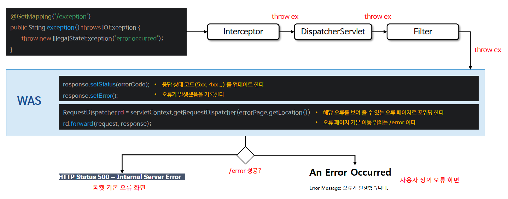

# ☘️ 서블릿 예외 처리

---

## 📖 내용

- 클라이언트 요청 처리 중 발생한 예외는 컨트롤러, 필터, 서블릿, DispatcherServlet 등에서 처리되지 않을 경우 상위 계층으로 전파되어 최종 WAS 까지 전달 된다
- 서블릿은 크게 두 가지 유형으로 오류처리를 지원하는데 하나는 실제 예외가 발생하는 경우, 또 하나는 Response.sendError() 를 통해 오류 상태를 기록하는 경우이다

---

### 예외 발생 (Throw Exception)

- 컨트롤러에서 발생한 예외나 오류는 응답상태코드에 따라 서버내부오류, 페이지 찾을 수 없음 오류 등으로 나타나며 WAS 에서 최종 오류 처리를 제어한다


<sub>※ 이미지 출처: 인프런</sub>

---

### Response.sendError()
- Response.sendError() 는 요청이 잘못되었거나 서버에서 처리할 수 없는 상황이 발생했을 때 클라이언트에게 HTTP 상태 코드와 오류 메시지를 전송하기 위해 사용된다


<sub>※ 이미지 출처: 인프런</sub>

---

## 🔍 중심 로직

```java
```

📌

---

## 💬 코멘트

---
