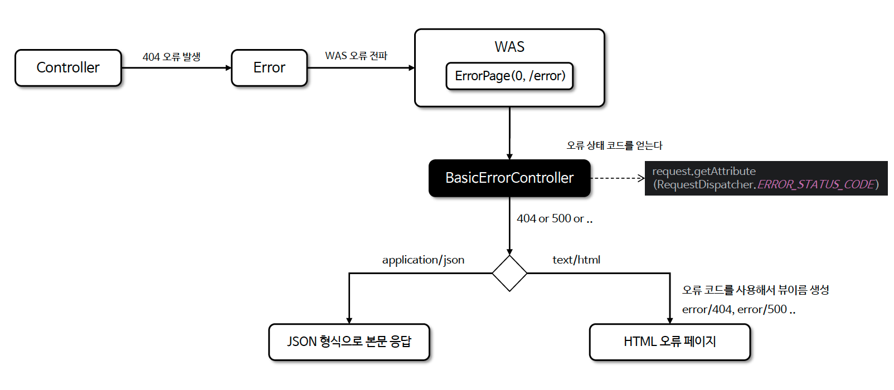

# ☘️ 스프링의 기본 오류 처리 BasicErrorController

---

## 📖 내용

- BasicErrorController 는 Spring Boot 에서 제공하는 기본적인 오류 처리 컨트롤러로 어플리케이션에서 발생하는 예외 또는 오류를 처리하고 기본적인 오류 페이지 및 JSON 형식의 오류 응답을 반환한다
- BasicErrorController 는 기본적으로 /error 경로로 요청하는 모든 오류를 처리하고 있으며 이는 WAS 에서 오류 페이지를 요청하는 기본 경로인 /error 와 일치한다

---

### 구조 및 특징
- 오류 처리의 기본 동작 제공
  - 클라이언트로부터 발생하는 HTTP 상태 코드를 기반으로 HTML 오류 페이지(Whitelabel Error Page) 혹은 REST API의 경우 JSON 형식으로 응답한다
- 사용자 정의 오류 처리
  - 개발자는 ErrorController 를 구현하여 기본 동작을 커스터마이징할 수 있다
- ErrorAttributes 와 연동
  - 오류 관련 데이터를 제공하는 ErrorAttributes 와 연계하여 오류의 세부 정보를 응답에 포함할 수 있다

---

### 오류 처리 방식

<sub>※ 이미지 출처: 인프런</sub>

---

### View 방식의 오류 처리 - ErrorViewResolver
- ErrorViewResolver 는 오류가 발생했을 때 보여줄 화면(오류 페이지)을 찾는 역할을 한다
- 기본적으로 /error/ 경로 아래에서 오류 코드(예: 404, 500) 나 오류의 종류에 맞는 템플릿 파일이나 정적 리소스를 찾아서 적절한 화면을 보여주는 역할을 한다

#### 오류 화면 우선 순위
1. 뷰 템플릿
   - resources/templates/error/400.html
   - resources/templates/error/4xx.html
2. 정적 리소스
   - resources/static/error/500.html
   - resources/static/error/5xx.html
3. 적용 대상이 없을 때( error )
   - resources/templates/error.html

---

### Rest API 방식의 오류 처리
- Spring Boot 는 REST 요청(Accept: application/json)이 발생했을 때 BasicErrorController를 사용해 JSON 형식의 오류 응답을 자동으로 생성해 준다
- BasicErrorController 는 기본적인 화면 오류 처리에는 매우 유용하지만 API 오류 처리를 위한 세밀한 요구사항을 충족하는 데는 한계가 있다

---

### 오류 정보 처리 - ErrorAttributes
- 오류가 발생했을 때 오류와 관련된 정보를 가져올 수 있게 해주는 기능으로 Model 에 담아서 이 정보를 로그로 기록하거나 사용자에게 보여줄 때 사용할 수 있다

---

### 오류 정보 제어 설정
```properties
server.error.include-message
server.error.include-binding-errors
server.error.include-exception
server.error.include-stacktrace
server.error.include-path
```

| 설정 값     | 설명                    | 사용 환경          | 예시 사용                |
|----------|-----------------------|----------------|----------------------|
| never    | 정보를 절대 포함하지 않음        | 운영 환경          | 보안이 중요한 API          |
| always   | 정보를 항상 포함             | 개발 환경          | 로컬 디버깅               |
| on_param | 요청에 특정 파라미터가 있을 때만 포함 | 개발 (꼭 필요 시 운영) | ?message=&exception= |

---

## 🔍 중심 로직

```java
package org.springframework.boot.autoconfigure.web.servlet.error;

// imports

@Controller
@RequestMapping("${server.error.path:${error.path:/error}}")
public class BasicErrorController extends AbstractErrorController {

	private final ErrorProperties errorProperties;

    // constructors
    
	@RequestMapping(produces = MediaType.TEXT_HTML_VALUE)
	public ModelAndView errorHtml(HttpServletRequest request, HttpServletResponse response) {
		HttpStatus status = getStatus(request);
		Map<String, Object> model = Collections
			.unmodifiableMap(getErrorAttributes(request, getErrorAttributeOptions(request, MediaType.TEXT_HTML)));
		response.setStatus(status.value());
		ModelAndView modelAndView = resolveErrorView(request, response, status, model);
		return (modelAndView != null) ? modelAndView : new ModelAndView("error", model);
	}

	@RequestMapping
	public ResponseEntity<Map<String, Object>> error(HttpServletRequest request) {
		HttpStatus status = getStatus(request);
		if (status == HttpStatus.NO_CONTENT) {
			return new ResponseEntity<>(status);
		}
		Map<String, Object> body = getErrorAttributes(request, getErrorAttributeOptions(request, MediaType.ALL));
		return new ResponseEntity<>(body, status);
	}

	@ExceptionHandler(HttpMediaTypeNotAcceptableException.class)
	public ResponseEntity<String> mediaTypeNotAcceptable(HttpServletRequest request) {
		HttpStatus status = getStatus(request);
		return ResponseEntity.status(status).build();
	}

    // protected methods

}
```

```java
package org.springframework.boot.autoconfigure.web.servlet.error;

// imports

@FunctionalInterface
public interface ErrorViewResolver {

	ModelAndView resolveErrorView(HttpServletRequest request, HttpStatus status, Map<String, Object> model);

}
```

```java
package org.springframework.boot.web.servlet.error;

// imports

public interface ErrorAttributes {

	default Map<String, Object> getErrorAttributes(WebRequest webRequest, ErrorAttributeOptions options) {
		return Collections.emptyMap();
	}

	Throwable getError(WebRequest webRequest);

}
```

📌

---

## 💬 코멘트

---
